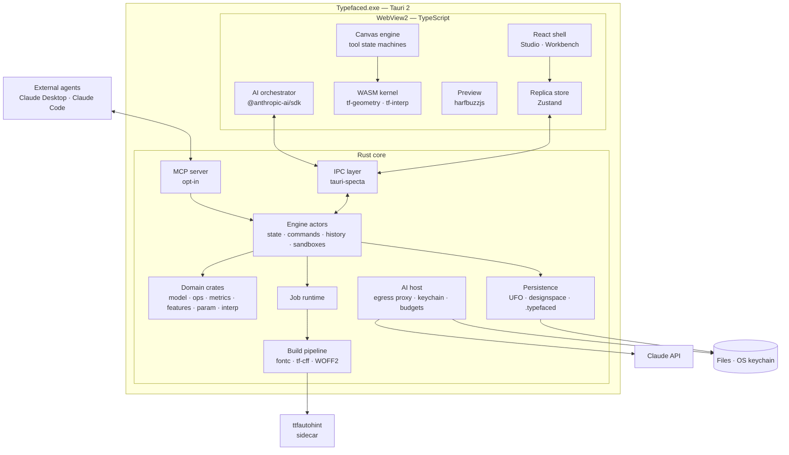
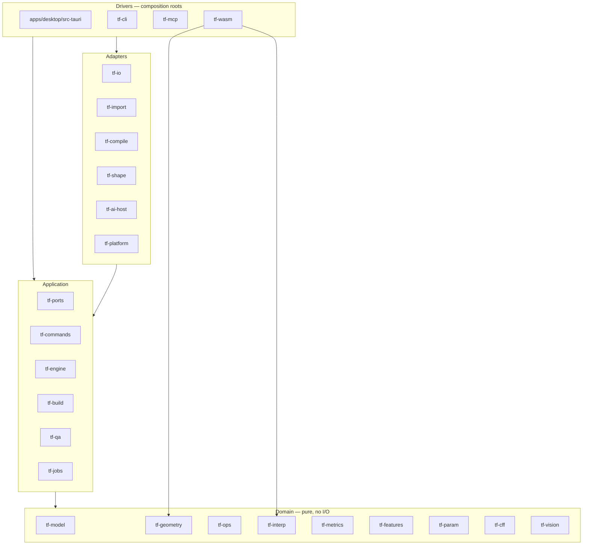
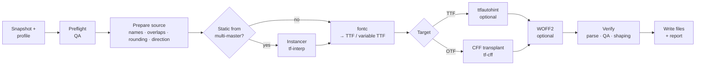
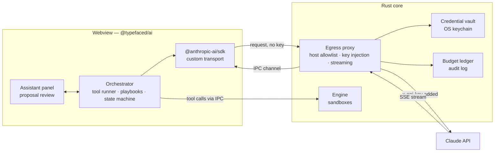
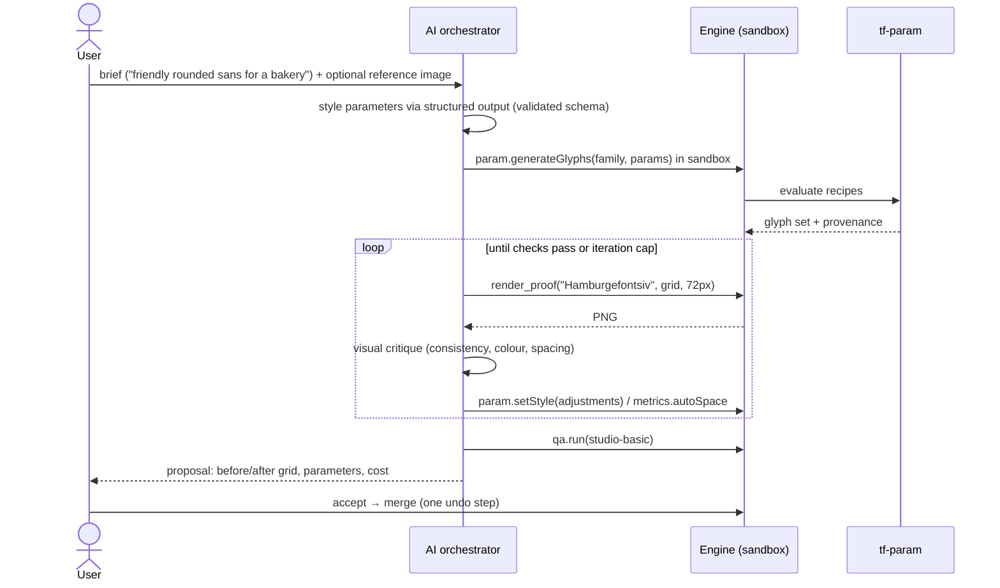
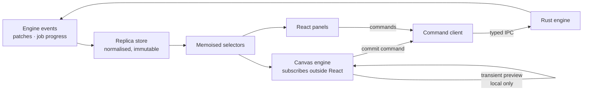
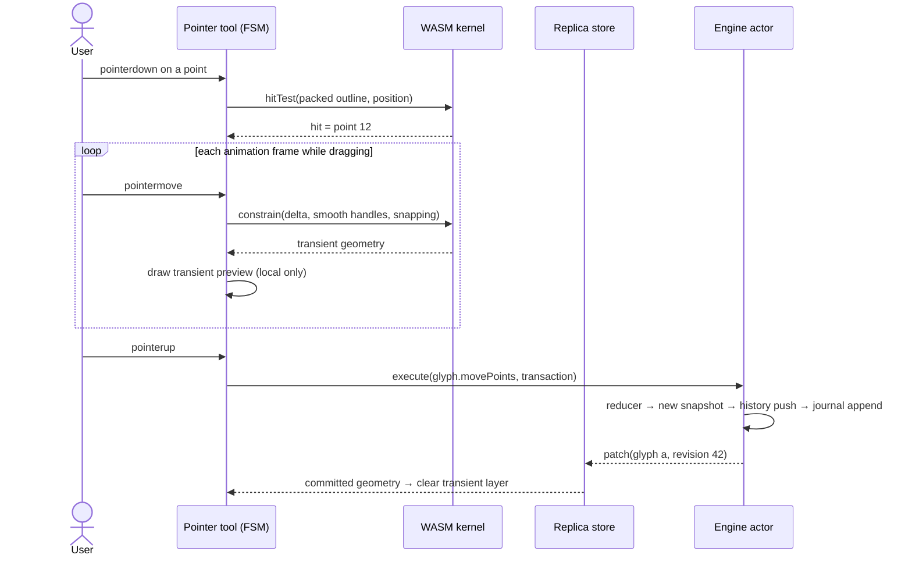
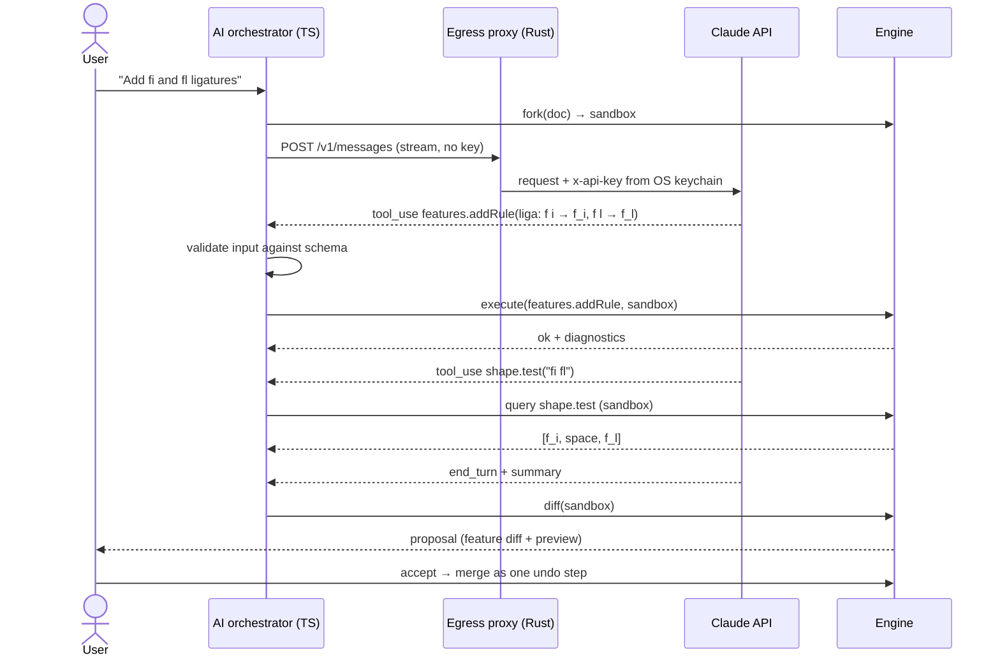
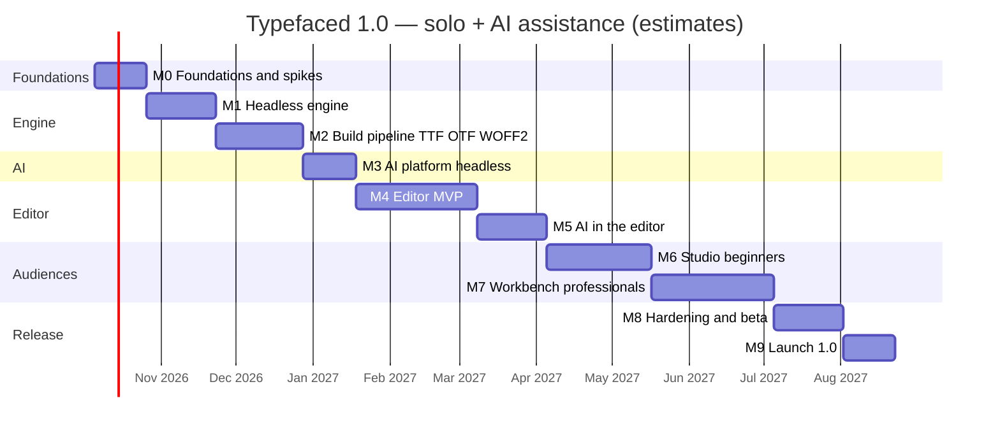

# Typefaced — Implementation Plan

**Status:** Draft 1, for review · **Date:** 2026-09-29
**Inputs:** [research.md](research.md), plus the product decisions made on 2026-09-29 (proprietary license; beginners *and* professionals; AI first; TTF *and* CFF-based OTF output).

## How to read this plan

| Sections | What they cover |
|---|---|
| §0 | One-page summary |
| §1–§4 | Decisions, principles and overall architecture |
| §5–§7 | Every module: what it does, the programming paradigm and design patterns chosen for it, and why |
| §8–§13 | Key flows, data formats, cross-cutting concerns, security, quality, delivery |
| §14–§18 | Roadmap, risks, ADR backlog, open questions, and the first two weeks of work |

The appendices hold the initial command catalog, the dependency-license policy, and "golden path" recipes for adding features consistently. The recipes matter most when coding with AI assistants.

---

## 0. Summary

**What we are building.** A proprietary, Windows-first desktop font editor for:

- **Beginners**, in a guided *Studio* workspace.
- **Professionals**, in a *Workbench* workspace.

Both run on one engine. AI is a first-class way to operate the app. Export formats are TrueType (static and variable TTF), CFF-flavoured OpenType (OTF) and WOFF2.

**Architecture in one paragraph.** A headless Rust **engine** owns the font document. The document is stored as immutable, structurally shared snapshots, and it changes only through typed **commands**. The same command catalog serves four clients:

- the TypeScript UI in a Tauri 2 webview;
- the in-app AI agent;
- an MCP server for external agents;
- a command-line tool.

The UI keeps a read-only replica of the document, fed by patch events from the engine. It draws glyphs on an imperative Canvas2D engine, and runs interactive geometry through a WebAssembly build of the same Rust geometry kernel.

Exports run as background jobs. TTF comes from Google's **fontc** compiler; OTF comes from fontc's output plus an **in-house CFF writer**.

The AI agent runs in the webview on the **official Anthropic TypeScript SDK**. The Rust side holds the API key and makes the HTTPS calls. Every AI edit lands in a **sandbox branch** that the user reviews before merging.

**Key choices**

| Area | Choice |
|---|---|
| Desktop shell | Tauri 2 (WebView2), Windows first |
| Document state | Rust engine; persistent immutable snapshots; a single-writer actor; lock-free readers |
| Programming interface | One command catalog → UI, AI, MCP, CLI (generated TypeScript types + JSON Schemas) |
| Source format | UFO 3 + designspace 5; `.typefaced` single-file package for beginners |
| TTF / variable TTF | fontc 1.0, linked in-process |
| CFF-based OTF | fontc TTF → "CFF transplant" using the in-house `tf-cff` writer |
| UI | React + Zustand replica store + imperative Canvas2D engine + WASM geometry kernel |
| AI | `@anthropic-ai/sdk` tool runner in TypeScript; Rust egress proxy + OS keychain; sandbox proposals; default model `claude-opus-5` |
| AI glyph generation | A parametric glyph engine (`tf-param`) driven by the AI, with visual self-critique |
| Beginners (Studio) | Templates, "font from a description", handwriting import, auto-spacing, one-click export |
| Professionals (Workbench) | Kerning groups, feature code, masters and variable fonts, imports from other editors |

**Timeline estimate.**

- 10 milestones, about 46 weeks of focused solo work with AI assistance.
- Version 1.0 around Q3 2027, ±25% (§14).
- The first two weeks cover legal and repository setup, scaffolding and four de-risking spikes (§18).

---

## 1. Decisions and assumptions

| # | Decision (2026-09-29) | Consequence for the plan |
|---|---|---|
| D1 | License: **all rights reserved** | Only permissively licensed dependencies (Appendix B). No GPL code: Fontra, FontForge, Glyphr Studio, BirdFont, HT Letterspacer and potrace may be studied as design references only, never copied. |
| D2 | Audience: **beginners and professionals** | One engine and one document model. Two workspaces (Studio, Workbench) are configurations over shared panels and tools, with progressive disclosure. |
| D3 | **AI first** | Interpreted as: AI ships in 1.0, *and* the architecture is AI-first, so every capability is a typed, schema-described command an agent can call. The app still opens, edits and exports fonts fully offline, without AI. |
| D4 | Output: **TTF and CFF-based OTF** | fontc for TTF and variable TTF; an in-house CFF writer for static OTF; an in-house instancer for static fonts from multi-master sources. fontmake serves as the test oracle in CI and as a contingency adapter. |
| D5 | **Windows first** (from the research) | Tauri 2 + WebView2. macOS and Linux follow after 1.0. |

**Assumptions to confirm** (see §17):

- Claude (the Anthropic API) is the LLM provider.
- Users bring their own API key in the 1.0 beta; a hosted gateway for users without keys is decided before the public launch.
- Latin script comes first; Greek and Cyrillic next.
- The GitHub repository either becomes private or deliberately stays source-visible.

**Repository note.** A public repository marked "all rights reserved" is *source-visible*, not open source: anyone can read the code, but nobody may reuse it. If the code (or this plan) should stay confidential, make the repository private before the first push.

---

## 2. Architecture principles

1. **One engine, four clients.** The UI, the AI agent, the MCP server and the CLI all go through the same command/query API. No client has a private back door.
2. **Everything is a command.** Every change to a document is a typed, validated, undoable and auditable command with a JSON Schema. That makes it automatically scriptable and callable by AI.
3. **Immutable snapshots, single writer.** Document state is persistent and structurally shared. One actor writes; everyone else reads snapshots without locks.
4. **AI proposes, the user decides.** AI edits go into a sandbox branch. The user reviews a visual diff and merges it as a single undo step.
5. **Functional core, imperative shell.** Domain logic is pure and deterministic. File access, UI, network and OS services sit at the edges, behind ports.
6. **Standard formats in and out.** UFO/designspace sources and OpenType binaries. Users are never locked in.
7. **Don't rebuild compilers or shapers.** Reuse fontc, HarfBuzz/harfrust and fontations. Build only what is missing: the CFF writer, the instancer and the parametric engine.
8. **Performance by design.** Data-oriented hot paths, a WASM kernel for interaction, background jobs, content-addressed caches.
9. **A supply chain safe for proprietary software.** License gates in CI, and clean-room rules for AI-assisted coding.
10. **Offline-first; AI optional at runtime.** AI is first-class, but it is never required to open, edit or export a font.

---

## 3. System architecture

### 3.1 Architectural style

- **Modular monolith:** one Cargo workspace plus one pnpm workspace, organised as a **hexagonal architecture** (ports and adapters).
- **Functional core, imperative shell:** the domain crates are pure; the shells are the Tauri app, the CLI and the MCP server.
- **CQRS-lite:** commands change state through reducers; queries read snapshots and memoised projections.
- **Event-driven integration:** the engine publishes patches and domain events. The UI replica, autosave, caches and MCP notifications subscribe to them.
- **Event-sourcing-lite:** each document has a command journal for crash recovery and auditing. The journal is not the primary storage.

### 3.2 Containers



### 3.3 Runtime model

- **Processes.**
  - One app process: the Rust core plus the renderer processes that WebView2 manages.
  - Short-lived command-line sidecars, currently only ttfautohint.
  - **No Python at runtime.**
- **Tasks and threads.**
  - A Tokio runtime.
  - One **engine actor per open document**, which is the only writer.
  - **Readers** get the latest snapshot through `ArcSwap` (read-copy-update), without messaging the actor.
  - CPU-heavy work runs in the **job runtime** (Rayon inside `spawn_blocking`) on a snapshot. It commits its results back as ordinary commands carrying the revision they were computed from. The engine rejects or re-bases stale results (optimistic concurrency).
- **IPC.**
  - Commands and events typed with tauri-specta.
  - Binary payloads for outlines and images.
  - Tauri channels for streams: patches, job progress and AI egress streams.

### 3.4 Major trade-offs

| Decision | Chosen | Rejected | Why |
|---|---|---|---|
| Who owns document state | Rust engine; the UI holds a replica | TypeScript model with Rust file I/O (Fontra's approach) | The AI, MCP and CLI need headless access. There is one validation path, and heavy operations stay in Rust. The IPC cost is absorbed by local transient previews and the WASM kernel. |
| Undo | Snapshot history on persistent data | Inverse-operation log | Correct by construction. The same mechanism also gives AI sandboxes, background jobs and lock-free autosave. |
| Where the AI loop runs | TypeScript, official Anthropic SDK | Rust with raw HTTP | An official SDK exists for TypeScript but not for Rust. It absorbs API changes and provides the tool runner, streaming and context-management helpers. The key stays in Rust behind an egress proxy. |
| OTF generation | fontc TTF + in-house CFF transplant | Bundled Python fontmake | Avoids shipping a ~60 MB Python runtime and paying its start-up cost on every export. fontmake stays as a test oracle and a fallback adapter. |
| AI glyph generation | The LLM drives a parametric engine and critiques rendered proofs | The LLM draws raw outlines; or image diffusion + tracing | LLMs draw glyphs poorly (research §7.1) but choose parameters and judge images well. Parametric output is consistent and editable. |
| UI framework | React + Zustand + an imperative canvas | Svelte/Solid; a canvas rendered by React | AI coding assistants know React best, and the canvas must be imperative to reach 60 fps. |

---

## 4. Module map

### 4.1 Repository layout

```
typefaced/
├─ Cargo.toml                 # Rust workspace
├─ package.json               # pnpm workspace root
├─ rust-toolchain.toml        # pinned toolchain
├─ crates/
│  ├─ tf-model/               # domain: font data model
│  ├─ tf-geometry/            # domain: curves & paths (native + wasm)
│  ├─ tf-ops/                 # domain: pure glyph/font operations
│  ├─ tf-interp/              # domain: designspace interpolation & instancing
│  ├─ tf-metrics/             # domain: spacing & kerning algorithms
│  ├─ tf-features/            # domain: OpenType feature model & generation
│  ├─ tf-param/               # domain: parametric glyph engine
│  ├─ tf-cff/                 # domain: CFF table writer (pure serializer)
│  ├─ tf-vision/              # domain: image pipelines (handwriting, tracing)
│  ├─ tf-ports/               # application: port traits (interfaces to the outside)
│  ├─ tf-commands/            # application: command/query catalog = the API contract
│  ├─ tf-engine/              # application: state store, reducers, history, sandboxes
│  ├─ tf-build/               # application: export pipeline orchestration
│  ├─ tf-qa/                  # application: QA rules engine
│  ├─ tf-jobs/                # application: background job runtime
│  ├─ tf-io/                  # adapter: UFO/designspace/.typefaced persistence
│  ├─ tf-import/              # adapter: OTF/TTF/WOFF, SVG, .glyphs importers
│  ├─ tf-compile/             # adapter: fontc, CFF transplant, WOFF2, ttfautohint
│  ├─ tf-shape/               # adapter: shaper-font builder, harfrust shaping
│  ├─ tf-ai-host/             # adapter: egress proxy, key vault, budgets, audit log
│  ├─ tf-platform/            # adapter: OS services (keychain, fs watch, font install)
│  ├─ tf-mcp/                 # driver: MCP server (rmcp)
│  ├─ tf-cli/                 # driver: headless CLI
│  └─ tf-wasm/                # driver: wasm-bindgen facade for the UI kernel
├─ apps/
│  └─ desktop/
│     ├─ src-tauri/           # driver: Tauri composition root, IPC handlers
│     └─ ui/                  # Vite app entry
├─ packages/                  # TypeScript packages
│  ├─ bindings/               # generated IPC types + tool JSON Schemas (do not edit)
│  ├─ store/                  # replica store, selectors, command client
│  ├─ canvas/                 # glyph canvas engine + tools
│  ├─ preview/                # shaping, proofs, text preview
│  ├─ ai/                     # AI orchestrator + assistant UI
│  ├─ studio/                 # beginner workspace & wizards
│  ├─ workbench/              # pro workspace & panels
│  └─ kit/                    # design system: tokens, components, a11y
├─ assets/
│  ├─ recipes/                # parametric glyph recipes (data)
│  ├─ templates/              # starter projects, handwriting templates
│  └─ prompts/                # versioned AI prompt templates
├─ tests/
│  ├─ corpus/                 # test fonts (permissively licensed, with license files)
│  ├─ golden/                 # golden outputs
│  └─ evals/                  # AI evaluation suites
├─ docs/
│  ├─ research.md
│  ├─ implementation-plan.md
│  └─ adr/                    # architecture decision records
└─ xtask/                     # cargo xtask: build, codegen, checks, bundling
```

### 4.2 Dependency rules



The rules:

- **Domain crates** depend only on each other (with no cycles) and on pure libraries such as kurbo and serde. They never touch I/O, an async runtime or Tauri.
- **Application crates** depend on domain crates and on port *traits* (`tf-ports`), never on adapters.
- **Adapters** implement ports. They may use external libraries (norad, fontc, reqwest…) but never depend on drivers.
- **Drivers** are the only place where adapters are wired to ports. They are the composition roots.
- **TypeScript packages** depend on `@typefaced/bindings` and never form cycles. The canvas package never imports React.
- **Enforcement in CI:** `cargo xtask check-deps` (rules over `cargo metadata`) plus `cargo-deny` bans for Rust, and `dependency-cruiser` rules for TypeScript.

### 4.3 Paradigm and pattern matrix

This is the core of the "optimal paradigms and patterns" requirement. Each module's section (§5–§7) explains the choices in detail.

| Module | Programming paradigm | Core design patterns | Why this fits |
|---|---|---|---|
| `tf-model` | Immutable, value-oriented data (functional); domain-driven design | Aggregate root, Value Object, Newtype, Flyweight (shared `Arc` data), Identity Map | Snapshots cost almost nothing; illegal states are unrepresentable |
| `tf-geometry` (+ WASM) | Pure functions; data-oriented | Strategy (boolean-operation engine), Iterator/Visitor over segments, Spatial Index (R-tree) | Deterministic and testable; the same code runs natively and in the UI |
| `tf-ops` | Pure transformations | Command objects, Composite (macro operations), Specification (glyph selectors) | Operations can be batched, previewed and called by AI |
| `tf-interp` | Numerical, pure | Strategy (interpolation models), Memoisation, Specification (compatibility rules) | Shared with the UI through WASM for live designspace sliders |
| `tf-metrics` | Data-oriented numerics; data-parallel | Strategy (algorithms), Template Method, Specification | Whole-font operations in well under a second |
| `tf-features` | Declarative rules → code generation | Interpreter/Generator, Visitor (over the syntax tree), Composite | Beginner rules and professional code coexist safely |
| `tf-param` | Declarative/data-driven + functional; numerical optimisation | Interpreter (recipe language), Composite, Strategy (stroke/terminal/serif), Prototype (style presets) | Consistent, editable glyph sets that an AI can steer |
| `tf-cff` | Pure serialiser | Builder, Encoder (Visitor over path segments), Intermediate Representation, Strategy (optimisation levels) | Byte output that can be verified |
| `tf-vision` | Functional image pipeline; data-parallel | Pipes & Filters, Strategy, Notification | Deterministic, testable handwriting import |
| `tf-ports` | Interface definitions | Ports (hexagonal architecture), Dependency Inversion | Adapters can be swapped (fontc ↔ fontmake, provider ↔ gateway) |
| `tf-commands` | Schema-first, declarative | Registry, Command descriptor, Adapter generation (to IPC, MCP, AI, CLI) | One API for four clients |
| `tf-engine` | Functional core (reducers) + actor shell | Actor, Reducer, Command + CQRS, Memento (persistent snapshots), Unit of Work, Observer, Branch/Sandbox, Read-Copy-Update | One writer, lock-free readers, safe AI proposals, trivial undo |
| `tf-build` | Dataflow | Pipes & Filters, Strategy (export profiles), Builder + Typestate, Chain of Responsibility (preflight), content-addressed cache | Exports that are composable, verifiable and incremental |
| `tf-qa` | Rules engine | Specification/Rule objects, Composite (profiles), Command (quick fixes), Registry | Extensible, and every finding can be explained by the AI |
| `tf-jobs` | Async actors + data parallelism | Active Object, Cancellation Token, Bulkhead, Priority Queue | The UI stays responsive during heavy work |
| `tf-io`, `tf-import` | Imperative shell around pure mappers | Repository, Adapter, Anti-Corruption Layer, Factory (format detection), Template Method (atomic writes), Notification (import reports) | Isolates file formats; untrusted input stays contained |
| `tf-compile` | Imperative adapter | Adapter, Facade, Pipeline stage | Wraps fontc and the CFF transplant behind ports |
| `tf-shape` | Build on demand | Builder, Debounce, content-addressed cache, Adapter | Live text preview and AI verification of features |
| `tf-ai-host` | Security proxy (imperative shell) | Proxy (credential injection), Middleware chain, Circuit Breaker, Ledger | The key never reaches the webview; budgets are enforced |
| `tf-mcp` | Adapter | Adapter, Facade, Protection Proxy | External agents work under the same rules as internal ones |
| Desktop shell, `tf-cli` | Imperative shell | Composition Root, Facade | Thin and replaceable |
| `@typefaced/store` | Unidirectional data flow (Flux/Elm); immutable updates | Observer, Command client, memoised selectors, Optimistic Update | Predictable UI state |
| `@typefaced/canvas` | Imperative retained-mode rendering + finite-state machines; data-oriented | State (tool state machines), Composite (layers), Flyweight (Path2D cache), Command (commit), Scheduler (animation frame) | 60 fps editing |
| `@typefaced/ai` | Event-driven async orchestration | State Machine, Ports & Adapters (LLM client), Strategy (playbooks), Template Method (prompts), Saga via sandbox, human-in-the-loop gate | A reliable, reviewable agent experience |
| `@typefaced/preview` | Reactive | Adapter (shaper), Memoisation, Worker offload | Real OpenType shaping in the preview |
| `@typefaced/studio` | Declarative UI + finite-state machines | Wizard (state machine), Strategy (per flow) | Guided flows for beginners |
| `@typefaced/workbench` | Declarative UI | Container/Presentational, Registry (panels), Command palette | Professional productivity |
| `@typefaced/kit` | Component-driven | Design tokens, Compound components | Consistency and accessibility |

---

## 5. Core module designs (Rust)

Every module section follows the same shape: responsibility → paradigm → patterns → key types → libraries → testing → notes.

### 5.1 `tf-model` — domain model

**Responsibility.** The canonical in-memory representation of a font project, following designspace + UFO semantics, plus Typefaced extensions.

**Paradigm.** Immutable, value-oriented data with domain-driven design. Every collection is structurally shared, so cloning a whole `Font` copies a handful of pointers.

**Patterns.**
- **Aggregate root** — `Font` is the only entry point for changes; invariants are checked at that boundary.
- **Entities with stable IDs** — `GlyphId` (u32) is independent of the glyph name. Renaming is a refactoring command that updates components, kerning, groups and features.
- **Value objects** — `Point`, `Contour`, `Anchor`, `Guideline`, `Transform`: compared by value, never mutated in place.
- **Newtypes** — `FontUnits(f64)`, `GlyphName`, `Codepoint`, `AxisTag`, `Location` stop unit and identifier mix-ups at compile time.
- **Flyweight / structural sharing** — `Arc<Glyph>` and `Arc<Layer>` are shared across snapshots, and copy-on-write happens via `Arc::make_mut` inside reducers only.
- **Identity map** — a name ↔ id index.

**Key types (sketch).**

```rust
pub struct Font {                                   // aggregate root; cheap to clone
    pub info: Arc<FontInfo>,
    pub axes: Arc<Vec<Axis>>,                       // designspace axes (continuous/discrete) + avar maps
    pub sources: Arc<IndexMap<SourceId, Source>>,   // masters
    pub instances: Arc<Vec<Instance>>,
    pub glyphs: GlyphTable,                         // persistent map GlyphId -> Arc<Glyph> + name index + order
    pub kerning: Arc<IndexMap<SourceId, Arc<Kerning>>>,
    pub groups: Arc<Groups>,                        // incl. kerning groups (public.kern1/2)
    pub features: Arc<Features>,                    // user .fea + managed rule blocks
    pub lib: Arc<Lib>,                              // namespaced extensions (com.typefaced.*)
}
pub struct Glyph {
    pub name: GlyphName,
    pub codepoints: SmallVec<[Codepoint; 1]>,
    pub layers: IndexMap<LayerId, Arc<Layer>>,      // one per source + background layers
    pub meta: GlyphMeta,                            // provenance, recipe binding, tags, colour mark
}
pub struct Layer {
    pub advance: FontUnits,
    pub contours: Vec<Contour>,
    pub components: Vec<Component>,
    pub anchors: Vec<Anchor>,
    pub guidelines: Vec<Guideline>,
    pub image: Option<ImageRef>,
}
pub struct Point { pub x: f64, pub y: f64, pub kind: PointKind, pub smooth: bool, pub name: Option<Arc<str>> }
pub enum PointKind { Move, Line, Curve, QCurve, OffCurve }   // UFO point semantics
pub enum Provenance { Drawn, Traced { source: AssetId }, Generated { recipe: RecipeId, model: Option<String>, prompt_hash: Option<String> }, Imported { format: String } }
```

**Persistent collections.** Use `imbl` (MPL-2.0, which is allowed unmodified under Appendix B) or an in-house chunked copy-on-write vector (chunks of 64 `Arc<Glyph>`). A spike and ADR-017 decide. Either way, an edit costs O(chunk size), not O(glyph count), so 30,000-glyph CJK fonts stay fast.

**Libraries.** serde, indexmap, smallvec, `imbl` (or in-house).

**Testing.**
- Property tests (`proptest`) for the invariants: contour point sequences valid, glyph names unique, component references resolvable.
- Serde round-trip tests.
- Target coverage ≥ 90%.

### 5.2 `tf-geometry` — geometry kernel (native and WASM)

**Responsibility.** All the curve mathematics:

- evaluation, bounds, nearest point, hit testing, intersections;
- snapping to guides, metrics, angles and other points;
- keeping smooth-point handles collinear;
- offsetting and variable-width stroking;
- curve fitting for the freehand pencil tool, simplification, adding extreme points;
- contour direction and winding;
- cubic ↔ quadratic conversion;
- boolean operations, through a port.

**Paradigm.**
- Pure functions, data-oriented (slices and packed arrays, no allocation in hot loops).
- Compiles to `wasm32-unknown-unknown`, so there are no OS dependencies.

**Patterns.**
- **Strategy** — a `BooleanEngine` trait. The Skia PathOps and linesweeper adapters live *outside* this crate, so the kernel stays WASM-friendly.
- **Iterator / Visitor** — segment iterators walk UFO point sequences as lines, cubics and quadratic splines.
- **Spatial index** — an R-tree (`rstar`) for hit testing in dense glyphs and component-heavy layers.

**Libraries.** kurbo (MIT/Apache-2.0), rstar.

**Testing.**
- Property tests: fitting error bounds, cubic→quadratic error below tolerance, area invariants for boolean operations.
- `criterion` benchmarks with regression alerts.

**WASM facade (`tf-wasm`).**
- Coarse-grained calls on typed arrays: `hitTest`, `snap`, `constrainSmooth`, `fitStroke`, `interpolate`.
- Keeps call overhead negligible.
- Size budget: < 350 KB gzipped.

### 5.3 `tf-ops` — glyph and font operations

**Responsibility.** Pure transformations:

- **Geometry:** transform (move, scale, rotate, skew), round to grid, correct direction, add extremes, remove overlap (via `BooleanEngine`), simplify.
- **Structure:** decompose, set start point, reverse, align and distribute.
- **Glyph building:** build accented composites from anchors, make masters compatible (point order and count heuristics), change width while keeping sidebearings.
- **Refactoring:** rename glyphs with every reference updated.

**Paradigm.** Pure functions of the form `fn(&Font, &Params) -> Result<Font, OpError>`.

**Patterns.**
- **Command objects** — each operation implements `Operation { fn apply(&self, &Font) -> Result<Font>; fn describe(&self) -> OpDescription }`. That makes operations batchable, previewable and loggable.
- **Composite** — macro operations such as "prepare for export" or "clean up traced glyph".
- **Specification** — composable glyph selectors: `Lowercase & HasAnchor("top") & !Composite`.
- **Strategy** — heuristics for making masters compatible.

**Testing.** Golden tests on small UFO fixtures, plus property tests (e.g. decomposing a composite preserves its filled area).

### 5.4 `tf-interp` — designspace interpolation and instancing

**Responsibility.**
- The designspace model: continuous and discrete axes, avar mappings, sources, instances, substitution rules.
- Compatibility checking between masters.
- Interpolating glyphs, metrics, anchors and kerning at any location, used for live previews and for static-instance export.

**Paradigm.** Numerical and pure (linear algebra over point arrays). Also compiled to WASM for the UI's designspace sliders.

**Patterns.**
- **Strategy** — interpolation model: linear between two masters, or a variation-model solver with master supports.
- **Memoisation** — cached by (glyph revision, location).
- **Specification** — compatibility rules, reported as findings with suggested fixes.

**Testing.** Property tests: interpolating at a master's location returns that master; results are linear along a single axis. Compatibility fixtures.

### 5.5 `tf-metrics` — spacing and kerning

**Responsibility.**
- Sidebearing computation, auto-spacing, and metric links (e.g. "the left side of `n` equals `h`").
- The kerning model: pairs, groups and exceptions.
- Auto-kerning, collision audits and kerning audits.

**Paradigm.**
- Data-oriented numerics over precomputed **glyph profiles**: per-scanline left/right extents stored as structure-of-arrays.
- Rayon parallelism across glyphs and pairs. Pure functions throughout.

**Patterns.**
- **Strategy** — `SpacingAlgorithm` and `KerningAlgorithm` (below).
- **Template Method** — auto-spacing workflow: categorise glyphs → measure reference glyphs → compute per glyph → round → propose.
- **Specification** — pair and glyph-category filters.

**Algorithms.**
- Spacing: area-based (a clean-room implementation of the *published* HT Letterspacer method; see the note below), plus fixed, proportional and tabular.
- Kerning: optical gap first; learning from "model pairs" later.

**Clean-room rule.** Implement only from the published method description (its documentation is CC BY 4.0). Never read the GPL source. Record this in ADR-019.

**Testing.**
- Permissively licensed reference fonts give measured spacing baselines.
- Error metrics are checked against thresholds in CI.

### 5.6 `tf-features` — OpenType features

**Responsibility.** The feature source model has two layers:

1. **User `.fea` code** (Workbench).
2. **Managed rule blocks** generated from structured rules (Studio): ligatures, stylistic alternates and sets, case-sensitive forms, small caps, fractions, figure styles, and `calt` cycling for handwriting variants.

Kerning and mark positioning are generated automatically at compile time from kerning data and anchors (fontc's feature writers). The crate also provides:

- diagnostics mapped back to source ranges;
- glyph-class management;
- rename refactoring inside feature code.

**Paradigm.** Declarative rules → code generation; analysis over a syntax tree.

**Patterns.**
- **Interpreter/Generator** — rules → syntax tree → `.fea` text.
- **Visitor** — over the parsed syntax tree, for references, renames and class extraction.
- **Composite** — features → lookups → rules.
- **Strategy** — per-script rule packs (Latin first; Greek and Cyrillic next).

**Round-trip policy.** Managed blocks are delimited by markers:

```
# <typefaced:managed id="liga-basic">
…
# </typefaced:managed>
```

- Generated code never overwrites user code outside the markers.
- A user who edits inside a block turns it into user code, after an explicit confirmation.

**Libraries.** `fea-rs` (from the fontc project) for parsing and diagnostics.

**Testing.** Every generated block must compile, and shaping tests (via `tf-shape`) must turn given input strings into the expected glyph sequences.

### 5.7 `tf-param` — parametric glyph engine (the backbone of AI glyph generation)

**Responsibility.**
- Generate consistent, editable glyph outlines from declarative **recipes**: skeletons, a stroke model and style parameters.
- Fit those parameters to glyphs the user has drawn.

This is what lets the AI create whole glyph sets reliably (§6.6).

**Paradigm.**
- Declarative/data-driven, with pure functional generation.
- Constraint-style layout: skeleton points are expressions of metrics and parameters.
- Numerical optimisation for fitting parameters.

**Model.**
- **Style parameters.** `x_height`, `cap_height`, `ascender`, `descender`, `overshoot`, `stem_v`, `stem_h`, `contrast`, `contrast_angle`, `stroke_model` (monoline | broad nib | pointed pen), `terminal` (round | flat | angled), `serif` (none | slab | bracketed | wedge, with size), `aperture`, `width`, `slant`, `corner_rounding`.
- **Recipes** are small data files in `assets/recipes/`:
  - Skeleton paths are written as expressions of metrics and parameters.
  - Strokes are assigned a nib.
  - Glyphs reuse shared parts: stems, bowls, arches, serifs. For example, `h` = stem + the `n` arch.
- **Pipeline:**
  1. Evaluate expressions → skeleton paths.
  2. Stroke expansion: variable-width offsetting driven by the nib model, then curve fitting.
  3. Add terminals and serifs as sub-recipes.
  4. Boolean union.
  5. Clean-up: extremes, direction, simplification, rounding.
  6. Write the glyph layer, with the recipe and parameters recorded in `lib`.
- **Detach semantics.** Editing a generated glyph by hand "detaches" it, so parameter changes no longer overwrite it. The user can re-attach it, with a diff shown first.

**Patterns.**
- **Interpreter** — the recipe language.
- **Composite** — recipes built from sub-recipes.
- **Strategy** — stroke models, terminals and serifs.
- **Prototype** — style presets cloned and tweaked.
- **Template Method** — the generation pipeline.
- **Observer** — live regeneration while sliders move.

**Fitting to seed glyphs.**
1. Measure the glyphs the user drew (e.g. `n o H O`): stem widths from scanlines, contrast, x-height, overshoot.
2. Use those measurements as the initial parameters.
3. Refine with derivative-free optimisation (Nelder–Mead or CMA-ES), minimising the raster difference (IoU / Hausdorff distance) between generated and seed glyphs.

**Scope for 1.0.**
- Basic Latin: A–Z, a–z, 0–9, common punctuation.
- Three skeleton families: grotesque sans, humanist sans, slab.
- Accented letters built from components and anchors.
- Greek and Cyrillic reuse many of the same structures later.

**Intellectual property.**
- Recipes are authored from scratch, never traced from existing fonts.
- Provenance is recorded on every generated glyph (§11.4).

**Risk.** Designing recipes needs type-design expertise (§15, R6). Mitigations:
- Keep the scope small.
- Keep recipes as data, so they improve without code changes.
- Get a paid review by a type designer.
- Use visual evals (§6.8).

### 5.8 `tf-cff` — CFF table writer

**Responsibility.** Serialise a CFF (version 1) table for static fonts from cubic outlines and font metadata.

**Paradigm.** A pure serialiser: data in, bytes out. It works through an explicit intermediate representation and never touches files.

**Patterns.**
- **Builder** — `CffBuilder::new(upm).glyph(name, advance, path)…build()`.
- **Encoder / Visitor** — the Type 2 charstring encoder visits path segments and emits `rmoveto` / `rlineto` / `rrcurveto` with operator folding (`hlineto`, `vhcurveto`, …).
- **Intermediate representation** — typed INDEX and DICT structures before bytes.
- **Strategy** — optimisation levels: none, operator folding, subroutinisation (after 1.0).

**Contents.**
- The INDEX serialiser and the DICT operand encoder (integer and real encodings).
- Top DICT and Private DICT, with the font matrix set from the font's units per em.
- The String INDEX and a custom charset for glyph names.
- The CharStrings INDEX, with widths encoded against `defaultWidthX` / `nominalWidthX`; the pair is chosen to minimise size.
- FontBBox.
- Empty subroutine INDEXes in 1.0.
- No hints in 1.0.

**Build or reuse.** A spike evaluates `allsorts` (Apache-2.0), whose subsetter already serialises CFF structures. Otherwise, write it from scratch (estimated 1.5–2.5k lines of Rust).

**Verification.** Three independent checks run on every change in CI:
1. Round-trip parse with `read-fonts`, then outline extraction with `skrifa`; outlines must equal the rounded source outlines exactly.
2. `ttx` (fontTools) and OpenType Sanitizer, in CI only.
3. Rendering comparison against a fontmake-built OTF at several sizes.

**After 1.0.** Subroutinisation (smaller files). CFF2 for variable OTF is not planned: variable fonts ship as TTF.

### 5.9 `tf-vision` — image pipelines (handwriting and tracing)

**Responsibility.**
- **Templates:** generate printable handwriting templates (PDF) with corner markers and a QR code that identifies the layout.
- **Scan processing:** ingest scans or photos, correct perspective, extract cells, binarise, clean up.
- **Tracing:** trace outlines, fit curves, normalise to the template's guide lines, handle multiple variants per letter.
- **General tracing** of any image, e.g. logos or lettering.

**Paradigm.** A functional pipeline over images: every stage is pure and deterministic. Rayon parallelism across cells.

**Patterns.**
- **Pipes & Filters** — the stages.
- **Strategy** — thresholding (Otsu, Sauvola), tracer, smoothing.
- **Template Method** — each stage emits diagnostic images for debugging.
- **Factory** — template layouts.
- **Notification** — per-cell quality flags (empty, smudged, touching the border).

**Libraries.** `image`, `imageproc`, `rqrr` (QR codes), `nalgebra` (homography), `vtracer` (MIT/Apache-2.0), `kurbo` (fitting), `printpdf`.

**Testing.**
- Synthetic scans: a rendered template plus handwriting fixtures plus distortions (rotation, perspective, noise, uneven light).
- Golden metrics: cell-detection accuracy, glyph count, outline quality.

### 5.10 `tf-ports` — port traits

**Responsibility.** The interfaces through which application code reaches the outside world.

| Port | 1.0 adapter | Alternatives / future |
|---|---|---|
| `FontRepository` | UFO folder (norad); `.typefaced` package | — |
| `Importer` | Binary fonts (read-fonts/skrifa); SVG (usvg); `.glyphs` (glyphslib-rs) | `.fontra`, `.sfd` (babelfont-rs) |
| `FontCompiler` | fontc, in-process | fontmake sidecar (contingency) |
| `CffWriter` | `tf-cff` | allsorts-based |
| `BooleanEngine` | skia-safe PathOps *or* linesweeper (chosen by spike, ADR-008) | — |
| `Hinter` | ttfautohint sidecar (TTF only) | otfautohint (CFF, via Python) |
| `Woff2Codec` | woofwoof | ttf2woff2 |
| `Shaper` | harfrust (core) | — |
| `BinaryQa` | fontspector | — |
| `Tracer` | vtracer | — |
| `Rasterizer` | tiny-skia or vello_cpu (proof images, thumbnails, fitting) | — |
| `CredentialVault` | OS keychain (`keyring`) | — |
| `EgressHttp` | reqwest with a host allowlist | — |
| `FileWatcher` | notify | — |
| `FontInstaller` | Windows per-user install | macOS/Linux |
| `Clock`, `IdGen` | system | fakes in tests |

### 5.11 `tf-commands` — the API contract

**Responsibility.** The single, versioned catalogue of commands (mutations) and queries (reads). It is used by the UI, the AI agent, the MCP server, the CLI and future scripting. It holds types and metadata only, no logic.

**Paradigm.** Schema-first and declarative: the Rust types *are* the contract.

**Patterns.**
- **Registry** — every command is registered with a descriptor:
  - identifier, title and description (also written for the AI);
  - examples;
  - side-effect class (Appendix A);
  - which workspaces expose it;
  - whether it is AI/MCP-exposed and whether it is parallel-safe.
- **Command descriptor**.
- **Adapter generation** — from the registry, code generation emits:
  - TypeScript types and IPC bindings (`tauri-specta`);
  - JSON Schemas for AI tools and MCP (`schemars`, strict-mode compatible: `additionalProperties: false`, all fields listed as `required`, optional fields as nullable);
  - CLI subcommands (`clap`).
- **API versioning** — semver for the contract; deprecations carry replacement hints.

**Derives on every request/response type:** `serde`, `specta::Type`, `schemars::JsonSchema`.

**Testing.**
- Snapshot tests of the generated schemas (`insta`) catch accidental API breaks.
- A contract test checks every AI-exposed schema against the strict-tool-schema limits of the Claude API.

### 5.12 `tf-engine` — application core and state store

**Responsibility.**
- Owns open documents and applies commands.
- History (undo/redo), transactions, domain events.
- Sandboxes (branches) for AI proposals and "try it" previews.
- Crash journal, autosave scheduling, memoised queries.

**Paradigm.**
- **Functional core:** reducers of the form `(DocState, Command) -> Result<(DocState, Vec<DomainEvent>, TouchedSet)>`.
- **Actor shell:** one task per document, fed by a mailbox, serialises writes.

**Patterns.**
- **Actor** — the single writer; no locks around document state.
- **Reducer + Command + CQRS-lite** — commands through reducers; queries on snapshots.
- **Read-Copy-Update** — the latest snapshot is published through `ArcSwap`; readers never block.
- **Memento via persistent snapshots** — history is a list of `Arc<DocState>` roots with labels. Continuous gestures such as nudges are merged within a 500 ms window.
- **Unit of Work / Transaction** — several commands become one undo step (tools, macros, AI merges).
- **Observer / Pub-Sub** — a per-document event bus feeds UI patches, autosave, cache invalidation and MCP notifications.
- **Branch / Sandbox:**
  - `fork(doc) -> SandboxId` creates a branch.
  - Commands run with `ExecCtx { sandbox }`.
  - `diff(sandbox) -> ChangeSet`, then `merge(sandbox, selection)`, or `discard(sandbox)`.
  - Merging is a **three-way merge at entity granularity** (glyph, kerning pair, feature block, info field) with conflict detection. It handles the case where the user edited the same glyph during an AI run.
- **Structural diff** — reducers return the set of touched keys, and patches are built from those keys only. Diff cost is proportional to the change, not to the font size.
- **Memoisation** — derived data (decomposed outlines, bounds, sidebearings, interpolations) is cached by content revision.
- **Journal (event-sourcing-lite)** — an append-only command log per document, replayed after a crash.
- **Optimistic concurrency** — results computed in the background carry their base revision. The engine accepts them, re-bases them, or asks for a recompute.

**API sketch.**

```rust
#[async_trait]
pub trait EngineApi: Send + Sync {
    async fn execute(&self, doc: DocId, cmd: Command, ctx: ExecCtx) -> Result<ExecOutcome, CommandError>;
    async fn query(&self, doc: DocId, q: Query, at: Revision) -> Result<QueryResult, QueryError>;
    async fn undo(&self, doc: DocId) -> Result<(), CommandError>;
    async fn redo(&self, doc: DocId) -> Result<(), CommandError>;
    async fn fork(&self, doc: DocId, label: &str) -> Result<SandboxId, CommandError>;
    async fn diff(&self, sandbox: SandboxId) -> Result<ChangeSet, CommandError>;
    async fn merge(&self, sandbox: SandboxId, pick: ChangeSelection) -> Result<MergeReport, MergeError>;
    async fn discard(&self, sandbox: SandboxId);
    fn snapshot(&self, doc: DocId) -> Arc<DocState>;             // lock-free
    fn subscribe(&self, doc: DocId) -> broadcast::Receiver<EngineEvent>;
}
pub struct ExecCtx { pub origin: Origin /* User | Ai{session} | Mcp{client} | Cli */, pub txn: Option<TxnId>, pub sandbox: Option<SandboxId>, pub base: Option<Revision> }
```

**Testing (test-driven development).**
- Reducer unit tests.
- Property tests:
  - `undo ∘ redo = id`;
  - fork + discard leaves the base untouched;
  - merge(all) equals applying the sandbox's commands to the base when nothing conflicts.
- Journal replay tests and concurrency tests.
- Coverage ≥ 90%.

### 5.13 `tf-build` + `tf-compile` — export pipeline

**Responsibility.**
- Outputs: static TTF, variable TTF, static CFF-based OTF, WOFF2.
- Every export also writes a JSON/HTML build report.

**Paradigm.** Dataflow over immutable snapshots. Stages are pure where possible. Each export runs as a cancellable job with progress reporting.

**Patterns.**
- **Pipes & Filters** — the stages below.
- **Strategy** — an `ExportProfile` defines the stage list and options: "Web", "Desktop", "Variable", "Proof".
- **Builder + Typestate** — `ExportRequest::builder()…validate()` returns an `ExportPlan<Validated>`, which is the only kind of plan that can run.
- **Chain of Responsibility** — preflight checks; the chain stops at the first blocking error.
- **Template Method** — every stage has the same lifecycle: `prepare → run → verify`.
- **Adapter** — fontc, CFF transplant, WOFF2, ttfautohint.
- **Content-addressed cache** — each stage's output is keyed by a hash of its inputs, so re-exports skip unchanged work.

**Stages.**



1. **Snapshot** the document and freeze the profile.
2. **Preflight.** Checks include `.notdef` and space present, duplicate code points, open contours, incompatible masters, invalid names, vertical metrics that clip glyphs. Every failure comes with a suggested fix command.
3. **Prepare the source.**
   - Apply the component policy (keep / decompose nested / decompose mixed).
   - Production glyph names (AGL / `uniXXXX`).
   - Remove overlaps for static targets.
   - Round coordinates.
   - Contour direction per flavour: TrueType outer contours clockwise, CFF counter-clockwise.
   - Resolve rules at instance locations.
4. **Instancing**, for static fonts from multi-master sources. `tf-interp` produces one single-master source per instance (with avar mapping, kerning, anchors and rules resolved) → overlap removal → compile.
5. **Compile with fontc (in-process).**
   - Start by writing a temporary UFO + designspace (norad) and calling fontc's library entry point (`fontc::generate_font`; confirmed in Spike 1).
   - Later, implement fontc's `Source` trait on the snapshot for builds without temporary files.
   - Stay within designspace v4 features until fontc supports v5.
6. **CFF transplant, for OTF.** Take fontc's TTF for everything that doesn't depend on outlines (cmap, name, OS/2, hhea, hmtx advances, GSUB, GPOS, GDEF, STAT), then:
   - drop `glyf`/`loca`;
   - set `maxp` to version 0.5 and `post` to version 3.0;
   - build `CFF ` from the original **cubic** outlines (not from fontc's quadratic ones), in fontc's glyph order;
   - recompute the head bounding box, `hmtx` left sidebearings and `hhea` extents from the cubic bounds;
   - set the sfnt version to `OTTO`; recompute checksums.
7. **Hinting (optional).** TTF → ttfautohint sidecar, under the FreeType License. CFF output is unhinted in 1.0.
8. **Packaging.** WOFF2 through `woofwoof`.
9. **Verify.**
   - Parse the output back with `read-fonts`.
   - Run fontspector checks for the chosen profile.
   - Shape sample strings with harfrust and compare against expectations.
   - For OTF: check outline equality against the source.
10. **Write** atomically; produce the build report. License and copyright metadata go into name IDs 0, 13 and 14.

**Testing.**
- Golden builds of the test corpus.
- **Differential tests against fontmake in CI** (Python only in CI): normalised `ttx` diffs plus rendering diffs with skrifa at 12/24/96 px.
- Performance budgets (§10.4).

### 5.14 `tf-shape` — shaping support

**Responsibility.**
1. Quickly build a **layout-only "shaper font"** (cmap, advances, GSUB/GPOS/GDEF, no outlines) from the current snapshot. The UI's harfbuzzjs preview shapes text with it while drawing *live* outlines from the replica, so the preview updates without a full compile. (Fontra uses the same technique.)
2. Shape strings inside the core with **harfrust**, for tests, QA and the AI's feature-verification loop.

**Patterns.**
- **Builder** — the shaper font.
- **Debounce** + **content-addressed cache** — rebuild only when features, metrics, kerning or the cmap change.
- **Adapter** — harfrust.

**Notes.** A spike compares building with fontc's crates in-core against the npm `build-shaper-font` package (Apache-2.0). In-core is preferred: one pipeline, testable headlessly.

### 5.15 `tf-qa` — quality assurance

**Responsibility.**
- **Design-time checks** on source data.
- **Build-time checks** on binaries.

Every finding carries an explanation and, where possible, a quick-fix command.

**Paradigm.** A rules engine: declarative rule metadata plus pure check functions over snapshots, run in parallel.

**Patterns.**
- **Specification / Rule objects:**

  ```rust
  pub trait Check {
      fn id(&self) -> CheckId;
      fn severity(&self) -> Severity;
      fn applies_to(&self) -> Scope;
      fn run(&self, s: &DocState) -> Vec<Finding>;
  }
  ```

  Each `Finding` carries an optional `fix: Option<Command>`.
- **Composite** — profiles: *Studio basic*, *Workbench pro*, *Web*, *Variable*.
- **Registry** — checks are registered and looked up by ID.
- **Command** — quick fixes are ordinary commands, so they are undoable and the AI can call them.
- **Adapter** — fontspector for binary checks.

**Initial checks.**
- **Outlines:** open contours, missing extreme points, wrong direction, overlaps in static output.
- **Characters:** duplicate or missing code points.
- **Metrics:** inconsistent sidebearings across related glyphs, kerning collisions, vertical metrics clipping glyphs.
- **Metadata:** name-table consistency, license fields present, use of OFL Reserved Font Names.
- **Variable fonts:** master compatibility.

### 5.16 `tf-jobs` — background work runtime

**Responsibility.** Run long tasks off the interactive path, with progress reporting and cancellation: builds, QA runs, tracing, auto-spacing, generation, autosave.

**Paradigm.** Asynchronous actors (Tokio) with data parallelism inside CPU-bound jobs (Rayon via `spawn_blocking`).

**Patterns.**
- **Active Object** — a job handle exposes a future plus a progress stream.
- **Command** — a `Job` trait.
- **Observer** — progress events.
- **Cancellation Token** — cooperative cancellation.
- **Priority Queue** — interactive jobs run before background ones.
- **Bulkhead** — a concurrency limit per job type.
- **Idempotency keys** — re-requesting a build that is already running joins it instead of starting a second one.

### 5.17 `tf-io` and `tf-import` — persistence and importers

**`tf-io` responsibility.**
- Load and save UFO 3 + designspace 5 (folder layout) and the `.typefaced` package (a single zip file, see §9).
- Incremental saves: only changed `.glif` files are written, computed from the snapshot diff.
- Atomic writes, detection of external changes, crash recovery.

**Paradigm.** An imperative shell around pure mappers that translate between norad's types and domain types.

**Patterns.**
- **Repository** — `FontRepository::{load, save, save_incremental}`.
- **Adapter** — norad, zip.
- **Anti-Corruption Layer** — norad types never leak into the domain.
- **Strategy** — folder repository vs. package repository.
- **Template Method** — atomic write: write a temporary file → fsync → rename.

**Security.**
- Zip-slip protection, size limits and path normalisation.
- `.fea` `include` statements resolved only inside the project.

**`tf-import` responsibility.**
- **Binary OTF / TTF / WOFF / WOFF2** (via read-fonts/skrifa and woofwoof), converted to source:
  - outlines, including CFF, via a skrifa pen;
  - metrics, cmap, names, OS/2;
  - GPOS pair kerning, flattened back into pairs and, where possible, groups;
  - GDEF classes;
  - after 1.0: anchors from mark positioning, and GSUB → `.fea` (ligatures and single substitutions first).
- **SVG** (usvg → kurbo): single glyphs and whole icon sets.
- **`.glyphs` / `.glyphspackage`** via glyphslib-rs or babelfont-rs (MIT/Apache-2.0); the choice and its license are confirmed in M0.
- **`.fontra` and `.sfd`** via babelfont-rs, behind a feature flag while it is young.

**Patterns.**
- **Anti-Corruption Layer** per format.
- **Factory** — format detection by magic bytes and extension.
- **Notification** — an `ImportReport` lists lossy mappings and warnings.
- **Builder** — domain objects.

**Security.** Fonts, SVG files and packages are untrusted input:
- `cargo-fuzz` targets run nightly;
- limits on glyph count, component recursion depth, SVG size and nesting;
- SVG external references disabled;
- every import runs under a timeout.

### 5.18 `tf-ai-host`, `tf-mcp`, `tf-platform`, `tf-cli` and the desktop shell

- **`tf-ai-host`** — the Rust half of the AI subsystem (§6.2): credential vault, egress proxy, budget ledger, audit log.
- **`tf-mcp`** — the MCP server (§6.9).
- **`tf-platform`** — OS services: keychain (`keyring`), file watching (`notify`), app directories, **per-user font installation for testing**, clipboard, updater hooks.
- **`tf-cli`** — a headless command-line tool:
  - subcommands `typefaced build | qa | convert | info | import | mcp`;
  - a composition root of its own;
  - subcommands generated from the command registry.
- **Desktop shell (`apps/desktop/src-tauri`)** — the composition root for the app:
  - wires adapters to ports;
  - thin IPC handlers (deserialise → `EngineApi` → serialise);
  - forwards engine events to the UI over channels;
  - windows, menus, deep links, updater;
  - Tauri capability configuration and a strict Content-Security-Policy.

---

## 6. AI subsystem

### 6.1 Scope for 1.0

| Playbook | Workspace | What it does |
|---|---|---|
| **Assistant** (chat) | Both | Answers questions about the font; performs small edits through tools |
| **Feature assistant** | Both | Writes structured rules or `.fea` code and proves they work: compile → shape tests → fix loop |
| **Metadata & licensing** | Both | Fills names, OS/2 and license fields; checks Reserved Font Names |
| **QA explainer & fixer** | Both | Explains findings in plain language; proposes quick-fix commands |
| **Spacing & kerning assistant** | Both | Runs the algorithmic auto-space/kern with chosen parameters; critiques rendered proofs visually; proposes pairs |
| **Font from a description** | Studio | Brief and/or reference image → style parameters → parametric generation → render → critique → adjust → proposal |
| **Glyph completer** | Both | Measures glyphs the user drew → fits parameters → generates the missing glyphs → proposal |
| **Handwriting helper** | Studio | Optional vision labelling of template-free scans; clean-up suggestions |

### 6.2 Architecture



**Split of responsibilities.**

- **`@typefaced/ai` (TypeScript)** runs the agent on the official SDK's **tool runner** (`client.beta.messages.toolRunner`).
  - Tools are built from the command registry's JSON Schemas with `betaTool()`.
  - Because `betaTool()` does not validate at runtime, every tool's `run` function validates its input with Ajv against the same schema before dispatching it.
  - Approval gates live inside `run`. Tools with side-effect class E or D ask the user and return a "user declined" result when refused.
  - The SDK's HTTP transport is pointed at the Rust egress proxy through a custom `fetch`. The exact SDK option is confirmed in Spike 4; never guess SDK signatures (see §13.1).
- **`tf-ai-host` (Rust):**
  - stores the key in the OS keychain;
  - forwards only to allowlisted hosts (`api.anthropic.com`, and later the Typefaced gateway);
  - injects `x-api-key`;
  - streams server-sent events back over a Tauri channel;
  - records usage in the budget ledger;
  - writes the audit log;
  - enforces per-project AI permissions and a kill switch.
  - **The key never exists in the webview**, so an XSS bug cannot leak it.
- **Engine:**
  - At the start of a mutating task, the orchestrator forks a sandbox.
  - Every mutating tool runs with `ExecCtx { origin: Ai, sandbox }`.
  - Read-only tools read the sandbox snapshot directly.
  - At the end, the UI requests `diff(sandbox)` and shows the **proposal**; accepting it merges as one undo step.

**Patterns.**
- **Ports & Adapters** — an `LlmClient` port: Anthropic direct (bring your own key) in 1.0; Typefaced Cloud gateway later, using the same SDK with a different `baseURL` and credential.
- **Registry** — tools come from `tf-commands`.
- **Strategy + Template Method** — playbooks, each defined as {prompt template, allowed tools, effort, budget, success checks, UI surface}.
- **State Machine** — conversation states: `Idle → Streaming → RunningTools → AwaitingApproval → Proposing → Done | Failed`.
- **Proxy** — credential-injecting egress.
- **Middleware chain** — before each call: privacy check → budget check → cache layout; after each call: usage accounting → audit.
- **Saga via sandbox** — a multi-step task is compensated simply by discarding its sandbox.
- **Circuit Breaker** — sits on top of the SDK's retries, for repeated 429/5xx responses.
- **Observer** — streaming to the UI.
- **Human-in-the-loop gate**.

### 6.3 Tool surface

Following the agent-design guidance in the Claude API reference, the agent gets **dedicated tools, not a generic shell**. Dedicated tools can be gated, rendered, audited and scheduled in parallel.

- **Generated automatically** from every command marked `ai_exposed`. About 35 tools in 1.0 (Appendix A).
- **Read-only tools are parallel-safe.** When Claude asks for several in one turn, they run concurrently and **all results go back in a single user message**.
- **Outputs are compact, deterministic JSON** (sorted keys, so prompt caching stays stable).
  - Long lists are **paginated explicitly** (`next_offset`), never silently truncated.
- **Outlines are summarised.** `get_glyph` returns bounds, sidebearings, contour and point counts, and an SVG path only for small glyphs. The agent edits outlines through higher-level operations (transform, regenerate, adjust parameters) rather than by writing raw points.
- **`render_proof` returns a PNG** (text, glyph grid or kerning strings at a chosen size) for visual critique.
- **If the tool set grows past about 40**, switch to tool search. It appends schemas instead of swapping them, which preserves the cache.

### 6.4 Model and API configuration

These choices follow the Claude API reference as of 2026-09-29. They live in a versioned config file (`assets/ai/config.toml`), not in code, and are re-verified with the `claude-api` skill before implementation.

| Setting | Value |
|---|---|
| Default model | **`claude-opus-5`** for every playbook |
| Thinking | Adaptive (`thinking: {type: "adaptive"}`) |
| Effort (`output_config.effort`) | `low` for metadata and quick answers; `high` by default; `xhigh` for long glyph-design runs. Tuned per playbook with evals. |
| Streaming | Always for agent calls. Client tools set `eager_input_streaming: true`, so every tool input is validated before running. Always check `stop_reason` (`max_tokens`, `refusal`) before executing tools. |
| Refusals | Server-side fallbacks (beta `server-side-fallback-2026-07-01`, `fallbacks: "default"`), plus a clear UI message when a request is declined |
| Structured outputs | `output_config.format` for extraction tasks: style parameters from a brief, handwriting labels, metadata suggestions |
| Strict tools | `strict: true` on tool schemas (they are generated strict-compatible) |
| Prompt caching | Order: [tools, sorted] → [system prompt, versioned] → ● → [font-context digest] → ● → conversation (automatic caching for the tail). Mode or context changes go in as **mid-conversation system messages** (supported on Opus 5), so the cached prefix survives. A workspace switch that changes the tool set uses mid-conversation tool changes (beta `mid-conversation-tool-changes-2026-07-01`) for the same reason. Hit rate is tracked via `usage.cache_read_input_tokens`. |
| Long sessions | Context editing clears old tool results, especially proof images. Compaction (beta) for very long chats. Task budgets (beta) pace long generation runs. |
| Other models | A different model per route is a **product decision**, adopted only after the eval suite shows quality holds. Examples: `claude-fable-5-1` for the longest glyph-design runs; `claude-haiku-4-5` for per-cell handwriting labels. Newer models are also adopted only through the eval suite. |

**Cost envelope** (estimates at list prices of $5 / $25 per million input / output tokens; to be measured in M3):

- Small assistant tasks cost cents.
- A full "font from a description" run with several visual-critique rounds is roughly $1–5; caching lowers this.

The UI shows the running cost per task and enforces per-task and monthly budgets.

### 6.5 Playbooks as data

Each playbook is a file under `assets/prompts/<playbook>/`:

- `system.md` — versioned prompt;
- `tools.txt` — tool allowlist;
- `config.toml` — effort, budget, iteration cap;
- `checks.toml` — success checks, e.g. "feature code compiles" and "shape('fi') == [f_i]".

Playbooks can be improved without touching orchestrator code. Every change runs the eval suite (§6.8).

### 6.6 AI glyph generation

**Why not raw drawing?** In the VecGlypher benchmark (research §7.1), general-purpose LLMs reached only 24–47% relative accuracy when drawing glyph outlines directly. They are strong at **choosing parameters, following constraints and judging images**. So the AI steers `tf-param` instead of drawing.

**"Font from a description" flow**



**Consistency checks** combine deterministic measurements with visual review:

- stem-width variance across glyphs;
- x-height and overshoot adherence;
- sidebearing ratios;
- contour sanity;
- a legibility check where Claude reads back rendered glyphs;
- a final human review.

**Glyph completer.** The user draws seed glyphs, `tf-param` fits parameters to them (§5.7), and the missing glyphs are generated. Seeds are never overwritten; generated glyphs are marked as such.

**After 1.0.** Optional third-party image-model adapters (the user's own keys) plus tracing, each with its model license checked (no non-commercial models).

### 6.7 Safety, privacy and cost controls

- **Opt-in per project.**
  - AI is off for a project until the user enables it.
  - A clear notice lists what is sent: outline summaries, rendered proofs, metadata, the conversation. The provider's current data-handling terms are linked.
  - Nothing outside the project is ever sent.
- **Untrusted content.**
  - Font names, metadata, imported files and feature code are treated as data. Tool results label them as untrusted.
  - The agent cannot export, write outside the project, install fonts or reach the network without user confirmation (side-effect classes E and D).
- **Budgets.** Per-task and monthly limits, with running cost shown. Hard stop at the limit.
- **Audit.** A local JSONL audit log of every tool call (inputs, outputs, cost), viewable in the app.
- **Rendering.** Assistant markdown is sanitised (DOMPurify) before display; no raw HTML.
- **Kill switch.** One setting disables every AI feature and the MCP server.

### 6.8 Evaluations

**Eval suites** live in `tests/evals/`, one per playbook:

| Suite | How it is graded |
|---|---|
| Features | The code compiles, and shaping expectations match |
| Metadata | Field validity |
| QA explanations | Correctness, graded by a rubric plus spot-checks |
| Spacing | Error against reference spacing |
| Glyph generation | Measured consistency metrics, a legibility read-back, and periodic human rating |

**How the suites run:**
- **CI** replays recorded responses (no network, deterministic).
- **Nightly** runs call the live API under a budget cap.
- **Prompt, model or effort changes** must not regress any suite.

When building this, use the `claude-api` skill's `build-eval` and `hillclimb` workflows.

### 6.9 MCP server (external agents)

- **Library:** `rmcp`, the official Rust MCP SDK (MIT).
- **Transports:**
  - **stdio**, for Claude Desktop and Claude Code (`typefaced mcp`, headless);
  - **streamable HTTP on localhost only**, when the app is open.
- **Exposed tools** come from the same registry as the in-app agent.
- **Off by default.**
  - Requires a per-client bearer token.
  - Every mutation lands in a sandbox that needs approval in the app, unless the user enables "trusted automation" for that session.
  - Read-only clients can be granted separately.
- **Why this matters:** power users and AI-assisted workflows (including the developer's own) can drive Typefaced from Claude Code. This also works as a public integration surface.

### 6.10 AI for users without an API key

Bringing your own key is fine for professionals but a hurdle for beginners.

**Option: a hosted Typefaced Cloud gateway.** A small service with accounts, credits/billing, rate limits and abuse controls, forwarding to the Claude API with the company's key.

**Impact on the app is minimal:** the egress proxy switches its `baseURL` and credential type, and the SDK code stays the same. The gateway is a separate workstream; it is decided in §17 and, if chosen, built before the public launch.

---

## 7. UI architecture (TypeScript)

### 7.1 Stack

| Concern | Choice |
|---|---|
| Language & tooling | TypeScript (strict), React, Vite, pnpm |
| State | Zustand + Immer (replica store), memoised selectors |
| Lists | TanStack Virtual for glyph grids and kerning tables |
| Code editing | CodeMirror 6, with a `.fea` language mode and diagnostics from the core |
| Components | Radix UI primitives + Tailwind CSS in the shadcn/ui style (all MIT) |
| Text shaping | harfbuzzjs (MIT) with the shaper font from `tf-shape` |
| AI | `@anthropic-ai/sdk` (official), Ajv (tool-input validation), DOMPurify (sanitisation) |
| Internationalisation | i18next (English at launch; strings externalised from day one) |
| Tests | Vitest, Testing Library, Playwright (component and visual), WebDriver E2E via `tauri-driver` on Windows |

### 7.2 State and data flow



- **Paradigm:** unidirectional data flow (Flux/Elm style) with immutable updates.
- **Committed state** is always the engine's. The replica only applies patches.
- **Transient state** lives only in the UI: point positions during a drag, marquee rectangles, snapping guides. It is computed locally, with the WASM kernel, and discarded on commit.
- **Optimistic updates** only for cheap, predictable commands (e.g. toggling a flag); rolled back if the engine rejects them.
- **Large fonts:** glyph data loads lazily. The grid requests glyphs for the visible rows, and the core renders thumbnails (`Rasterizer` port) when fonts exceed about 5,000 glyphs.
- **Outline payloads** use a packed binary format:
  - `Float64Array` coordinates;
  - `Uint8Array` point-type flags (on-curve kind + smooth);
  - `Uint32Array` contour ends.

### 7.3 Canvas engine (`@typefaced/canvas`)

**Paradigm.** Imperative, retained-mode rendering plus finite-state machines. It is independent of React (mounted into a `<canvas>`).

**Patterns.**
- **Composite (layers):** each visual layer implements `draw(ctx, view)` and has a z-order, colours for light/dark and a user toggle:
  - grid, metrics lines, background image;
  - component outlines (dimmed), fill/outline;
  - on/off-curve points, handles, anchors, guidelines;
  - selection, measurement, snapping hints;
  - **AI proposal overlay** (ghost outlines, colour-coded diff).
- **State (tools as FSMs):** every tool is a typed state machine using discriminated unions, e.g. Pen: `Idle → PlacingOnCurve → DraggingHandles → Idle`. Tools: pointer, pen, pencil (freehand → curve fitting in WASM), knife, shapes, measure, sidebearings, kerning, anchors, components, hand/zoom.
- **Command:** a gesture ends in one committed command (a transaction), so it is one undo step.
- **Flyweight / cache:** `Path2D` objects cached by (glyph id, revision); off-screen canvases for static layers.
- **Scheduler:** redraws are coalesced into one `requestAnimationFrame` per frame and triggered by events, never by a constant loop.

**Coordinates.** Font units with y pointing up; one view transform handles zoom, pan and device pixel ratio.

**Performance budget.** 60 fps drag on a 5,000-point glyph; hit testing in under 1 ms (WASM R-tree).

**Testing.** FSM unit tests (transition tables), plus visual regression tests that render reference scenes to PNG and compare them with pixelmatch.

### 7.4 Workspaces: Studio and Workbench

**One engine, one document, two workspace profiles.** Profiles implement the **Strategy** pattern as configuration objects. Each profile decides:

- which panels and tools are visible;
- the command-palette entries (`when` clauses in the UI command registry);
- default AI playbooks;
- terminology ("letter spacing" vs. "sidebearings");
- guardrails (Studio hides masters and raw feature code, and uses managed rules);
- defaults (e.g. auto-space after generating glyphs).

Switching workspace is instant and never converts data. Individual panels offer **progressive disclosure** ("Show advanced").

**Studio flows** are wizards, each a state machine plus step components:

1. **New font** — from a template, from a description (AI), from handwriting, from an SVG set, or from an existing font.
2. **Customise style** — sliders over the parametric parameters, with a live preview.
3. **Handwriting capture** — print the template → scan or photograph → review the cells → font.
4. **Spacing & kerning** — one click, then a visual review.
5. **Test** — type your own text, with sample texts per language.
6. **Export & install** — one click to install the font on this PC, or export files.

**Workbench panels.**
- Glyph overview (virtualised) and font info.
- Metrics table; kerning editor (groups, pairs, exceptions).
- Features editor (CodeMirror + diagnostics + live preview).
- Designspace/masters editor with an interpolation preview; layers, anchors and components panels.
- QA report; build profiles.

**UI command registry.** Every UI action has an id, title, shortcut, `when` clause and handler. The same registry drives menus, the command palette and keyboard shortcuts.

### 7.5 Preview and proofs (`@typefaced/preview`)

- **Live preview** shapes text with harfbuzzjs using the shaper font from `tf-shape`, and draws outlines straight from the replica. It updates within one frame when outlines change, and within about 300 ms when features, kerning or metrics change.
- **Proof views:** waterfall, paragraph, glyph matrix, kerning strings, language samples, and dark/light backgrounds.
- **"True render" mode** compiles the full font, loads it through the `FontFace` API and renders with the operating system's text engine, as a final what-you-see check.
- **Worker offload** shapes very long texts in a Web Worker.

### 7.6 Design system, accessibility, internationalisation

- **Design tokens** (colour, spacing, typography, motion) with light and dark themes.
- **Keyboard-first:** every action is reachable from the command palette and shortcuts.
- **Accessibility:** WCAG 2.2 AA focus management and ARIA on panels.
- The canvas offers a **text description of the current glyph** (point/contour counts, metrics) for screen readers.
- **Strings are externalised from day one**; English at launch, more languages later (§17).

---

## 8. Key flows

### 8.1 Editing a point



### 8.2 AI proposal and merge



### 8.3 Exporting OTF

See the pipeline diagram in §5.13. In short: snapshot → preflight → prepare → (instance) → fontc TTF → CFF transplant → WOFF2 → verify → write + report. Everything runs as a cancellable job with progress events.

---

## 9. Data formats and persistence

**Native project formats**

| Format | For | Contents |
|---|---|---|
| **`.typefaced` package** (default in Studio) | Beginners; single-file sharing | A zip with `manifest.json` (format version, app version, project id), `font.designspace`, `masters/*.ufo`, `assets/` (scans, reference images), and `ai/` (optional, opt-in conversation logs) |
| **UFO folder project** (default in Workbench) | Professionals; git | `*.designspace` + `*.ufo` folders + `typefaced/` (assets). Diff-friendly and interoperable with Fontra, FontForge, Glyphs (via glyphsLib), RoboFont, FontLab |

**Typefaced data inside UFO.** Stored under reverse-DNS keys in `lib.plist`:

- `com.typefaced.provenance`
- `com.typefaced.recipe`
- `com.typefaced.styleParams`
- `com.typefaced.templateLayout`
- `com.typefaced.managedFeatures`

Other editors preserve these keys without understanding them.

**Format versioning.**
- `manifest.formatVersion`, with a **Strategy per version** for migrations.
- Newer files open read-only, with a warning, in older app versions.

**Autosave and recovery.**
- The command journal plus periodic snapshot saves go to `%LOCALAPPDATA%\Typefaced\recovery\<project-id>\`. Snapshots are immutable, so they are written from a background task without locking.
- On restart, an unfinished journal triggers a recovery prompt.
- Explicit saves stay under user control. An optional "autosave to project" mode is available for Workbench users.

**Deterministic output.**
- Stable ordering everywhere: `IndexMap`, sorted plist keys, canonical number formatting.
- Saving an unchanged project produces **no diff**, which matters for git users and for the build cache.

---

## 10. Cross-cutting concerns

### 10.1 Errors
- **Rust:** `thiserror` enums per crate; `Result` everywhere.
  - Library crates deny `unwrap`/`expect` (clippy lints).
  - Errors carry **stable codes** (e.g. `E_GLYPH_NOT_FOUND`) so the UI, the AI agent and MCP clients can react programmatically.
  - User-facing messages are produced at the shell.
- **TypeScript:**
  - IPC calls return typed results.
  - React error boundaries per panel.
  - The canvas survives panel failures.

### 10.2 Logging and tracing
- `tracing` spans per command, job and AI call.
- A **correlation ID** follows a request from UI → IPC → engine → job → egress.
- Logs rotate under `%LOCALAPPDATA%\Typefaced\logs\`.
- No telemetry leaves the machine unless the user opts in (§17).

### 10.3 Configuration
- **Layered settings** (defaults → user → project) with a typed schema (serde + JSON Schema): a **Chain of Responsibility** for resolution, and **Observer** for live updates.
- The settings UI is generated from the schema; Studio shows a simplified view.

### 10.4 Performance budgets

These run in CI as benchmarks with regression alerts.

| Metric | Budget |
|---|---|
| Cold start to usable window | < 1.5 s |
| Open a 1,000-glyph project | < 1 s (lazy); full load < 2 s |
| Point drag | 60 fps (frame < 16 ms) |
| Commit round-trip (IPC + reducer + patch) | < 8 ms at the 95th percentile |
| Preview update after a feature/kerning edit | < 300 ms |
| Export static TTF / OTF, 1,000 glyphs | < 2 s / < 3 s |
| Auto-space a whole 1,000-glyph font | < 1 s |
| Memory: 1,000-glyph project with 200 undo steps | < 500 MB |

### 10.5 Concurrency rules
- There is never shared mutable document state.
- Writes go only through the engine actor; everyone else reads snapshots.
- Jobs compute on snapshots and commit through commands with a base revision.
- Deadlock-free by construction: no locks around document state.

---

## 11. Security, privacy and license compliance

### 11.1 Threat model (summary)

| Threat | Controls |
|---|---|
| Malicious font, SVG or package files (parser exploits, zip-slip, decompression bombs) | Memory-safe Rust parsers; size, depth and time limits; zip-slip checks; nightly fuzzing; SVG external references disabled |
| Webview XSS (e.g. via font names or AI markdown) | Strict Content-Security-Policy; no remote content; sanitised markdown; minimal Tauri capabilities; **no secrets in the webview** |
| API key theft | Key in the OS keychain; injected at the Rust egress; never logged; host allowlist |
| Prompt injection via font data | Data labelled untrusted; E/D tools require confirmation; sandboxed writes; budgets |
| Abuse of the MCP server | Off by default; localhost only; per-client tokens; sandboxed writes; read-only grants |
| Update tampering | Signed updates (Tauri updater keys) + Authenticode/MSIX signing |
| Supply chain | Lockfiles; `cargo-deny` (advisories, licenses, sources); `npm audit`; Renovate; a CycloneDX software bill of materials (SBOM) per release |

### 11.2 Privacy
- Local-first.
- AI is opt-in per project, with a clear data notice.
- No telemetry by default.
- Local audit log.
- The privacy policy is written before the beta.

### 11.3 License compliance (proprietary product)
- **Allow and deny lists:** Appendix B, enforced in CI (`cargo-deny` for Rust; a license checker for npm).
- **Clean-room rule**, written into `CLAUDE.md` and the contributing guide:
  - never copy or paraphrase code from GPL projects (Fontra, FontForge, Glyphr Studio, BirdFont, HT Letterspacer, potrace);
  - use their docs and UX only as inspiration;
  - algorithms come from published descriptions.
- **Third-party notices:**
  - `THIRD_PARTY_NOTICES.txt` is generated per release (`cargo-about` + an npm license generator) and shown in the About dialog;
  - Apache-2.0 NOTICE files are propagated;
  - the FreeType License credit for ttfautohint goes into the documentation.
- **Bundled fonts** (the UI font, sample fonts) are OFL, with their license files kept. **Starter templates** are generated by `tf-param`, so they carry no third-party license.
- **AI models:** only models whose licenses allow commercial use (no "non-commercial" weights).
- **`LICENSE` file:** a proprietary notice ("Copyright © 2026 <holder>. All rights reserved. …"). Have a lawyer review it before release. If outside contributions are ever accepted, add a contributor license agreement (CLA).

### 11.4 Fonts and AI output policy
- Typefaced claims no rights in fonts users make.
- **Provenance is recorded per glyph** (drawn, traced, generated, imported) and shown in the UI.
- **OFL imports:** Reserved Font Names are detected, and a rename is required before export.
- **Generated glyphs** come from Typefaced's own recipes, so no third-party font data is involved.
- **User notice:** purely AI-generated designs may not be copyrightable in some jurisdictions (research §8).

---

## 12. Quality strategy

### 12.1 Test pyramid

| Layer | Tools | What |
|---|---|---|
| Unit (Rust) | `cargo nextest`, `proptest`, `insta` | Reducers, geometry, CFF encoding, metrics, rules — written test-first |
| Unit (TypeScript) | Vitest, Testing Library | Store, selectors, tool FSMs, playbook logic |
| Contract | `insta` schema snapshots; strict-schema checks | Command catalog, IPC bindings, AI tool schemas |
| Golden | Corpus fixtures | UFO round-trips, builds, imports |
| Differential | fontmake / fontTools in CI | TTF/OTF output vs. the reference (`ttx` + rendering diffs) |
| Fuzz | `cargo-fuzz` (nightly) | Font, SVG, package and `.fea` inputs |
| Visual | Playwright + pixelmatch | Canvas layers, proofs, UI components |
| End-to-end | `tauri-driver` + WebDriver on Windows | Studio and Workbench flows, export, recovery |
| AI evals | Recorded (CI) + live (nightly) | Playbook quality (§6.8) |
| Performance | `criterion`, UI timing marks | Budgets from §10.4 |

### 12.2 Coverage targets

These follow the installed ECC rules (at least 80%):

| Area | Target |
|---|---|
| Domain and engine crates | ≥ 90% |
| Adapters | ≥ 80% |
| TypeScript logic (store, FSMs, orchestrator) | ≥ 80% |
| Rendering code | Covered by visual tests instead of line coverage |

### 12.3 Definition of Done (every feature)
1. Tests are written first and are green; coverage thresholds are met.
2. Public APIs are documented (rustdoc / TSDoc).
3. The command catalog is regenerated, and AI-relevant commands have eval cases.
4. Accessibility and shortcuts are checked for UI work.
5. Performance budgets hold.
6. An ADR exists if an architectural decision was made.
7. The changelog entry follows Conventional Commits.

---

## 13. Tooling, CI/CD and release

### 13.1 Developer workflow (AI-assisted)
- **Pinned toolchains:** `rust-toolchain.toml`, Node LTS via `.nvmrc`, pnpm.
- **`cargo xtask`** commands:
  - `gen` (bindings and schemas), `check-deps`, `licenses`;
  - `bench`, `corpus`, `bundle`.
- **`CLAUDE.md`** holds architecture rules, the dependency directions, the clean-room rule, build and test commands, the golden paths (Appendix C), and "never guess SDK usage; check the `claude-api` skill". Generate it with `/project-init` once the project is scaffolded.
- **Pre-commit checks:**
  - Rust: `cargo fmt`, `clippy -D warnings`.
  - TypeScript: typecheck, lint (Biome or ESLint).

### 13.2 Continuous integration (GitHub Actions)

| Pipeline | Runs on | Contents |
|---|---|---|
| PR | Windows (primary) + Ubuntu (fast checks) | fmt, clippy, unit/property/contract tests, coverage gates, WASM build, TypeScript typecheck/lint/tests, `cargo-deny`, npm license check, dependency rules |
| Main | Windows | All of the above + golden and differential tests (Python installed in CI only) + E2E + visual tests + an unsigned bundle |
| Nightly | Windows | Fuzzing, live AI evals (budget-capped), performance trend |
| Release | Windows | Signed bundles (MSIX + NSIS), SBOM, third-party notices, updater manifest, release notes |

### 13.3 Release and distribution
- **Versioning.** SemVer; Conventional Commits; release-please generates the changelog.
- **Channels.** `beta` and `stable`, through the Tauri updater (signed manifests).
  - Host update artifacts on object storage (e.g. Cloudflare R2), so releases don't depend on the repository being public.
- **Windows.**
  - The **Microsoft Store (MSIX)** — free for individual developers since September 2025; the Store re-signs packages, so users see no SmartScreen warning.
  - A **direct download** (NSIS installer) signed with an OV certificate. Azure Artifact Signing is open to individual developers only in the US and Canada.
  - Target Windows 10 22H2+ and Windows 11, x64 first. A native ARM64 build follows once the Rust toolchain targets are set up; ttfautohint runs under x64 emulation until then.
- **After 1.0.** macOS (notarised DMG), then Linux (AppImage/Flatpak), after WebKit canvas performance is verified.

---

## 14. Roadmap

Estimates assume one developer working with AI assistance. Every milestone ends with a demo and an exit review.

| # | Milestone | Weeks | Scope | Exit criteria |
|---|---|---|---|---|
| M0 | Foundations & spikes | 3 | Repository and licensing setup; workspace scaffold (Cargo + pnpm + Tauri 2); CI with license gates; ADR-001…018; test corpus; `CLAUDE.md`; **four spikes (§18)** | CI green on Windows; typed IPC round-trip; spikes answered with ADRs |
| M1 | Headless engine | 4 | `tf-model`, `tf-engine` (actor, reducers, history, sandboxes, journal), `tf-commands` (~30 commands), `tf-io` (UFO/designspace + `.typefaced`), `tf-cli` (`info`, `convert`) | Byte-stable UFO round-trip on the corpus; undo/sandbox property tests green; ≥ 90% coverage |
| M2 | Build pipeline | 5 | fontc integration (TTF, variable TTF), `tf-cff` + transplant (OTF), instancer, boolean engine, WOFF2, ttfautohint sidecar, preflight QA, build reports, differential tests | Corpus fonts build to TTF + OTF + WOFF2; OTF outlines verified; fontspector critical checks pass; export budgets met |
| M3 | AI platform (headless) | 3 | Tool registry → Anthropic tools + MCP; `tf-mcp`; egress proxy + keychain; `@typefaced/ai` orchestrator (tool runner, streaming, validation); sandbox proposals; eval harness v0 (feature + metadata playbooks) | Claude Code (via MCP) and a minimal in-app chat can both add ligatures as a reviewable proposal; evals pass |
| M4 | Editor MVP | 7 | `kit`, `store`, `canvas` (pointer, pen, pencil, knife, shapes; components, anchors, guides; metrics; multi-glyph edit line), glyph grid, font info (basic), preview (harfbuzzjs + shaper font), export dialog, recovery UI | A 26-letter font designed from scratch and exported as TTF/OTF; 60 fps drag; E2E green |
| M5 | AI in the editor | 4 | Assistant panel, proposal review with visual diffs, QA explainer, feature assistant with live verification, spacing assistant (visual critique), cost/budget UI, privacy settings | Evals meet targets; 5-user usability test passed |
| M6 | Studio (beginners) | 6 | `tf-param` v1 (3 families, basic Latin), "font from a description", handwriting wizard (`tf-vision`), SVG/icon-set import, auto-spacing v1, one-click export & install | A beginner makes an installable font in < 15 min (usability test); handwriting cell accuracy ≥ 95% |
| M7 | Workbench (professionals) | 7 | Kerning editor + auto-kerning v1; features editor (CodeMirror + diagnostics); masters & variable fonts (designspace editor, compatibility checker, interpolation preview, VF export); imports (`.glyphs`, binaries, SVG); path operations; QA pro profile | An existing family is edited and exported as static OTF/TTF + VF, matching fontmake within tolerance |
| M8 | Hardening & beta | 4 | Performance, fuzzing, security review, accessibility audit, i18n scaffolding, installers/signing/updater, docs & tutorials, beta programme | Windows beta shipped; no P0/P1 bugs; notices and SBOM complete |
| M9 | 1.0 launch | 3 | Polish, onboarding, pricing/licensing, store listing, (gateway if chosen) | 1.0 in the Microsoft Store and as a direct download |



**Total:** about 46 weeks, i.e. 1.0 around August–September 2027, with a ±25% range.

**Parallelisation.** With a second contributor, M3 can run in parallel with M2, and M6 in parallel with M7, saving about 10 weeks.

**After 1.0 (candidate backlog).**
- **Platforms:** macOS and Linux.
- **Colour fonts:** COLRv1 with COLRv0/OT-SVG fallbacks.
- **Scripts:** Greek and Cyrillic recipe packs.
- **Output:** CFF subroutinisation; CFF hinting.
- **AI:** Typefaced Cloud gateway (if not done before launch); optional image-model adapters; auto-kerning v2 (learning from model pairs).
- **Other:** a scripting API; collaboration.

---

## 15. Risks and mitigations

| # | Risk | Likelihood / impact | Mitigation |
|---|---|---|---|
| R1 | fontations/fontc API churn (pre-1.0 crates, monthly breaking changes) | High / Medium | Pin versions; isolate behind `FontCompiler` and import ports; upgrade monthly as one unit with contract tests |
| R2 | CFF writer bugs produce broken OTFs | Medium / High | The three-way verification (§5.8); differential tests against fontmake; a fontmake sidecar adapter as contingency behind the same port |
| R3 | Canvas latency across IPC | Medium / High | Transient local previews + WASM kernel; the IPC benchmark in Spike 3; fallback: move hot interaction state further into the UI |
| R4 | AI glyph generation quality disappoints | Medium / High | Parametric backbone; visual critique loop; evals; human review; scope limited to basic Latin in 1.0 |
| R5 | AI cost or privacy concerns deter users | Medium / Medium | Budgets and caching; opt-in; bring-your-own-key; gateway pricing decided before launch |
| R6 | Recipe design needs type-design expertise | High / Medium | Small scope; recipes as data; paid review by a type designer; eval-driven iteration |
| R7 | Solo-developer scope creep (the editor "graveyard") | High / High | Milestone gates; strict MVP scopes; ADRs; no new modules without an ADR |
| R8 | GPL contamination via AI-generated code | Medium / High | License gates; clean-room rule in `CLAUDE.md`; code-review checklist |
| R9 | tauri-specta is still a release candidate (2.0.0-rc.24) | Low / Medium | Pin it; fallback is `ts-rs` + generated invoke wrappers from our own registry |
| R10 | Boolean engine robustness (linesweeper beta; skia-safe build weight) | Medium / Medium | `BooleanEngine` port with two adapters; choose by robustness corpus (Spike) |
| R11 | Windows signing and SmartScreen | Medium / Medium | Microsoft Store MSIX + OV certificate; reputation builds over the beta |
| R12 | WebKit canvas performance blocks macOS/Linux | Medium / Low (after 1.0) | Host-API abstraction keeps Electron possible as a fallback |
| R13 | Claude API changes | Medium / Medium | Official SDK; config-driven model settings; eval regression suite; re-verify with the `claude-api` skill each quarter |
| R14 | Legal status of AI-generated designs; OFL rules | Low / High | Provenance; own recipes; Reserved Font Name checks; legal review before launch |

---

## 16. ADR backlog (write during M0)

| ADR | Decision |
|---|---|
| 001 | Desktop shell: Tauri 2 + WebView2, Windows first |
| 002 | Rust engine owns document state; the UI is a replica |
| 003 | Persistent immutable state; snapshot undo; actor + read-copy-update |
| 004 | Commands as the single API for UI, AI, MCP and CLI; generated types and schemas |
| 005 | Native formats: UFO 3 + designspace 5, and the `.typefaced` package; `com.typefaced.*` lib keys |
| 006 | Compiler: fontc in-process; fontmake as oracle and contingency |
| 007 | CFF-based OTF via TTF → CFF transplant with `tf-cff` |
| 008 | Boolean engine: skia-safe vs. linesweeper (from the spike) |
| 009 | AI orchestration in TypeScript on the official SDK; Rust egress proxy + keychain |
| 010 | AI edits as sandbox proposals with three-way merge |
| 011 | Model configuration: `claude-opus-5` by default; config-driven; changes gated by evals |
| 012 | MCP server via `rmcp`; off by default; sandboxed writes |
| 013 | UI stack: React + Zustand + imperative Canvas2D + WASM kernel |
| 014 | Studio and Workbench as workspace profiles over one engine |
| 015 | Parametric glyph engine as the backbone of AI glyph generation |
| 016 | Proprietary license, dependency policy and clean-room rule |
| 017 | Persistent collections: `imbl` vs. an in-house chunked copy-on-write vector |
| 018 | Hinting: ttfautohint sidecar for TTF only in 1.0 |
| 019 | Clean-room spacing algorithm from the published method |

The ADRs themselves live in [docs/adr/](adr/README.md).

---

## 17. Open questions (need your decision)

1. **Repository visibility.** Keep it public (source-visible) or make it private? Decide before pushing this plan and the code.
2. **Business model.** Free, paid, freemium, or subscription? This drives the AI gateway and the licensing and activation work.
3. **AI for users without a key.** Build the hosted gateway before the public launch, or launch with bring-your-own-key only?
4. **Minimum platform.** Windows 10 22H2+ and 11, x64 only at launch, or also native ARM64?
5. **Script priority after Latin.** Greek, Cyrillic, both, or something else?
6. **Telemetry.** None, or opt-in anonymous usage statistics?
7. **Name and trademark.** Check that "Typefaced" is available in your target markets.
8. **Type-design expertise.** Budget for a type designer to review the parametric recipes?
9. **UI languages** at launch beyond English?

---

## 18. First two weeks

1. **Legal and repository.**
   - Decide repository visibility.
   - Add a proprietary `LICENSE`.
   - `git init`, with a `.gitignore` that includes `.claude/claudex/`, `target/` and `node_modules/`.
   - Add the remote and protect the main branch.
2. **Scaffold.**
   - Create the Tauri 2 app (React + TypeScript template) under `apps/desktop`.
   - Set up the Cargo workspace with empty crates from §4.1, the pnpm workspace and `xtask`.
3. **CI.**
   - Windows runner: fmt/clippy/tests, TypeScript checks, `cargo-deny` with the Appendix B policy, and the npm license check.
4. **ADRs 001–007** written from this plan.
5. **Spike 1 — fontc as a library (2 days).** Compile a small UFO in-process to TTF and measure time and binary size. Confirm the `generate_font` entry point and the designspace v4 limits.
6. **Spike 2 — CFF transplant (3 days).**
   - Minimal `tf-cff` for 3 glyphs.
   - Transplant into fontc's TTF.
   - Validate with `read-fonts`/`skrifa` outlines, `ttx` and OpenType Sanitizer; install the font on Windows and check rendering.
   - Evaluate `allsorts` for reuse.
7. **Spike 3 — IPC and interaction latency (2 days).** Measure a packed-outline patch stream plus a commit round-trip at the 95th percentile; a pen drag at 60 fps with the WASM kernel.
8. **Spike 4 — AI egress (2 days).**
   - Configure `@anthropic-ai/sdk` (tool runner, streaming) to send its HTTP traffic through a Tauri command that injects the key from the Windows Credential Manager.
   - One read-only tool and one sandboxed mutation end to end.
   - Before writing code, read the `claude-api` skill's TypeScript docs; never guess the SDK's option names.
9. **Rerun `/project-init`** after scaffolding, to generate `CLAUDE.md` with the real build and test commands.

---

## Appendix A — Initial command catalog (v1)

**Kinds:**

| Kind | Meaning | Confirmation for AI/MCP |
|---|---|---|
| **Q** | Query (read-only, parallel-safe) | — |
| **M** | Mutation (undoable; runs in a sandbox for AI/MCP) | — |
| **E** | External effect (writes outside the project, installs fonts, uses the network) | Required |
| **D** | Destructive (bulk delete, overwriting existing files) | Required |

**AI** = exposed as an AI/MCP tool in 1.0.

| Domain | Command | Kind | AI |
|---|---|---|---|
| Document | `doc.new(template)`, `doc.open(path)`, `doc.close` | E | — |
| | `doc.save`, `doc.saveAs(format, path)` | E | — |
| | `doc.undo`, `doc.redo` | M | — |
| Glyphs | `glyph.create(name, codepoints, width)` | M | ✓ |
| | `glyph.delete(ids)` | D | ✓ |
| | `glyph.rename(id, name)` (updates all references) | M | ✓ |
| | `glyph.duplicate`, `glyph.setCodepoints`, `glyph.setWidth` | M | ✓ |
| | `glyph.setOutline(packed \| svgPath)` | M | ✓ |
| | `glyph.movePoints`, `glyph.insertPoint`, `glyph.deletePoints`, `glyph.toggleSmooth` | M | — (UI) |
| | `glyph.transform(matrix, selection)` | M | ✓ |
| | `glyph.addComponent`, `glyph.removeComponent`, `glyph.decompose` | M | ✓ |
| | `glyph.addAnchor`, `glyph.moveAnchor`, `glyph.removeAnchor` | M | ✓ |
| | `glyph.applyOperation(op, selector)` — remove overlap, correct direction, add extremes, round, simplify | M | ✓ |
| | `glyph.buildComposites(selector)` — accented letters from anchors | M | ✓ |
| Metrics | `font.setVerticalMetrics` | M | ✓ |
| | `metrics.setSidebearings(glyphs, lsb, rsb)` | M | ✓ |
| | `metrics.autoSpace(params, selector)` | M | ✓ |
| | `metrics.linkSidebearings(rule)` | M | ✓ |
| Kerning | `kerning.setPairs(pairs)`, `kerning.removePairs` | M | ✓ |
| | `kerning.setGroup(side, name, members)` | M | ✓ |
| | `kerning.autoKern(params, pairs)` | M | ✓ |
| Features | `features.setCode(text)` | M | ✓ |
| | `features.addRule(rule)`, `features.removeRule(id)` | M | ✓ |
| Font info | `font.setInfo(fields)`, `font.setLicense(preset \| custom)` | M | ✓ |
| Designspace | `axis.add \| update \| remove`, `source.add \| remove`, `instance.add \| remove`, `rule.add` | M | ✓ |
| Parametric | `param.setStyle(params)` | M | ✓ |
| | `param.generateGlyphs(family, glyphSet)` | M | ✓ |
| | `param.fitToSeeds(glyphs)` | M | ✓ |
| | `param.detach(glyph)`, `param.reattach(glyph)` | M | ✓ |
| Vision | `handwriting.createTemplate(layout)` | E | ✓ |
| | `handwriting.import(images, template)` | M | ✓ |
| | `image.trace(image, options)` | M | ✓ |
| Import | `import.file(path, options)`, `import.svgSet(paths)` | M | — (UI picks the files) |
| Build | `export.build(profile, destination)` | E | ✓ (confirmation) |
| | `export.installForTesting(font)` | E | ✓ (confirmation) |
| QA | `qa.fix(findingId)` | M | ✓ |
| Queries | `query.fontSummary`, `query.listGlyphs(filter, offset)`, `query.getGlyph(id, fields)` | Q | ✓ |
| | `query.metrics(glyphs)`, `query.kerning(pairs)`, `query.features`, `query.qaFindings(profile)` | Q | ✓ |
| | `shape.test(text, features)` | Q | ✓ |
| | `render.proof(kind, text, size)` → PNG | Q | ✓ |
| | `query.diff(sandbox)` | Q | — (UI) |
| QA (run) | `qa.run(profile)` | Q | ✓ |

---

## Appendix B — Dependency license policy

| Category | Licenses | Condition |
|---|---|---|
| **Allowed** | MIT, Apache-2.0, BSD-2-Clause, BSD-3-Clause, ISC, Zlib, BSL-1.0, Unicode-3.0 / Unicode-DFS-2016, CC0-1.0 | Keep notices |
| **Allowed with conditions** | MPL-2.0 | Unmodified; file-level copyleft respected |
| | FTL (FreeType License) | Credit in the documentation |
| | OFL-1.1 | Fonts and assets only; license files kept |
| **Denied** | GPL-2.0/3.0, AGPL, LGPL, SSPL, EUPL, CC-BY-NC-\*, "non-commercial" or research-only model licenses, unlicensed or unknown | Any exception needs a written ADR and legal review |

LGPL is excluded as the default so the policy stays simple.

**Enforcement.** `cargo-deny` (`deny.toml`) and the npm license checker run in every PR. `xtask licenses` generates the third-party notices.

---

## Appendix C — Golden-path recipes

Use these for every change, especially when an AI assistant writes the code. They keep the architecture consistent.

**C.1 Add a command**
1. Define the request and response types in `tf-commands`:
   - derive `serde`, `specta::Type`, `schemars::JsonSchema`;
   - write the doc comment for humans and the AI, plus an example;
   - set the side-effect kind, workspace availability and `ai_exposed`.
2. Write the reducer tests first in `tf-engine` (unit + property tests), then the reducer, which must be pure.
3. Register the command and run `cargo xtask gen` to regenerate the TypeScript bindings, tool schemas and CLI.
4. UI: add a UI action (id, title, shortcut, `when` clause) that dispatches the command, with a test.
5. AI: the tool appears automatically. Add eval cases if the command matters to a playbook.
6. Update docs and the changelog.

**C.2 Add a canvas tool**
1. Model the states and transitions as a discriminated union, and test the transition table first.
2. Use the WASM kernel for hit testing and constraints; draw transient previews in a local layer.
3. Commit exactly one transaction command per gesture.
4. Add shortcuts and a visual regression scene.

**C.3 Add a QA check**
1. Implement `Check` with fixtures that pass and fail.
2. Add an optional quick-fix command (C.1).
3. Register the check in one or more profiles.
4. Write the plain-language explanation used by the QA explainer playbook.

**C.4 Add an export stage**
1. Implement the `Stage` trait (`prepare → run → verify`) with a cache key over its inputs.
2. Add it to the relevant `ExportProfile` strategies.
3. Add golden and differential tests.

**C.5 Add an AI playbook**
1. Create `assets/prompts/<name>/`: versioned `system.md`, tool allowlist, effort, budget, iteration cap, success checks.
2. Add eval cases with a grading method.
3. Record fixtures for CI.
4. Add the UI entry point, including a cost preview.

**C.6 Add a parametric recipe**
1. Add the recipe data file with parameter bindings, reusing shared sub-recipes.
2. Add render snapshot tests at 3 parameter settings.
3. Add consistency-metric thresholds.
4. Add the recipe to its family's glyph-set manifest.
