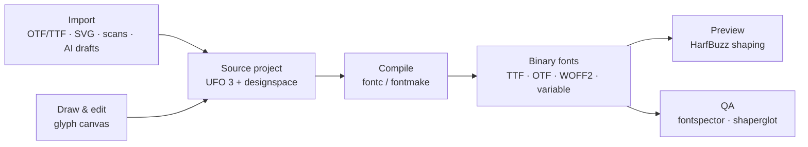
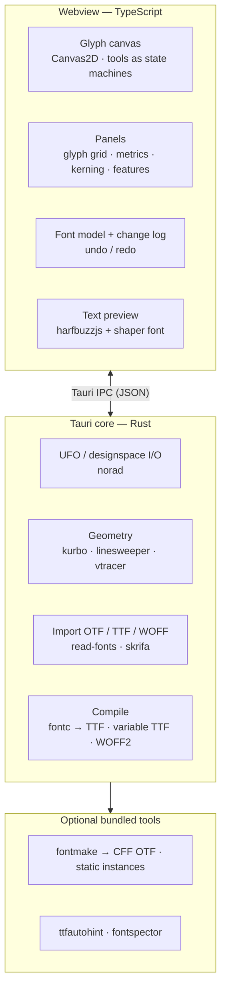

# Typefaced — Research Report

**Free font editors in 2026, and how to build a desktop font editor**

Compiled 2026-09-29. Sources are listed at the end. Items marked *(unverified)* could not be confirmed from a primary source. Nothing here is legal advice.

---

## TL;DR

- **Free landscape:**
  - FontForge (capable, dated, GPL) is still the only mature free desktop editor.
  - Fontra (modern, variable-first, GPL) runs its UI in a browser.
  - Glyphr Studio, FontStruct, Calligraphr and similar are web tools for beginners or for a single job.
  - 2025–26 brought a wave of alpha editors built on the Rust font toolchain (Shift, Runebender Xilem).
  - Paid pro editors are Mac-only (Glyphs 4, RoboFont) or expensive (FontLab 8, $499).
- **The gap:** there is no free, local, modern, Windows-first desktop editor that takes a non-expert from a sketch, handwriting or an AI draft to a finished, well-spaced font, while still producing professional source files.
- **How to build it:** don't wrap other apps' user interfaces; reuse their engines. Compiling (fontc/fontmake), text shaping (HarfBuzz) and the source format (UFO) are already solved by permissively licensed open-source components. Build your own UI on top of them.
- **Recommended stack:** Tauri 2 shell + TypeScript/Canvas2D editor + UFO 3/designspace as the native format + fontc 1.0 linked into the Rust core for compiling + harfbuzzjs for live text preview. Windows first. fontc only outputs TrueType-flavoured fonts, so add a fontmake sidecar later if you need CFF-flavoured OTF or static instances.
- **Using other apps:**
  - Saving UFO lets users round-trip to Fontra, FontForge, Glyphs and FontLab.
  - FontForge can run headless as a subprocess to import legacy formats.
  - If GPL-3.0 is acceptable, embedding Fontra is the fastest route to a full editor.
- **AI:** generators produce rough TTFs; general LLMs draw glyphs badly but write feature code well. Make AI optional and pluggable, and keep the core working on CPU only.
- **Differentiators worth building:** local handwriting → font, AI draft → finished font, proper spacing and kerning, and colour fonts without paywalls.
- **Decide first:** the license (permissive or GPL) and the target audience (see §11).

---

## 1. Existing free apps

Free options fall into four groups:

1. **One mature but dated desktop editor:** FontForge.
2. **Modern open-source editors** that run in a browser or are still early: Fontra, Glyphr Studio, and a wave of 2025–26 newcomers.
3. **Simple web and freemium tools** for one job each: FontStruct, Calligraphr, BitFontMaker2, and others.
4. **Specialty tools** for bitmap, icon and colour fonts.

No free, polished, native desktop editor covers the whole journey from first sketch to finished font on Windows.

### 1.1 Desktop editors

| App | License / cost | Platforms | Latest release | Formats (native → export) | Level | Scriptable / headless |
|---|---|---|---|---|---|---|
| **FontForge** | GPL-3.0, free | Windows, macOS, Linux | 2025-10-09, the first since Jan 2023; weekly commits | `.sfd` → TTF, OTF, WOFF/WOFF2, UFO, Type 1, SVG, BDF | Pro features, dated UI | Yes: Python module, `fontforge -script` |
| **Fontra Pak** | GPL-3.0, free | Windows 10+, macOS 11+, Ubuntu | 2026.9.1 (2026-09-29); about 2 releases a month | `.fontra`, UFO/designspace, `.glyphs` (partial write); reads TTF/OTF → TTF/OTF/WOFF2 via fontmake | Intermediate → pro; variable-first | Yes: `fontra` server CLI, workflow tools |
| **BirdFont** | GPL-3.0 source. Free binaries only for OFL fonts; $4.99 for commercial fonts; $9.99 "Plus" adds CFF, colour and variable output | Windows, macOS, Linux, BSD | Windows 6.15.5 (~Feb 2026, secondary source); the GPL source lags at 2.33.6 (Sep 2024) | `.birdfont` → TTF, EOT, SVG | Intermediate | Partly: `birdfont-export`, `-import`, `-autotrace` |
| **Bits'N'Picas** | MPL-1.1 / LGPL-3 | Java (all OSes) | 2.2.2 (2026-09-17) | Bitmap fonts → TTF, BDF, PSF, FNT and more; emoji as sbix/CBDT/SVG | Intermediate (bitmap) | Yes: command-line converters |
| **Private Character Editor** (`eudcedit`) | Built into Windows | Windows | Present in Windows 11 | Private Use Area symbols only, 64×64 grid | Beginner | No |
| **FontLab Pad 2** | Freeware | Windows, macOS | 2.0 (2026-09-17) | Opens fonts → PNG/SVG/PDF. **Cannot edit glyphs or export fonts** | Viewer only | No |
| TruFont | GPL-3.0 | Windows, macOS, Linux | 0.6.6 (2020); discontinued | UFO → OTF/TTF | — | — |
| Fony, Type light | Freeware | Windows | Frozen (≈2015 or earlier) | Bitmap / TTF | Beginner | No |

### 1.2 Web, freemium and specialty tools

| App | License / cost | Latest | Formats | Level | Notes |
|---|---|---|---|---|---|
| **Glyphr Studio 2** | GPL-3.0, free; runs in the browser, can be self-hosted | v2.10.5 (2026-09-18) | `.gs2` JSON; imports OTF/TTF/WOFF/SVG → OTF, TTF, WOFF, WOFF2 | Beginner → intermediate | One maintainer, monthly releases. No variable fonts, colour or hinting |
| **FontStruct** | Free (ads/sponsors); colour only for patrons | New features Apr 2025 | Modular "brick" grid → TTF, WOFF2, COLRv0, `.glyphs` | Beginner | The grid limits what you can draw; each author picks a license |
| **Calligraphr** | Free: 75 characters, 1 font, 2 variants. Pro: €10/month, or €6/month on a 6-month plan | Live service | Handwriting on a scanned template → TTF/OTF | Beginner | Fonts belong to the user; commercial use allowed |
| **FontCrafter** | Free; everything runs locally in the browser | Launched 2026-03-06 | Handwriting → OTF/TTF/WOFF2 | Beginner | Automatic ligatures and alternates |
| **BitFontMaker2** | Free | Unchanged since ~2012 | 16×16 pixel grid → TTF | Beginner | — |
| **Metaflop** | Open source; output fonts are OFL | Maintained in 2026 | Metafont sliders → OTF + web font | Beginner (parametric) | — |
| **Fontello** | MIT, free | Last commit 2022 | SVG icons → TTF/WOFF/WOFF2 + CSS | Icon fonts | Has a CLI |
| **IcoMoon** | Free: 1 project, no WOFF2, download links expire after 24 h. Paid: $9–29/month | Live service | SVG → icon fonts (TTF/OTF/WOFF, COLRv0) | Icon fonts | — |
| **nanoemoji** (Google) | Apache-2.0 | 0.16.0 (2026-08-11) | SVG → COLRv0/v1, OT-SVG, CBDT, sbix | Pro (command line) | The standard free route to colour and emoji fonts |
| **Inkscape** SVG Font Editor + Typography extensions | GPL, free | 1.4.4 (2026-05-06) | Makes SVG fonts only; FontForge is needed to convert them to TTF/OTF | Beginner | — |

**Defunct or frozen:** Prototypo (shut down; code MPL-2.0 but assets proprietary), Fontark (site down), PaintFont (now redirects to Calligraphr), gerb, MkFont, TruFont, the original Druid-based Runebender, Microsoft Font Maker (unmaintained), MyScriptFont (unreachable *(unverified)*).

### 1.3 New entrants (2025–2026)

A wave of new open-source editors built on the Rust font toolchain appeared in 2025–26. That confirms where the ecosystem is heading (the stack in §5), and it means "a modern editor" alone won't stand out.

| Project | Stack / license | Status | Notable |
|---|---|---|---|
| Runebender Xilem | Rust + Xilem GUI; Apache-2.0/MIT | Alpha; daily commits; no releases yet | Hyperbezier pen, image autotrace, fontc export; `runebender-core` CLI and MCP server |
| Shift | Electron + Rust; Apache-2.0/MIT | Pre-release v0.1 nightlies (Aug 2026) | SQLite-based `.shift` format; loads UFO/designspace/TTF/OTF; fontc export in progress; kerning and feature UI planned after v0.8 |
| Colr Pak | Fork of Fontra Pak; GPL-3.0 | 0.7.6 (Jul 2026) | Editor for COLRv1 colour fonts |
| Bezy | Rust + Bevy; GPL-3.0 | No release; last push Nov 2025 | Text-editor-style; terminal UI aimed at AI-agent workflows |
| Nib | Web; free beta | 2026 | Real-time collaboration and AI-generated glyphs. Early feedback: no group kerning, AI glyphs ignore metrics |
| Typlr | Web beta; free tier, $9/$24 per month | 2026 | Masters and axes, AI kerning; warns users of possible data loss |

### 1.4 Paid reference apps

| App | Price | Platforms |
|---|---|---|
| Glyphs 4 (released 2026-07-27) | €/$319 (upgrade from 3: $199) | macOS 12+ only |
| Glyphs Mini 2 | €49 | macOS only |
| FontLab 8 (8.4.x) | $499 perpetual (3-month "Starter" $97) | Windows, macOS |
| RoboFont 4.6 | €400 | macOS only |
| FontCreator 16 (2026-04-29) | Store: $49 Essentials / $199 Professional. The launch post describes one edition plus a subscription; the sources conflict | Windows, macOS |
| Fontself Maker | Illustrator $39 on sale (list $98); Illustrator + Photoshop $59 (list $78) | Adobe plug-in, Windows/macOS |

### 1.5 Online "AI font generators" (freemium)

These are web services that turn a prompt, an image or handwriting into a font file. They are useful benchmarks for what users now expect, and for what goes wrong.

| Product | Output | Free tier | Paid | Notes |
|---|---|---|---|---|
| Mixfont | TTF from prompt or image | 50 credits | Pro $20/mo, Max $200/mo | Allows commercial use and resale. Its own blog admits baseline, kerning and letter-width problems; 3–4 min per generation |
| Creative Fabrica Font Generator | TTF, basic Latin only | ~5 fonts | Subscription | Diffusion-based. License terms *(unverified)* |
| YoFont | TTF / OTF / WOFF / WOFF2 | 100 glyphs | $9–24.50/mo | Claims 60 languages incl. CJK; non-Latin quality *(unverified)* |
| Lipi.ai | OTF / TTF / WOFF2 | Editing is free | Pay to export (price not published) | Browser glyph editor plus generation |
| Coki Fonts, GLIPH, MakeFont, InkToType | TTF from image or handwriting | Coki: 5 fonts; GLIPH: 10 credits | Coki: $5 per 10 credits | — |

Tools that are often called "AI font generators" but do **not** produce installable fonts: Recraft V4 (SVG only), Kittl (letter images), Adobe Firefly Text Effects (images of up to 20 characters), Picsart, FontVibe, and the "fancy text" sites (Unicode substitution). Monotype's AI features are for *finding* fonts, not designing them. Adobe's "Project Glyph Ease" (one drawn letter → full glyph set) was a MAX 2023 demo with no shipping product found *(unverified)*.

**Quality today:** a hands-on test published 2026-09-28 (GeekExtreme) found that prompt → TTF works, but every tool's output needed manual refinement, and kerning, ligatures and per-glyph control were weak across the board. None of the big paid editors (Glyphs 4, FontLab 8, FontCreator 16) advertises generative AI.

---

## 2. Gaps and opportunities

**What users complain about** (from TypeDrawers, Hacker News and GitHub; Reddit could not be crawled)

1. **The most capable free tool feels dated.** FontForge is described as unpolished but reliable, with an old-fashioned interface. Dave Crossland (Google Fonts) has called its codebase a monument worth conserving but not restoring.
2. **Free tools lag on modern formats.** FontForge cannot design variable or colour fonts natively.
3. **Users chain several tools**, e.g. Fontra for variable fonts, FontForge for OpenType tables and something else for colour, and report hand-fixing UFO files after round trips.
4. **Colour fonts are fragmented or paywalled:** BirdFont Plus, FontStruct patrons, IcoMoon's paid tiers. Fontra has no colour plans. Safari still doesn't render COLRv1, so exporters must also produce fallback formats.
5. **The pro tier is Mac-only or expensive.** Glyphs and RoboFont are macOS-only, which leaves Windows users with FontLab ($499) or FontCreator. In the Hacker News thread about Glyphs 4, a hobbyist without a Mac compared FontForge vs Glyphs to a life raft vs a yacht.
6. **Spacing and kerning are weak spots** in free and new tools: Nib lacks group kerning; Glyphr Studio only added kerning classes in June 2026.
7. **Hinting has a gap.** ttfautohint can't hint variable fonts, and among free tools only FontForge does real hinting.
8. **Slow releases and single maintainers.** FontForge went 33 months without a release. BirdFont, Glyphr Studio and most newcomers are one-person projects.
9. **Freemium caps and license friction:** Calligraphr's 75-character limit, BirdFont's OFL-only free builds, FontCraft's personal-use-only free tier, IcoMoon's 24-hour download links.
10. **Approachability and trust matter.** Commenters on Brutalita (below) mostly asked for basics: undo/redo, moving points, editing existing letters. Typlr warns of possible data loss; FontCrafter's main pitch is that nothing leaves your device.

**Evidence of demand**

- **Handwriting fonts are popular.** On Hacker News, "FontCrafter" (a local, in-browser handwriting-to-font tool) got 482 points and 157 comments (March 2026). "Making a font of my handwriting" got 337 points (September 2025); its author gave up on FontForge and Inkscape and paid for Calligraphr.
- **A friendly UI alone is not enough.** Brutalita, a simple experimental editor, got 601 points (September 2025), but new beginner web editors in 2026 (FontBob, Nib) got almost no traction. A new tool needs a clear hook.

**Opportunities, ranked**

1. **A free, offline, Windows-first (and cross-platform) editor with a modern UI.** This is the clearest gap. FontForge works but is dated; Fontra is modern but runs in a browser tab and is GPL; the new Rust-based editors are alpha; the polished editors are paid or Mac-only.
2. **Local handwriting → production-quality font.** Multiple variants per letter, ligatures, automatic accented letters, spacing and kerning, and editable Bézier outlines, without Calligraphr's 75-character free limit and without uploading anything.
3. **"AI draft → finished font."** The web generators stop at a rough TTF, and the desktop editors don't help finish one. Import or generate a draft, then clean up outlines, check consistency, auto-space and kern, run QA and export.
4. **Spacing and kerning done properly.** Group kerning, auto-spacing and auto-kerning are weak or missing in free and new tools, while FontLab and Fontself have taught users to expect them in one click.
5. **Colour fonts without paywalls.** COLRv1 authoring with automatic fallbacks (COLRv0 or OT-SVG) for Safari. Today colour is paywalled (BirdFont Plus, FontStruct patrons, IcoMoon) or needs a separate fork (Colr Pak).
6. **More scripts for non-experts.** Latin Extended and Vietnamese can be built mostly from components; Greek and Cyrillic could start from AI drafts. CJK is attractive but most models and datasets are non-commercial.
7. **Variable fonts for non-experts.** Automatic point-compatibility fixing between masters, and research-grade tools that draft extra axes from a static font (NIV, 2026).

**Cross-cutting principle: trust.** Work locally, never lose data (autosave, crash recovery, plain-text formats), and never lock users in (always export UFO).

---

## 3. How a font editor works (short primer)

A font editor never works directly on the installable font. It edits a **source** project and **compiles** it into binary fonts, the way a code editor edits source files that a compiler turns into an executable.

**What a font source contains**

- **Glyphs:** outlines made of Bézier contours (cubic curves in PostScript/CFF fonts, quadratic in TrueType), **components** (reused glyphs, e.g. `é` = `e` + `acutecomb`), **anchors** (where accents attach), advance width and sidebearings.
- **Font-wide data:** vertical metrics (units per em, ascender, descender, x-height, cap height), kerning (pairs and groups), OpenType feature code (`.fea`: ligatures, alternates, mark positioning), names and license metadata, hinting.
- **Masters and axes** for variable fonts (e.g. Light ↔ Bold), described by a *designspace* file.

**Rules of thumb**

- Keep a text-based source format as the working format. Binary fonts lose editing information: kerning groups, feature source code, cubic curves (in TrueType), master structure.
- Treat importing a TTF/OTF as *conversion to source*, not as editing the binary.
- Don't write your own compiler. OpenType compilation (tables, feature compilation, variations, subroutinization) is where most of the complexity lives, and two maintained open-source compilers already exist.

**What the editor itself must do** (the feature set pro editors share)

- **Pen tool:** click places a corner point; click-drag places a smooth point with handles; Shift constrains to 0/45/90°; Alt breaks the handles; close or continue contours; add points on a segment.
- **Pointer tool:** marquee and Shift selection; arrow-key nudges of 1/10/100 units; double-click toggles smooth ↔ corner; smooth points keep their handles collinear; moving a node while keeping its handles.
- **Other tools:** knife (cut contours), shapes, set start point, reverse contour direction, measurement ruler.
- **Structure:** components (transform, decompose), anchors, per-glyph and font-wide guidelines.
- **Metrics:** metrics lines, sidebearings, kerning; several glyphs in one edit line so letters are designed in context.
- **Other essentials:** background layer or image for tracing, remove overlap, cubic ↔ quadratic conversion, compatible masters for interpolation, undo/redo.

---

## 4. Ways to build Typefaced — using other apps or not

There are five basic approaches. They can be mixed.

| Approach | How it works | Effort | Control over UX | License impact | Capability ceiling | Main risk |
|---|---|---|---|---|---|---|
| **A. Own editor on open-source libraries** | Your own UI; compile with fontc or fontmake; shape text with HarfBuzz | High: months to an MVP, years to parity with pro tools | Full | Your choice; the key libraries are permissive (MIT / Apache-2.0) | Highest | Scope creep (many open editors died this way) |
| **B. Embed or fork Fontra** | Bundle Fontra's Python server as a sidecar and show its web UI in your own window; extend with plugins | Low to start, grows as you diverge | Medium | The distributed app becomes GPL-3.0; you must offer source | High today (variable fonts, kerning, features, HarfBuzz) | Fast-moving upstream; Python + JS + server stack; immature plugin API |
| **C. Drive FontForge headlessly** | Call `fontforge -script` as a subprocess for conversions and outline operations | Medium (you still build the whole editor) | Full UI; fixed backend | Fine at arm's length; ship its GPL binary with a source offer | Broad but aging | Awkward Python setup on Windows; slow release cadence |
| **D. Plugin for an existing app** | Extend FontLab, Glyphs, RoboFont, Figma or Illustrator | Low | The host app's UX | The host's terms; your code can stay closed | Limited by the host; not a standalone app | Hosts are Mac-only or costly |
| **E. Pipeline from vector tools** | Draw in Inkscape/Figma, export SVG, build the font | Low | None over drawing | Minimal | Icon and display fonts only | Round-trip friction; weak product |
| **F. Borrow from a permissively licensed editor** | Reuse code or ideas from Shift (Electron + Rust) or Runebender Xilem / `runebender-core` (Rust) | Medium | Full | Apache-2.0/MIT: any license, keep their notices | Grows with you | Both are pre-release, single-maintainer projects |

**How each one works in practice**

- **B. Fontra.** Fontra Pak (Fontra's desktop app) is already a PyInstaller bundle: a small PyQt6 launcher starts the Python server on a free port and opens the editor in the *system browser*. Typefaced could do the same but load `localhost:{port}/editor.html?project=…` inside its own window, then add features through Fontra's Python entry points (file backends, views, project managers) or its early JS panel plugins. It is the fastest way to a full-featured editor, but you inherit Fontra's UX and its release churn, and the whole app must be GPL-3.0.
- **C. FontForge.** Scripts run with `fontforge -script x.py` or `fontforge -lang=py -c "…"` open no windows and can convert and generate formats, merge fonts, remove overlaps, simplify, autohint and validate. On Windows there is no PyPI package, and normal CPython cannot import FontForge's module, so a subprocess is the only practical route. Best used as an optional helper for legacy formats, not as the core.
- **D. Plugins.** Glyphs 3/4 and RoboFont are macOS-only, so they can't even be developed for on Windows. FontLab 8 ($499, Windows and macOS) embeds Python 3.11. Figma plugins that export TTF/OTF exist (Vector Type, FontSmith, Fontic, FigType, Typemaker, and SVG2Fontify for icon fonts), as does Fontself Maker for Illustrator/Photoshop. All keep the host's UX, and none is a standalone app.
- **E. Pipelines.** Inkscape can be scripted (`--actions`), and its Typography extensions and SVG Font Editor produce an *SVG font*, which still needs another tool to become TTF/OTF. BirdFont's `birdfont-import` / `birdfont-export` CLIs work but tie you to its format and a nearly stalled project.
- **F. Permissive newcomers.** Shift and Runebender Xilem are Apache/MIT-licensed, built on fontc and active in 2026. Their code can be reused in Typefaced under any license, as long as their notices are kept. Both are pre-release, so treat them as references and a parts bin, not as foundations.

**Recommendation: A, with a hybrid twist.** Build your own UI, but don't rebuild the engines: use the open-source compilers, shaper and file formats that the professional open-source toolchain already relies on. Save in UFO so users can open their work in Fontra, FontForge, Glyphs, RoboFont or FontLab whenever Typefaced lacks a feature. Optionally call FontForge as a subprocess to import legacy formats, and use F as a parts bin.

If you are happy for Typefaced to be GPL-3.0 and want a full feature set as fast as possible, B is the alternative.

**Positioning:** several teams are building "a modern, fontc-based editor" (Shift, Runebender Xilem, Bezy), so that alone won't make Typefaced stand out. Lead with the differentiators in §2: Windows-first polish, handwriting, AI draft → finished font, and spacing/kerning.

**Lessons from open-source editors that stalled** (TruFont, Runebender, MFEK, Metapolator, Prototypo):

- TruFont died when its author started a rewrite with a new data format *and* a new widget toolkit, then left with both unfinished.
- Runebender (Rust) was built alongside its own GUI toolkit (Druid). The toolkit's abstractions never settled, Druid was discontinued, and the editor never became usable.
- So: don't build a GUI toolkit and an editor at the same time; don't change the data model halfway through; reuse standard formats and compilers; plan for being the only maintainer.

---

## 5. Recommended architecture

**Tauri 2 shell + TypeScript/Canvas2D editor + UFO/designspace files + fontc compiler in the Rust core + harfbuzzjs preview.** Windows first.

| Layer | Choice | Why |
|---|---|---|
| Desktop shell | **Tauri 2** (Rust; 2.11.5 as of July 2026) | Installers of a few MB; WebView2 on Windows is Chromium and ships with Windows 11; built-in sidecars and signed auto-updates |
| Editor UI | **TypeScript + Vite**; imperative **Canvas2D** glyph view; **React** (or Svelte) for panels only | Fontra proves Canvas2D is enough for a serious glyph editor; TypeScript/React is where AI coding assistants are strongest |
| In-memory font model | TypeScript: packed paths with point types and a smooth flag; every edit recorded as a change object with a rollback change | Gives undo/redo and multi-window sync from one mechanism (Fontra's design) |
| Native file format | **UFO 3 + designspace** | Open standard; round-trips with Fontra, FontForge, Glyphs, RoboFont and FontLab |
| File I/O (Rust) | **norad** (UFO 3 + designspace read/write); later **babelfont-rs** to import `.glyphs` / `.fontra` / `.sfd` | JavaScript has no maintained UFO library; norad is what fontc itself uses |
| Geometry (Rust) | **kurbo** (Bézier math, curve fitting, cubic → quadratic); **linesweeper** (beta) or **skia-safe** PathOps for remove-overlap | fontc 1.0 doesn't remove overlaps itself |
| Import binary fonts (Rust) | **read-fonts / skrifa** (fontations) | Outlines, metrics, character map and kerning are straightforward. Turning GSUB/GPOS back into `.fea` code must be written, or delegated to Python's ufo-extractor |
| Compiler | **fontc 1.0** (2026-09-01; MIT/Apache-2.0), linked into the Rust core through `fontc::generate_font`; its ~6 MB CLI is the fallback | Fast; no Python runtime; one binary; you control the build targets, including Windows ARM64, which has no official fontc build. Outputs static and variable **TTF only** |
| WOFF2 | **woofwoof** or **ttf2woff2** crate | fontc has no WOFF2 output |
| Hinting (optional) | **ttfautohint** CLI under the FreeType License | Static TTF only; nothing autohints variable fonts today |
| Optional compiler | **fontmake** sidecar (PyInstaller; CPython ≥3.11) | Only for CFF-flavoured OTF, static instances from a variable source, or designspace 5 features that fontc 1.0 lacks |
| Live text preview | **harfbuzzjs** + **build-shaper-font** (Apache-2.0, npm) | Real OpenType shaping while outlines are drawn live from the model, without recompiling — the method Fontra adopted in March 2026 |
| Image tracing | **VTracer** (MIT, Rust) | For handwriting and image import; avoids GPL-licensed potrace |
| QA | **fontspector** (Apache-2.0) | Rust successor to fontbakery |

**Design rules**

- Put the Tauri-specific calls behind a small "host API" module, so Electron could replace Tauri if WebKit problems on macOS or Linux get in the way.
- Keep the canvas imperative (not rendered by React): cached `Path2D` objects, z-ordered drawing layers (metrics, guidelines, anchors, handles, nodes, selection), and redraws batched on events rather than a constant animation loop.
- Model each tool as a small state machine.
- The TypeScript model holds the live editing state. The Rust core loads and saves UFO and compiles. Start by saving a UFO and compiling that; later, implement fontc's `Source` trait on the in-memory model for near-instant builds.
- Pin the fontations and fontc crate versions. They are pre-1.0 (apart from fontc itself) and make breaking changes roughly monthly, so upgrade them deliberately and together.
- Stick to the designspace features fontc 1.0 understands (the v4 level) unless the fontmake sidecar is present.
- When coding with an AI assistant, put the Tauri **2** docs in context; Tauri 1 examples are common and incompatible.
- If Typefaced will not be GPL, study Fontra, FontForge, Glyphr Studio and BirdFont for design ideas but do not copy their code, and tell your AI assistant the same.

**MVP scope** (one master, static font): pen, pointer and knife tools; smooth and corner nodes; components; anchors; metrics and sidebearings; multi-glyph edit line; undo/redo; background image; open/save UFO; export TTF and WOFF2. Then kerning, then a `.fea` feature editor, then masters and variable fonts.

**Alternatives considered**

| Option | When it wins | Trade-off |
|---|---|---|
| Electron 44 | You need identical rendering on Linux (Tauri issue #5761: ~5 FPS canvas under WebKitGTK vs 17–30 FPS in Chromium) | 80–200 MB installers |
| Python + PySide6 (Qt 6.11) | You want the entire Python font toolchain in-process | Heavier packaging; C++/Qt UI work is slower with AI assistance; no built-in updater. PySide6 is LGPLv3 (PyQt6 is GPL or commercial) |
| Fontra inside a Tauri window | You accept GPL-3.0 and want a full editor fastest | UX and roadmap tied to upstream |
| Flutter 3.47 / Avalonia 12 | Strong canvases | No font tooling in Dart; little in .NET |
| Rust-native GUI (egui 0.34, iced 0.14, Slint, Xilem alpha, GPUI) | Maximum performance | Immature or tied to other projects; Runebender shows the cost |

---

## 6. Libraries, formats and specs

Versions were checked against PyPI, crates.io, npm and GitHub on 2026-09-29.

### 6.1 The compile step: fontc vs fontmake

| | fontc 1.0.0 (Rust) | fontmake 3.12.1 (Python) |
|---|---|---|
| Released | 2026-09-01, its first stable release | 2026-06-02 |
| Packaging | One ~6 MB executable, or linked in-process as a Rust library | CPython ≥3.11 plus ~32 MB of compressed wheels |
| Inputs | UFO, designspace (v4 feature level), `.glyphs`, `.glyphspackage`, `.fontra` (experimental) | UFO, designspace 5, `.glyphs` |
| Outputs | Static and variable **TTF only** | TTF, OTF (CFF), CFF2, variable, static instances |
| Overlap removal / hinting / WOFF2 | None / none / none | Yes / via ttfautohint / via fontTools |
| Speed | "10× or more faster" is Google's design goal; no public benchmark found | Pays Python start-up time on every run |
| Maturity | ~89% of ~3,450 Google Fonts builds come out identical to fontmake's after normalisation, and Google Sans Code ships with it. **Not yet Google Fonts' default compiler** (gftools still defaults to fontmake) | The industry-standard open-source compiler |

Since 1.0, fontc has merged avar2 support (2026-09-11). Overlap removal (using linesweeper) and VARC support are open pull requests.

**Choice for Typefaced:** fontc in-process for fast TTF and variable export, Rust crates for WOFF2 and overlap removal, and ttfautohint for hinting. Add fontmake as an optional sidecar for CFF-flavoured OTF and static instances.

### 6.2 Key libraries by language

**Rust** (recommended core)

| Crate | License | Version | Role | Caveats |
|---|---|---|---|---|
| fontations: read-fonts, write-fonts, skrifa, font-types | MIT/Apache-2.0 | 0.44 / 0.53 / 0.47 / 0.12.5 (Sep 2026) | Read and write OpenType tables. skrifa draws outlines at any variation location and runs in Chrome | Pre-1.0, with breaking changes about monthly. No CFF/CFF2 writer |
| fontc | MIT/Apache-2.0 | 1.0.0 | Compiler (see 6.1); includes fea-rs for `.fea` | TTF only |
| norad | MIT/Apache-2.0 | 0.18.4 | UFO 3 + designspace read/write | — |
| kurbo | MIT/Apache-2.0 | 0.13.1 | Bézier math, offsetting, curve fitting, cubic → quadratic | No boolean operations |
| linesweeper | MIT/Apache-2.0 | 0.4.0 | Boolean operations on Bézier paths (remove overlap) | "Early beta"; repo moved to Radicle |
| skia-safe | MIT (Skia is BSD-3) | 0.153.3 | Full Skia, including PathOps | Heavy to build from source; prebuilt Windows binaries exist |
| harfrust | MIT | 0.13.3 | HarfBuzz ported to Rust (rustybuzz is archived) | A little slower than HarfBuzz; no Graphite |
| vtracer | MIT/Apache-2.0 | 0.6.5 (1.0 in alpha) | Raster → vector tracing | 1.0 API still changing |
| babelfont-rs | MIT/Apache-2.0 | 0.2.1 | Read/write UFO, designspace, Glyphs 2/3, Fontra, SFD; basic VFJ reading | Early development |
| fontspector | Apache-2.0 | 1.8.0 | Font QA (Rust port of fontbakery): Windows binary, library crate, WASM build | — |
| woofwoof / ttf2woff2 | MIT/Apache-2.0 | 1.0.2 / 0.13.3 | WOFF2 encoding (woofwoof also decodes) | Small maintainer teams |

**Python** (optional sidecar; the most complete toolchain)

| Library | License | Version | Role |
|---|---|---|---|
| fontTools | MIT | 4.66.0 (needs Python ≥3.11) | Everything binary: all tables, WOFF2, feaLib, varLib (avar2, VARC), instancer, subsetter, designspaceLib 5.1 |
| ufoLib2 / defcon / fontParts | Apache-2.0 / MIT / MIT | 0.18.1 / 0.12.2 / 1.1.1 | UFO I/O; an object model with change notifications; a scripting API |
| fontmake + ufo2ft | Apache-2.0 / MIT | 3.12.1 / 3.9.1 | The compiler and its UFO → binary pipeline |
| glyphsLib | Apache-2.0 | 6.15.0 | `.glyphs` (v2/v3) ↔ UFO + designspace |
| skia-pathops / booleanOperations | BSD-3 / MIT | 0.9.2 / 0.10.0 | Overlap removal (skia-pathops is faster) |
| ufo-extractor | MIT | 0.8.1 | OTF/TTF/WOFF → UFO (VFB import needs the GPL vfbLib) |
| uharfbuzz | Apache-2.0 | 0.56.2 | HarfBuzz bindings |
| ttfautohint-py / cffsubr | MIT (+FTL) / Apache-2.0 | 0.6.1 / 0.4.0 | Hinting (18 MB Windows wheel); CFF subroutinizer |
| nanoemoji + picosvg | Apache-2.0 | 0.16.0 / 0.23.0 | SVG → colour fonts |
| fontbakery | Apache-2.0 | 1.1.0 | QA. Effectively replaced by fontspector: gftools switched in Sep 2026 |

**JavaScript / TypeScript** (webview side)

| Library | License | Version | Use it for | Caveats |
|---|---|---|---|---|
| harfbuzzjs | MIT | 1.6.2 | Shaping preview in the webview | — |
| opentype.js | MIT | 2.0.0 (May 2026, revived) | Reading fonts; quick CFF-flavoured OTF output | Cannot write TrueType outlines, GPOS/kerning or variations, so it can't be Typefaced's compiler |
| ot-builder | MIT | 1.8.1 | Full binary read/write, including CFF2, GSUB/GPOS and variations | Small community; no `.fea` compiler |
| canvaskit-wasm | BSD-3 | 0.42.0 | Skia in WASM (PathOps, rendering), if Canvas2D ever falls short | Multi-MB download |
| woff2-encoder | MIT | 2.0.0 | WOFF2 in WASM | — |
| fontkit, paper.js | MIT | 2024 | — | Dormant |

There is **no maintained UFO library in JavaScript**, which is one reason file I/O belongs in the Rust core.

**C/C++, .NET and tracing**

- **HarfBuzz 14.5.0** (Old MIT) and **FreeType 2.14.3** (FTL/GPLv2): the shaping and rendering engines underneath almost everything.
- **AFDKO 5.0.1** (Apache-2.0): Adobe's CFF toolchain (`addfeatures`, `tx`, `otfautohint`). Wheel for win_amd64 only.
- **ttfautohint 1.8.4** (FTL/GPLv2): static TrueType only; dormant since 2021.
- **.NET:** SixLabors.Fonts reads fonts but cannot write them, and its split license requires a commercial license for companies with over $1M revenue. SkiaSharp and HarfBuzzSharp (MIT) are bindings. Not a good base for a font editor.
- **Tracing:**
  - potrace: GPL-2.0+; a commercial license is sold separately.
  - AutoTrace: GPL/LGPL; supports centreline tracing.
  - **VTracer: MIT/Apache-2.0, the safe choice.**

### 6.3 Minimal core per stack

| Need | Rust | Python | JS/TS |
|---|---|---|---|
| Source read/write | norad | ufoLib2 / defcon, designspaceLib, glyphsLib | **Gap:** no maintained UFO library |
| Import OTF/TTF/WOFF | read-fonts / skrifa + a WOFF2 decoder. **Gap:** the binary → source converter (especially GSUB/GPOS → `.fea`) must be written | fontTools + ufo-extractor | opentype.js 2 or ot-builder |
| Compile static + variable | fontc (TTF only) | fontmake / ufo2ft (everything) | ot-builder + your own interpolation |
| `.fea` features | fea-rs (inside fontc) | feaLib | **Gap:** fontTools under Pyodide, or fea-rs built to WASM |
| WOFF2 | woofwoof / ttf2woff2 | fontTools + brotli | woff2-encoder |
| Overlap removal | linesweeper or skia-safe | skia-pathops | canvaskit-wasm |
| Autohinting | **Gap:** bundle ttfautohint | ttfautohint-py, otfautohint | **Gap** |
| Shaping preview | harfrust | uharfbuzz | harfbuzzjs |
| QA | fontspector | fontspector (fontbakery is legacy) | **Gap:** fontspector binary |

**Takeaway:** a Rust core with a TypeScript UI covers everything needed for TrueType-flavoured fonts. The exceptions are autohinting (bundle ttfautohint) and full import of OpenType features. Python remains the fallback for CFF output, static instances and the most complete import.

### 6.4 Source formats

| Format | Status | Tooling |
|---|---|---|
| **UFO 3** (+ single-file `.ufoz`) | Open, vendor-neutral spec. There is no UFO 4 spec, only proposals | fontTools/ufoLib2/defcon, norad, fontmake, fontc, Fontra, RoboFont, babelfont |
| **designspace 5.0/5.1** | 5.0 added discrete axes, multiple variable fonts and STAT labels; 5.1 added axis mappings (avar2) | fontTools, norad. **fontc 1.0 supports only the v4 feature level** |
| Glyphs 3 (`.glyphs`, `.glyphspackage`) | Public spec (GlyphsSDK), controlled by one vendor | glyphsLib, glyphslib-rs, fontc, Fontra |
| `.fontra` | Folder of JSON/CSV/`.fea` files; no formal spec (defined by GPL code) | Fontra, fontc (experimental), babelfont-rs |
| `.babelfont` JSON | Lossless, with TypeScript types | babelfont-rs (early) |
| FontForge `.sfd` | Documented, but the docs are often out of date | FontForge |
| FontLab `.vfj` | JSON with no public schema | babelfont-rs (basic reading) |

**Recommendation:** UFO 3 + designspace 5 as Typefaced's native format, with `.ufoz` as a single-file option.

- It is the only format that both compilers and both library ecosystems (Python and Rust) read and write. It diffs well in git, and every major editor imports and exports it.
- Store Typefaced-only data under reverse-DNS keys in the UFO `lib` (e.g. `com.typefaced.*`).
- Offer import and export for `.glyphs` and `.fontra`.
- Gap: UFO has no standard for variable or "smart" components. If Typefaced needs them, model them internally and map them to Glyphs smart components or VARC on export.

### 6.5 OpenType spec status

- **Spec versions:** Microsoft's OpenType spec is still **1.9.1 (May 2024)**. **ISO/IEC 14496-22:2026** (Open Font Format, 5th edition) was published around July 2026 *(month partly verified)*. It reportedly adds avar2, more than 64k glyphs, VARC (variable components) and cubic curves in TrueType (`glyf` v1).
- **avar2:** ships in Chrome, Firefox and Apple platforms. fontTools builds it from designspace 5.1, and fontc merged support after 1.0.
- **VARC:** supported by fontTools, HarfBuzz and Fontra. fontc support is an open pull request.
- **COLRv1 colour fonts:** work in Chrome, Edge and Firefox, but **not Safari** (as of May 2026), so export fallbacks too.
- **More than 64k glyphs, and cubic curves in `glyf`:** little platform support yet.
- **Incremental Font Transfer:** a W3C Candidate Recommendation Draft (Nov 2025); Chrome lists it only as "proposed". Not relevant to an editor MVP.

### 6.6 Windows notes

- The Python toolchain has win_amd64 wheels for everything, but **no Windows ARM64 wheels** for skia-pathops, uharfbuzz, ttfautohint-py, afdko or fontc.
- Linking fontc into Typefaced's own Rust core lets you build native Windows ARM64 binaries yourself.

---

## 7. AI and automation

### 7.1 What works today

- **General LLMs are bad at drawing glyphs but good at font code.** In the VecGlypher paper's text-to-glyph benchmark (relative OCR accuracy), Claude Sonnet 4.5 scored 46.7, GPT-5 44.0 and Gemini 2.5 Pro 24.0, against about 100 for the specialised model. Use general LLMs for feature code, metadata and explanations, not for outlines.
- **Specialised models exist but are heavy, Latin-first, or restrictively licensed:**

| Model | Output | Code / weights / license | Practical notes |
|---|---|---|---|
| VecGlypher (CVPR 2026, Meta) | SVG paths directly | Code Apache-2.0; 27B weights under an "other" (Gemma-based) license | Only 62 Latin letters and digits; ~54 GB of weights (BF16). A community 4-bit build (~16 GB) might fit a 24 GB GPU *(unverified)* |
| DeepVecFont-v2 (CVPR 2023) | SVG | MIT; weights | Needs 4 reference glyphs for Latin; Chinese training data is non-commercial |
| DualVector (CVPR 2023) | SVG | MIT; weights | Needs a patched diffvg (CUDA) |
| FontDiffuser (AAAI 2024) | Raster | Non-commercial research only | Chinese-focused |
| StarVector 1B/8B (CVPR 2025) | Image/text → SVG | Apache-2.0 | Best for icons and logos |
| OmniSVG 1.1 4B/8B | Image/text → SVG | Weights Apache-2.0; dataset CC BY-NC-SA | 8B needs 26 GB VRAM; 5–98 s per SVG |
| NIV (June 2026) | Static TTF → variable TTF (weight, width, slant, optical size) | Code, models and data on GitHub; license *(unverified)* | Trained on Google Fonts variable fonts |
| Ref2Font V3 | An "Aa" sample → glyph atlas → TTF | Repo MIT; the 9B base model is non-commercial | FLUX.2 klein 4B is Apache-2.0 (~13 GB VRAM) |

### 7.2 Automation that doesn't need AI

- **Spacing:** HT Letterspacer's area/depth/overshoot method is documented (docs CC BY 4.0), so it can be reimplemented cleanly; the plugin itself is GPL-3.0 and Glyphs-only. FontLab 8 and Fontself already offer one-click auto-spacing and auto-kerning, so users will expect it.
- **Kerning:** Kern On (commercial, Glyphs-only) learns from a few "model pairs" the designer kerns. ML approaches such as atokern (MIT) are experimental.
- **Hinting:** ttfautohint is dual-licensed FreeType License / GPLv2 (use it under the FreeType License). It handles static TrueType only and has been dormant since 2021 (1.8.4). otfautohint (in AFDKO, Apache-2.0) handles CFF/CFF2. No tool autohints variable fonts.

### 7.3 Handwriting → font pipeline

How the best current tools do it (FontCrafter, 2026, fully local in the browser):

1. Print a template with coloured corner markers; the user writes one character per cell.
2. Scan or photograph; correct perspective from the markers, then compute cell positions arithmetically (more robust than detecting boxes).
3. Adaptive threshold, then connected components to isolate each character; drop stray specks (they inflate sidebearings).
4. Trace contours, then smooth and fit curves. Typefaced would use VTracer plus curve fitting (e.g. kurbo) to get clean Béziers.
5. Normalise to baseline and x-height; auto-space.
6. Cycle 2–3 variants per letter with the OpenType `calt` feature so text doesn't look mechanical; add ligatures; build accented letters automatically from components.

Open-source references: builtree/handwrite (MIT; potrace + FontForge), HandFonted (MIT; template-free, uses OCR), draw-your-font (MIT), Handwright, Fontify. Users ask for cursive joins, non-Latin scripts and local processing.

### 7.4 AI features for Typefaced, in order of feasibility

1. **OpenType feature assistant:** the LLM writes `.fea`, Typefaced compiles and shape-tests it with HarfBuzz, and errors go back to the LLM until it passes.
2. **Metadata and licensing assistant:** fill names, OS/2 fields, license text.
3. **QA explainer:** turn fontspector results into plain language with suggested fixes.
4. **Typefaced MCP server:** expose editor operations so Claude or other agents can drive Typefaced. Community MCP bridges already exist for Glyphs, FontLab and FontForge.
5. **Glyph drafts from a few seed letters:** generate candidates (cloud API or local GPU), normalise to the seeds' metrics, trace, check each glyph with OCR and stroke measurements against the seeds, then have the user refine. Latin first.
6. **Variable-axis drafts** from a static font (NIV-style): research-grade today.

**Principle:** AI is optional and pluggable (local model, or the user's own API key). All core features run on the CPU without it.

---

## 8. Licensing and legal notes

*Not legal advice.*

**Your app's license**

- The recommended stack is permissively licensed (Tauri MIT/Apache-2.0; fontc and fontations Apache-2.0/MIT; fontTools MIT; HarfBuzz MIT-style; VTracer MIT; build-shaper-font Apache-2.0). You stay free to choose any license for Typefaced, including closed source.
- **GPL-3.0 projects:** Fontra, FontForge, Glyphr Studio, BirdFont, HT Letterspacer; potrace is GPL-2.0+. Forking one, or combining its code in the same process, makes Typefaced GPL. Calling a GPL program as a separate command-line process is normally fine (FSF GPL FAQ), unless the two exchange complex internal data structures intimately.
- **Qt:** PySide6 is LGPLv3 (allowed in closed apps if users can replace the Qt libraries); PyQt6 is GPL or commercial.
- The GitHub repo is currently public with no license, which legally means "all rights reserved". Pick a license before accepting contributions.

**Fonts made with Typefaced**

- Fonts a user makes are program output and are generally not covered by the editor's license, even a GPL editor's. Templates or glyph data that Typefaced ships and that end up inside users' fonts need their own license (OFL or CC0).
- Counter-example to avoid: BirdFont's free Windows/macOS binaries require every font edited with them to be released under the SIL Open Font License.
- **SIL OFL 1.1:** fonts can be used, modified and bundled freely but not sold on their own; derivatives stay OFL; *Reserved Font Names* can't be reused by modified versions. When a user imports an OFL font, Typefaced should read the Reserved Font Names and require a rename before export.

**AI-generated fonts**

- **US:** typeface designs are not copyrightable; font software can be, but Laatz v. Zazzle (2024–25) narrowed protection for fonts drawn in an editor. Purely AI-generated material is not copyrightable (US Copyright Office, January 2025; the Supreme Court declined *Thaler v. Perlmutter* on 2 March 2026).
- **EU:** typefaces are protected as designs (Regulation 2024/2822: 3 years unregistered, up to 25 years registered); copyright can also apply (CJEU *Mio/konektra*, December 2025). **UK:** typefaces are artistic works (CDPA ss.54–55).
- **Training data:** many foundry EULAs now ban AI training. The SIL OFL FAQ (v1.25) treats a font generated by a model trained on OFL font sources as a derivative work, which must be OFL.
- **Policy for Typefaced:** claim no rights in user output; if bundled models were trained on OFL fonts, default AI outputs to OFL; preserve license name IDs 13/14; record how each glyph was made (drawn, traced, AI-generated).

---

## 9. Distribution

- **Windows signing:** EV certificates no longer give instant SmartScreen reputation. Azure Artifact Signing (formerly Trusted Signing, about $9.99/month *(unverified)*) is only open to individual developers in the US and Canada. **The Microsoft Store has been free for individual developers since September 2025**, and the Store re-signs MSIX packages, so users see no SmartScreen warning.
- **macOS:** Apple Developer Program ($99/year), Developer ID certificate and notarization; Tauri automates the signing steps.
- **Updates:** Tauri's updater needs a signing key pair and can read a static JSON manifest from GitHub Releases.
- **Order:** Windows first (WebView2 is the same Chromium you debug in), then macOS, then Linux (the WebKitGTK canvas-performance issue needs testing).

---

## 10. Suggested roadmap

| Phase | Goal | Contents |
|---|---|---|
| 0 | Decide and scaffold | Audience, license, stack sign-off; Tauri 2 + TypeScript + Vite skeleton; CI; sample UFO fonts as test fixtures |
| 1 | MVP editor | Open/save UFO; glyph grid; canvas with pen/pointer/knife; smooth/corner nodes; components, anchors, guidelines; metrics and sidebearings; multi-glyph edit line; undo/redo; background image; export TTF + WOFF2 (fontc + a WOFF2 crate); HarfBuzz text preview |
| 2 | Complete static fonts | Kerning (pairs and groups); `.fea` editor with live preview; remove overlap; import OTF/TTF/SVG; font info (names, metrics, license, Reserved Font Name checks) |
| 3 | Differentiator | Handwriting-to-font wizard (template PDF → scan → trace → variants); auto-spacing; first auto-kerning |
| 4 | Variable fonts | Masters, designspace, compatibility checker, interpolation preview; fontmake sidecar if CFF output or static instances are needed |
| 5 | Optional AI | `.fea` assistant, metadata/QA assistant, Typefaced MCP server, glyph drafts from seed letters |
| — | Release | Windows (Microsoft Store MSIX or signed installer) → macOS (notarized) → Linux (AppImage/Flatpak) |

---

## 11. Decisions for you

1. **License.** Permissive or closed (build your own on permissive libraries), or GPL-3.0 (which also opens the "Fontra inside Typefaced" shortcut)?
2. **Audience and hook.** Beginners and hobbyists (handwriting, AI drafts), a Windows-native "pro-lite" editor, or both, in that order?
3. **AI in v1?** None, or optional bring-your-own-key features?
4. **Output formats in the MVP.** TrueType only (fontc alone), or CFF-flavoured OTF as well (adds a Python sidecar)?
5. **Platform order.** Windows first is recommended.

---

## Sources

**Editors and apps**
- FontForge: https://github.com/fontforge/fontforge/releases/tag/20251009 · https://fontforge.org/docs/scripting/python.html · https://fontforge.org/docs/scripting/scripting.html · https://github.com/fontforge/fontforge/issues/4377
- Fontra: https://github.com/fontra/fontra · https://github.com/fontra/fontra-pak/releases · https://fontra.xyz/changelog.html · https://docs.fontra.xyz/reference/menu/file/export-as · https://blog.fontra.xyz/blog/opentype-harfbuzz/ · https://github.com/fontra/build-shaper-font · https://github.com/fontra/fontra-compile
- BirdFont: https://birdfont.org/ · https://birdfont.org/license/EULA_Birdfont_free.html · https://github.com/johanmattssonm/birdfont
- Glyphr Studio: https://github.com/glyphr-studio/Glyphr-Studio-2/releases · https://github.com/mattlag/Font-Flux-JS
- New entrants: https://github.com/eliheuer/runebender-xilem · https://github.com/eliheuer/runebender-core · https://github.com/shift-editor/shift · https://github.com/mitradranirban/colr-pak · https://github.com/bezy-org/bezy · https://typlr.app/ · https://typedrawers.com/discussion/5696/new-font-editor-announcement-nibfont-seeking-feedback
- Others: https://github.com/trufont/trufont · https://github.com/linebender/runebender · https://www.fontlab.com/fontlab-pad/ · https://github.com/kreativekorp/bitsnpicas · https://fontstruct.com/news/2025/04/13/new-download-formats-woff2-and-colr/ · https://www.calligraphr.com/en/pricing/ · https://www.calligraphr.com/en/docs/faq/ · https://arcade.pirillo.com/fontcrafter.html · https://www.pentacom.jp/pentacom/bitfontmaker2/ · https://www.metaflop.com/faq · https://github.com/fontello/fontello · https://icomoon.io/pricing · https://github.com/googlefonts/nanoemoji · https://inkscape-manuals.readthedocs.io/en/latest/creating-custom-fonts.html · https://github.com/byte-foundry/prototypo
- Paid: https://glyphsapp.com/buy · https://glyphsapp.com/news/glyphs-4-create-love-the-process · https://www.fontlab.com/font-editor/fontlab/ · https://robofont.com/licensing/ · https://www.high-logic.com/news/fontcreator-16-released · https://www.fontself.com/store
- Plugins and pipelines: https://help.fontlab.com/fontlab/8/whats-new/whats-new-12-scripts-extensions/ · https://www.figma.com/community/plugin/1575189840946481213/vector-type · https://github.com/svg2fontTeam/SVG2Fontify · https://inkscape.org/doc/inkscape-man.html · https://manpages.debian.org/testing/birdfont/birdfont-export.1.en.html

**Architecture, frameworks, distribution**
- Fontra internals: https://raw.githubusercontent.com/fontra/fontra-pak/main/FontraPakMain.py · https://raw.githubusercontent.com/fontra/fontra/main/src-js/fontra-core/src/canvas-controller.js · https://raw.githubusercontent.com/fontra/fontra/main/src-js/fontra-core/src/var-path.js · https://raw.githubusercontent.com/fontra/fontra/main/src-js/fontra-core/src/changes.js · https://raw.githubusercontent.com/fontra/fontra/main/docs/plugin-structure.md
- Lessons from stalled editors: https://typedrawers.com/discussion/4929/creating-a-font-editor · https://www.cmyr.net/blog/druid-architecture.html · https://poignardazur.github.io/2022/12/09/druid-ecosystem/
- Tauri: https://v2.tauri.app/develop/sidecar/ · https://v2.tauri.app/reference/webview-versions/ · https://v2.tauri.app/develop/debug/linux-graphics/ · https://github.com/tauri-apps/tauri/issues/5761 · https://v2.tauri.app/plugin/updater/ · https://v2.tauri.app/distribute/sign/windows/ · https://v2.tauri.app/distribute/sign/macos/
- Other frameworks: https://endoflife.date/electron · https://docs.flutter.dev/perf/impeller · https://avaloniaui.net/blog/avalonia-12 · https://github.com/slint-ui/slint/blob/master/LICENSE.md · https://www.gpui.rs/ · https://github.com/linebender/vello · https://skia.org/docs/user/modules/canvaskit/
- Signing: https://learn.microsoft.com/en-us/azure/artifact-signing/faq · https://blogs.windows.com/windowsdeveloper/2025/09/10/free-developer-registration-for-individual-developers-on-microsoft-store/
- Editing UX references: https://unifiedfontobject.org/versions/ufo3/glyphs/glif/ · https://handbook.glyphsapp.com/editing-paths/ · https://docs.fontra.xyz/reference/editor-view/tools/pen

**Toolchain and specs**
- Registries: pypi.org, crates.io, npmjs.com, nuget.org and the GitHub API (queried 2026-09-29)
- fontc: https://github.com/googlefonts/fontc/releases/tag/fontc-v1.0.0 · https://github.com/googlefonts/fontc/pull/2070 · https://github.com/googlefonts/fontc/pull/2080 · https://github.com/googlefonts/gftools/releases
- Rust: https://github.com/googlefonts/fontations · https://github.com/harfbuzz/harfrust · https://github.com/jneem/linesweeper · https://github.com/simoncozens/babelfont-rs · https://github.com/fonttools/fontspector · https://github.com/visioncortex/vtracer
- JavaScript: https://github.com/opentypejs/opentype.js/releases/tag/2.0.0 · https://github.com/ot-builder/monorepo · https://github.com/itskyedo/woff2-encoder
- Python and C/C++: https://github.com/robotools/extractor · https://raw.githubusercontent.com/adobe-type-tools/afdko/develop/NEWS.md · https://github.com/harfbuzz/harfbuzz/blob/main/NEWS · https://freetype.org/ttfautohint/ · https://github.com/autotrace/autotrace · https://github.com/SixLabors/Fonts/blob/main/LICENSE
- Formats: https://github.com/unified-font-object/ufo-spec/issues/238 · https://fonttools.readthedocs.io/en/latest/designspaceLib/xml.html · https://github.com/schriftgestalt/GlyphsSDK/blob/Glyphs3/GlyphsFileFormat/GlyphsFileFormatv3.md · https://fontforge.org/docs/techref/sfdformat.html
- Specs: https://learn.microsoft.com/en-us/typography/opentype/spec/changes · https://www.iso.org/standard/14496-22 · https://typedrawers.com/discussion/5569/open-type-glyph-table-version-1 · https://www.w3.org/TR/IFT/ · https://chromestatus.com/feature/5135917565214720 · https://github.com/harfbuzz/boring-expansion-spec · https://github.com/w3c/csswg-drafts/issues/14509

**AI and automation**
- Products and tests: https://www.geekextreme.com/can-ai-generate-fonts/ · https://www.mixfont.com/pricing · https://www.mixfont.com/blog/font-licensing-is-about-to-change · https://yofont.com/ · https://www.lipi.ai/font-studio · https://www.creativefabrica.com/tools/ai-font-generator/ · https://www.kittl.com/blogs/how-to-create-custom-fonts-with-ai-ais/ · https://blog.adobe.com/en/publish/2023/10/11/max-sneaks-2023
- Models: https://arxiv.org/html/2602.21461 · https://github.com/xk-huang/VecGlypher · https://huggingface.co/VecGlypher/VecGlypher-27b-it · https://github.com/yizhiwang96/deepvecfont-v2 · https://github.com/thuliu-yt16/dualvector · https://github.com/yeungchenwa/FontDiffuser · https://github.com/ndvbd/NIV · https://github.com/SnJake/Ref2Font · https://huggingface.co/starvector/starvector-8b-im2svg · https://github.com/OmniSVG/OmniSVG
- Pipeline tools: https://github.com/visioncortex/vtracer · https://potrace.sourceforge.net/ · https://docs.rs/kurbo/latest/kurbo/fn.fit_to_bezpath_opt.html · https://github.com/fonttools/fontspector · https://github.com/googlefonts/shaperglot · https://letterspacer.htfonts.com/ · https://kern-on.com/ · https://github.com/simoncozens/atokern · http://freetype.org/ttfautohint/ · http://adobe-type-tools.github.io/afdko/otfautohint_Notes.html
- MCP bridges: https://github.com/Dithilli/fontlab-mcp-server · https://lobehub.com/mcp/thierryc-glyphs-mcp · https://glama.ai/mcp/servers/LHxis/fontforge-mcp
- Handwriting: https://github.com/builtree/handwrite · https://github.com/reshamgaire/HandFonted · https://github.com/danilo-znamerovszkij/draw-your-font · https://williamzujkowski.github.io/posts/2026-03-09-handwright-paper-to-font/ · https://chameth.com/making-a-font-of-my-handwriting/

**Licensing and legal**
- https://www.gnu.org/licenses/gpl-faq.en.html · https://www.qt.io/licensing/open-source-lgpl-obligations · https://openfontlicense.org/ · https://openfontlicense.org/ofl-faq/
- https://www.copyright.gov/ai/Copyright-and-Artificial-Intelligence-Part-2-Copyrightability-Report.pdf · https://www.courtlistener.com/opinion/10707818/nicky-laatz-et-al-v-zazzle-inc-et-al/ · https://www.mayerbrown.com/en/insights/publications/2026/03/supreme-court-denies-review-in-ai-authorship-case · https://eur-lex.europa.eu/legal-content/EN/TXT/PDF/?uri=CELEX%3A32024R2822 · https://ipkitten.blogspot.com/2025/12/cjeu-broadly-follows-ag-and.html · https://commercialtype.com/eula

**Community evidence**
- Hacker News: https://news.ycombinator.com/item?id=49085065 · https://news.ycombinator.com/item?id=47306655 · https://news.ycombinator.com/item?id=45141636 · https://news.ycombinator.com/item?id=45347072 · https://news.ycombinator.com/item?id=38424880
- TypeDrawers: https://typedrawers.com/discussion/5400/which-is-the-best-free-font-editor · https://typedrawers.com/discussion/4437/lack-of-2-important-fosss-abilities-for-making-variable-fonts · https://typedrawers.com/discussion/5622/hinting-is-anyone-still-using-it
- FontLab on colour fonts in 2026: https://blog.fontlab.com/2026/05/03/color-fonts-in-2026/
