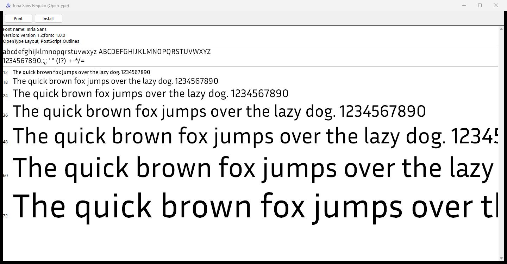

# Spike 2: CFF writer and TTF → OTF transplant

Validates [ADR-0007](../adr/0007-cff-otf-via-ttf-transplant.md). Plan: [M0 Step 7](../../plans/typefaced-m0-foundations-and-spikes.md). Code: [`crates/tf-cff/`](../../crates/tf-cff/), [`crates/tf-compile/src/otf.rs`](../../crates/tf-compile/src/otf.rs), [`crates/tf-compile/src/source.rs`](../../crates/tf-compile/src/source.rs).

## Question

Can Typefaced produce CFF-based OTFs whose outlines round-trip exactly, that pass OTS and that render on Windows, by transplanting a `CFF ` table built from the cubic sources into fontc's TTF? And should the CFF writer be built or reused?

Pass criteria (ADR-0007, Step 7 exit criteria), for the fixture and the corpus static family:
- OTF outlines identical to the rounded, decomposed source (0 point differences);
- OTS passes;
- `ttx` parses the file;
- Windows Font Viewer renders it;
- the build-versus-reuse decision is made, with evidence.

## Setup

| Item | Value |
|---|---|
| CPU / RAM | Intel Core i7-9750H, 6 cores / 12 threads; 32 GB (same machine as Spike 1) |
| OS | Windows 11 Pro, build 26300 |
| Toolchain | rustc 1.98.1 (48a229cea 2026-09-01) |
| Crates | `fontc` =1.0.0 (unchanged from Step 6); new direct dependencies, all already in fontc's tree at these exact versions: `kurbo` =0.13.1, `read-fonts` =0.43.3 (in `tf-cff`, for the CFF standard strings only), `write-fonts` =0.52.0, `norad` =0.18.4 (feature `kurbo`); dev: `skrifa` =0.46.2. No new package in `Cargo.lock`, so no license change |
| Validators | fontTools 4.61.1 (`ttx`, plus a script that recomputes bounds with fontTools), opentype-sanitizer 9.2.0 (`python -m ots`), Windows Font Viewer (`fontview.exe`) |
| Specs | Adobe TN #5176 (CFF), TN #5177 (Type 2 charstrings), OpenType `head`, `hhea`, `hmtx`, `maxp`, `post` |
| Corpus | `inria-sans` (6 static UFOs, 591 glyphs each, 1000 units per em, `public.postscriptNames`, 3,516 components, 264 of them with fractional offsets) |

## Reuse check (Task 1)

| Candidate | Finding (source read at the pinned or current version) | Verdict |
|---|---|---|
| `write-fonts` 0.52.0 | `generated/generated_cff.rs` (CFF 1 header, INDEX, charset, FDSelect structs) exists but is **not compiled**: `src/ps/cff.rs` only declares `pub mod v2;`. `v2.rs` has `Index::from_items` for **CFF2** (32-bit count, not CFF 1). No DICT writer, no Type 2 charstring encoder, no CFF table builder. `FontBuilder` is usable: it writes `OTTO` when a `CFF ` table is present, orders tables as recommended for CFF, and computes table checksums and `checkSumAdjustment` | No CFF writer; reuse `FontBuilder` for the font assembly |
| `allsorts` 0.17.0 (Apache-2.0) | Has `impl WriteBinary for CFF` used by its subsetter, but nothing to make a **new** font: `Index` fields are private, the owned INDEX data is `pub(super)`, `MaybeOwnedIndex` can only `replace` existing entries, `Dict` has `new()` but no way to add entries, and the only charstring writer (`CharStringConverter`) is private and converts CFF2 charstrings, not outlines. It would also add a large dependency tree (brotli-decompressor, flate2, ouroboros, pathfinder_geometry, glyph-names, libc, encoding_rs…) parallel to fontations | Not usable for new fonts |

**Decision: build `tf-cff`.** The writer is about 650 lines of non-test Rust (estimate in ADR-0007: 1.5–2.5k), plus about 360 lines for the transplant and the UFO outline reader. The ADR's `CffWriter` port and the allsorts adapter are not needed.

## Method

### `tf-cff` (domain, pure)

`CffBuilder::new(postscript_name, units_per_em).glyph(name, advance, &BezPath)…build()`:
- **Layout:** Header (1, 0, 4, offSize 4), Name INDEX, Top DICT INDEX, String INDEX, empty Global Subr INDEX, charset (format 0), CharStrings INDEX, Private DICT. Top DICT offsets (`charset`, `CharStrings`, `Private`) always use the 5-byte form (prefix 29), so the Top DICT is written in one pass.
- **Top DICT:** `FontBBox` (union of glyph bounds), `FontMatrix` only when units per em ≠ 1000 (`[1/upem 0 0 1/upem 0 0]` as DICT reals), `charset`, `CharStrings`, `Private` (size, offset).
- **Private DICT:** `defaultWidthX` = `nominalWidthX` = the most common advance; glyphs at that advance store no width, the others store `advance − nominalWidthX` first.
- **Names:** standard strings keep their SID (read-fonts' `Sid::resolve_standard`, TN #5176 Appendix A); other names go in the String INDEX from SID 391. `.notdef` must be first; names must be unique printable ASCII; the font name follows TN #5176 §7.
- **Charstrings:** `rmoveto`, `rlineto`, `rrcurveto`, `endchar`; no hints, no subroutines, no seac. Points are rounded with `floor(v + 0.5)` (fontc's and fontTools' rule) before the deltas are taken, so rounding never drifts. A final line back to a subpath's start is left to the implicit close, subpaths without segments are left out, quadratic segments are rejected, numbers outside 16 bits and charstrings over 65,535 bytes (TN #5177 Appendix B) are errors. Custom SIDs stop at 64,999 (TN #5176 Table 2).
- **Bounds:** `tf_cff::bounds(path)` gives the bounds of the outline as encoded: exact extrema (kurbo), floor for minima, ceiling for maxima, as fontTools computes them for CFF. Extrema within 1e-6 of an integer are snapped first (see *Findings*).

### Transplant (`tf-compile`, adapter)

`ttf_to_otf(ttf, &SourceOutlines)`:
- reads glyph names from `post`, advances from `hmtx`, the PostScript name (name ID 6) from `name`;
- builds the `CFF ` table in the TTF's glyph order;
- takes a `.notdef` that fontc made up (the source has none) from the TTF's `glyf`: fontir's box of straight lines, contours reversed back to the PostScript direction;
- drops `glyf`, `loca`, `cvt `, `fpgm`, `prep`, `hdmx`, `LTSH`, `VDMX`, `gasp`, and `DSIG` (the signature would no longer match);
- `maxp` → 0.5; `post` → 3.0 with italicAngle, underline metrics, isFixedPitch (and the memory fields) kept;
- `head` box, `hmtx` left side bearings (same long/short split) and `hhea` minLeftSideBearing, minRightSideBearing, xMaxExtent from the cubic bounds;
- copies every other table byte for byte; `FontBuilder` sets `OTTO` and recomputes all checksums and `head.checkSumAdjustment`;
- rejects variable fonts (`fvar`), vertical metrics (`vmtx`, whose top side bearings would also need recomputing), fonts that already have `CFF ` or `CFF2`, and an `hhea.numberOfHMetrics` outside 1 to numGlyphs.

`OS/2` is copied unchanged: fontbe 1.0.0 derives no `OS/2` field from glyph bounds (`usWinAscent` = ascender + typo line gap and `usWinDescent` = |descender| come from font info, `ufo2fontir`/`fontir`; `xAvgCharWidth` from advances).

`SourceOutlines::from_ufo` reads the default layer with norad, converts contours with `Contour::to_kurbo`, and decomposes components recursively through their `kurbo::Affine` (contours reversed when the transform mirrors, as fontc does), each glyph once. Open contours, contours without on-curve points (norad would turn them into a bare move, so they would vanish), missing component bases, cycles, nesting deeper than 64 and outlines over 65,536 path elements (components that reuse each other grow exponentially) are errors. Glyphs in `public.skipExportGlyphs` serve as component bases but are not outlines of their own, as in fontc. Glyphs are keyed by the name fontc writes into `post`: `public.postscriptNames` when present (unless `com.github.googlei18n.ufo2ft.useProductionNames` is false), cleaned to `A–Z a–z 0–9 . _` (fontbe `post.rs`). Two glyphs with the same production name are an error (fontc would add `.N`). `compile_to_otf(ufo)` chains `compile_to_ttf`, `from_ufo` and `ttf_to_otf`.

### Checks

- **Unit tests (tf-cff):** byte-exact encodings at −32769, −32768, −1132, −1131, −108, −107, 0, 107, 108, 1131, 1132, 32767, 32768 (DICT) and the 16-bit range (charstrings); reals −2.25 (TN #5176's example `1e e2 a2 5f`), 0.001, −0.5, 1, 1/2048; INDEX with offSize 1, 2 and 3, empty, and over 65,535 items; charstring bytes for a square and a curve.
- **Read-back tests (tf-cff):** a 3-glyph font (`.notdef` with only a width, `A` standard SID 34, `a.alt` custom SID 391) parsed by read-fonts (Name INDEX, charset, strings, widths, FontBBox, FontMatrix, exact charstring commands) and drawn by skrifa from a minimal sfnt, at 1000 and 2048 units per em; rounding without drift; every error.
- **Round-trip tests (tf-compile, `tests/otf.rs`):** fixture in CI, the six Inria Sans styles with `--ignored`. For every glyph, the commands skrifa draws from the OTF equal the source outline (decomposed) with points rounded, after the clean-up skrifa and FreeType apply to every CFF outline (zero-length lines and a final line back to the start are not drawn, empty subpaths are not drawn). Also: `Aacute` = `A` + `acute` moved by (120, 200); advances equal the TTF's; `head`, `hmtx`, `hhea` match bounds computed in the test from the source; `cmap`, `name`, `OS/2`, `GSUB`, `GPOS`, `GDEF`, `STAT` byte-identical to the TTF; dropped tables absent; `maxp` 0.5; `post` 3.0 with the same metrics; every table checksum and the whole-font checksum (0xB1B0AFBA); Name INDEX = PostScript name; charset names = the TTF's `post` names.
- **External:** `ttx -t "CFF "` and a full `ttx` dump, `python -m ots`, and a fontTools script that recomputes `FontBBox`, the `head` box, every `hmtx` left side bearing and the `hhea` extents from the `CFF ` table and compares them with the file.
- **Windows:** each OTF opened in `fontview.exe` (not installed), window captured.

Reproduce:

```bash
cargo test -p tf-cff -p tf-compile
cargo xtask corpus fetch && cargo test -p tf-compile -- --ignored
cargo run -p tf-compile --example compile -- tests/fixtures/min.ufo target/min.otf
ttx -t "CFF " -o target/min-cff.ttx target/min.otf
python -m ots target/min.otf
```

## Results

### Pass criteria

| Criterion | Fixture (`min.ufo`, 6 glyphs) | Inria Sans, 6 styles × 591 glyphs |
|---|---|---|
| Point differences against the rounded, decomposed source | **0** (6 glyphs) | **0** in every style (11,425–11,569 path commands compared per style, 68,998 in total) |
| `Aacute` = `A` + `acute` at (120, 200) | Yes | — (covered by the per-glyph comparison: 312 composites) |
| OTS (`File sanitized successfully!`) | Pass | Pass, all 6 |
| `ttx -t "CFF "` and full `ttx` dump | Pass | Pass, all 6 |
| fontTools recomputation (FontBBox, `head` box, every lsb, `hhea`) | Identical | Identical, all 6 |
| Windows Font Viewer | Opens ("Typefaced Test Regular (OpenType)", "PostScript Outlines"); the sample text is mostly fallback because the fixture has only `A`, `O`, `Á`, `´` and space | **Renders**: all 6 open with sample text at 12–72 pt, "OpenType Layout, PostScript Outlines" (screenshot below) |
| Build vs reuse decided | Build `tf-cff` (see *Reuse check*) | |



*Inria Sans Regular, converted by `compile_to_otf`, opened with `fontview.exe` from the file (no Inria font is installed on the machine); window captured with `PrintWindow`.*

### Size and speed

| Font | TTF (fontc) | OTF (transplant) |
|---|---:|---:|
| `min.ufo` | 1,132 B | 1,188 B |
| Inria Sans Regular | 59,748 B | 83,564 B |
| Inria Sans, other styles | 58,604–61,464 B | 82,584–83,356 B |

The OTFs are about 40% larger: no subroutines and no charstring operator merging (one operator per segment).

Release build of the `compile` example **without fat LTO** (`CARGO_PROFILE_RELEASE_LTO=false`, 16 codegen units, to avoid the 25-minute link of Spike 1), machine at about 11% CPU load:

| Input | `compile_to_ttf` (5 runs, ms) | `compile_to_otf` (runs, ms) |
|---|---|---|
| `min.ufo` | — | 36, 43, 45, 37, 65 (median 43) |
| Inria Sans Regular | 413, 424, 406, 458, 420 (median 420) | 857, 779, 715, 865, 677 (median 779) |
| Inria Sans, other 5 styles | — | 634–992 (3 runs each) |

The OTF path adds about 360 ms per 591 glyphs over the TTF compile (reading the UFO a second time with norad, building the CFF, rewriting the tables). Scaled to 1,000 glyphs: about 1.3 s, under the §10.4 budget of 3 s for a static OTF.

### Findings

- **Float noise at integer bounds.** kurbo's cubic bounding box finds the root of a vertical end tangent at `t = 1 − ε` and returns 39.9999… for a curve ending at x = 40 (Inria Sans Bold `two`, curve (180, 346) (103, 308) (40, 238) (40, 95)). Floor turned that into 39 for 13 glyphs across the family, while fontTools said 40. `tf_cff::bounds` now snaps extrema within 1e-6 of an integer before floor/ceil; after that, fontTools agrees on every glyph. With integer control points a true extremum within 1e-6 of an integer that is not that integer is not a practical case, and the cost of a wrong guess would be one unit of side bearing.
- **Glyph names.** fontc 1.0.0 renames glyphs with `public.postscriptNames` by default (`Flags::PRODUCTION_NAMES`), sanitises them and adds `.N` to duplicates. The OTF keys outlines by the `post` names of the TTF, so `SourceOutlines` must use the same rule. It follows it except for duplicates, which are an error. In M2, when the engine writes the temporary UFO and knows the names, `SourceOutlines` can be built from (name, path) pairs instead (`FromIterator`).
- **fontc's `.notdef`.** fontc synthesises a `.notdef` at glyph 0 when a source has none (fontir `synthesize_notdef`), so the source has no outline for it. The code review found that this made `ttf_to_otf` fail with `MissingOutline(".notdef")` (Inria Sans and the fixture have one, so the first tests missed it). The transplant now takes that glyph from `glyf` and reverses it; a test compiles the fixture without its `.notdef`. That OTF passes OTS and `ttx`, matches fontTools' recomputation, and its `.notdef` charstring is fontir's box (outer contour counter-clockwise, inner clockwise).
- **Top DICT FontInfo.** The Top DICT has no `ItalicAngle`, `UnderlinePosition`, `UnderlineThickness`, `isFixedPitch`, `FullName`, `FamilyName` or `Notice`, so CFF defaults apply there (`ttx` shows underline −100/50). OpenType consumers read `post` and `name`; tools that read the CFF Top DICT directly (for example PDF embedding) would see the defaults.
- **Path API detail.** kurbo lets a segment follow `ClosePath` without a `MoveTo` (it starts at the previous subpath's start); `tf-cff` follows that rule rather than rejecting such paths.

## Decision

**ADR-0007 is Accepted** (status changed in the same change). For the fixture and all six Inria Sans styles the transplant gives 0 point differences, passes OTS and `ttx`, matches fontTools on every recomputed metric, and renders in Windows Font Viewer. `tf-cff` is built in-house: neither write-fonts 0.52.0 nor allsorts 0.17.0 can serialise CFF 1 for a new font.

Known gaps, as the ADR expects: no subroutinisation, no hints (and no stem hints in the Private DICT, no BlueValues), no charstring operator merging.

## Follow-ups

- Size: merge consecutive `rlineto`/`rrcurveto` arguments (up to the 48-operand stack) and add `hlineto`/`vlineto`/`hhcurveto`-style operators; subroutinisation and CFF hinting stay on the after-1.0 backlog.
- Top DICT FontInfo (`ItalicAngle`, underline metrics, `isFixedPitch`, `FullName`, `FamilyName`, `Notice`) from the same values as `post` and `name`.
- `vmtx`/`VORG`: recompute top side bearings from the cubic bounds instead of rejecting fonts with vertical metrics.
- Quadratic UFO contours are rejected; raising them to cubics (`QuadBez::raise`) is a small change if quadratic sources ever matter.
- `compile_to_otf` reads the UFO twice (fontc, then norad). In M2 the engine writes the temporary UFO and can pass its own outlines, so the two reads cannot disagree.
- Duplicate production names: follow fontc's `.N` suffixes, or (M2) build `SourceOutlines` from the engine's own names.
- Designspace sources: `compile_to_otf` takes a `.ufo` only; static instances from a designspace come with the M2 export pipeline (variable fonts stay TTF, ADR-0007).
- CI: ADR-0007 asks for `ttx` and OTS on every change; the `gates` job could install fontTools and opentype-sanitizer and run them on `target/min.otf` (Step 12 or M2).
- Rendering comparison against a fontmake-built OTF at several sizes (ADR-0007, check 3) is not done in M0.
- New commands for Step 12 to fold into `AGENTS.md`: `cargo run -p tf-compile --example compile -- <in.ufo> <out.otf>` (OTF output), `ttx -t "CFF " -o <out.ttx> <font.otf>`.
