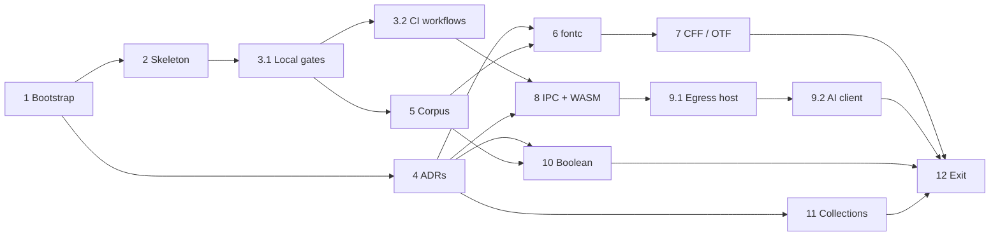

# Blueprint: Typefaced M0 — Foundations & Spikes

**Objective.** Carry out milestone M0 of [docs/implementation-plan.md](../docs/implementation-plan.md). When M0 is done, Typefaced has:
- a licensed monorepo with CI and license gates;
- a walking skeleton that proves the typed-IPC seam end to end;
- the architecture decisions written up as ADRs;
- every open technical question answered by a spike.

After that, M1 (headless engine) can start.

| | |
|---|---|
| Created | 2026-09-29 (revised the same day after an adversarial review) |
| Scope | M0 only. Each later milestone gets its own blueprint, created in Step 12 (rolling-wave planning). |
| Mode | **Direct** for Step 1 (no repository exists yet). **Branch / PR / CI** for everything after. |
| Steps | 14 (twelve steps; 3 and 9 are split into two PRs each) · critical path of 7 steps · up to 3 steps in parallel |
| Effort | About 15 working days solo; about 9–10 days with two agents working in parallel |
| Source documents | `docs/implementation-plan.md`, in particular §4 (module map), §5.8 and §5.13 (CFF and export), §6.2 (AI egress), §7.2–7.3 (packed outlines, canvas budgets), §10.4 (performance budgets), §12.2 (coverage targets), §13 (tooling), §14 (M0 row), §16 (ADR list), §18 (first two weeks) and Appendix B (license policy). Also `docs/research.md`. |

## How to use this plan

- **One step per session and per pull request.** A fresh agent needs only three parts of this file: *Conventions*, *Invariants* and the step's own section.
- **Prompt for a new session:** `Execute Step N of plans/typefaced-m0-foundations-and-spikes.md, including commit, push and PR.`
- **Before you start:**
  - check that every step in *Depends on* is DONE in the status table;
  - update your local `main`.
- **When you finish:** set your row to `DONE (#PR)` inside your own PR, then stop.
- **Consent.**
  - A request to execute a step covers that step's local commits, the branch push, opening the PR, and the tools listed in its **Installs** row.
  - Merging, changing repository settings, spending money on API calls, and anything marked **GATE** each need a separate, explicit yes from the user in chat.

## Status

| Step | Title | Depends on | Tier | Effort | Status |
|---|---|---|---|---|---|
| 1 | Repository bootstrap | — | default | 1 h | DONE (bootstrap commit on `main`) |
| 2 | Walking skeleton: workspaces, Tauri shell, typed IPC | 1 | default | 1 d | DONE (#2) |
| 3.1 | Local gates: xtask, cargo-deny, coverage | 2 | default | 0.5 d | DONE (#4) |
| 3.2 | CI workflows | 3.1 | default | 0.5 d | DONE (#5) |
| 4 | Architecture decision records | 1 | default | 0.5 d | DONE (#1) |
| 5 | Test fixtures and pinned corpus | 3.1 | default | 0.5 d | DONE (#6) |
| 6 | Spike 1 — fontc as an in-process library (ADR-006) | 4, 5 | default | 2 d | DONE (#9) |
| 7 | Spike 2 — CFF writer and OTF transplant (ADR-007) | 6 | strongest | 3 d | DONE (PR pending) |
| 8 | Spike 3 — IPC latency and WASM kernel (ADR-002, ADR-013) | 3.2, 4 | default | 2 d | TODO |
| 9.1 | Spike 4a — AI egress host (Rust) | 8 | strongest | 1 d | TODO |
| 9.2 | Spike 4b — AI client and tool runner (TypeScript) (ADR-009) | 9.1 | strongest | 1 d | TODO |
| 10 | Spike 5 — boolean engine (ADR-008) | 4, 5 | default | 1.5 d | DONE (#10) |
| 11 | Spike 6 — persistent collections (ADR-017) | 4 | default | 1 d | DONE (#3) |
| 12 | M0 exit review and handoff | all | strongest | 0.5 d | TODO |

**Tier:**
- `strongest`: run with the most capable model available. Used where the step is correctness- or security-critical.
- `default`: the normal coding model.

## Dependency graph and parallel waves



| Wave | Steps (‖ = can run in parallel) | Files shared by the parallel steps |
|---|---|---|
| A | 1 | — |
| B | 2 ‖ 4 | none |
| C | 3.1 ‖ 11 | status table |
| D | 3.2 ‖ 5 | status table |
| E | 6 ‖ 8 ‖ 10 | `Cargo.lock` (6 and 8); status table |
| F | 7 ‖ 9.1 | `Cargo.lock`; status table |
| G | 9.2 (Step 7 may still be running; no shared files) | — |
| H | 12 | — |

- **Critical path:** 1 → 2 → 3.1 → 5 → 6 → 7 → 12, about 8 working days.
- Conflicts in shared files are resolved with the *merge protocol* below.

## Deviations from the implementation plan (deliberate)

1. **Crates are created when a step first needs them.** §18 said to create empty crates for all of §4.1. Empty crates are scaffolding with no code, and they cost CI time.
2. **`apps/desktop` is the root of the create-tauri-app project**, holding the frontend `src/` and `src-tauri/`. §4.1 showed a separate `ui/` folder, which is not needed.
3. **Two extra spikes.** M0 in §14 lists four spikes, but ADR-008 (boolean engine) and ADR-017 (persistent collections) also say "decided by spike". Steps 10 and 11 run those spikes, so no M0 ADR stays open. Both are off the critical path; the user may defer them to M1/M2.
4. **ADR count.** §14 says "ADR-001…018", while §16 lists 19. This plan writes all 19.
5. **Biome is the TypeScript linter/formatter.** The plan said "Biome or ESLint".
6. **Deferred:**
   - pre-commit hooks (CI enforces the same checks);
   - Renovate;
   - nightly fuzzing;
   - TypeScript layer rules (dependency-cruiser), which arrive with `packages/canvas` in M4;
   - consolidating `[workspace.dependencies]`, which happens in M1.
7. **License allow-list additions.** Any permissive license added during M0 is justified in a comment in `deny.toml`. Step 12 folds these additions into Appendix B.
8. **Spike crates live outside the root workspace.** Each is its own small Cargo workspace under `spikes/`, with its own `[workspace]` table and lockfile. Heavy spike dependencies (skia-safe, criterion) therefore never enter product CI or the root `Cargo.lock`.
9. **The API key passes through the webview once.** §6.2 says the key never exists in the webview. In M0 the user types it into a password field, and it crosses IPC once to be stored. The field is cleared right away, and the key is never persisted, logged or readable back from JavaScript. ADR-009 records this trade-off; M3 evaluates a native OS credential prompt instead.
10. **Coverage gates follow §12.2 per layer:** domain and application crates at least 90%, adapters at least 80%, TypeScript logic at least 80%. Drivers and `xtask` are not gated: `xtask`'s pure logic is unit-tested, and drivers get end-to-end tests later.

## Pre-flight snapshot (2026-09-29, this machine)

| Item | Found | Action |
|---|---|---|
| git | 2.55.0 | — |
| gh | 2.86.0, logged in as `georgehadji`; token scopes `repo`, `workflow`, `read:org`, `gist` (no `read:user`, so the account's plan can't be queried) | — |
| GitHub repository | `georgehadji/Typefaced`: **PUBLIC**, empty, no default branch, viewer is ADMIN | GATE in Step 1 |
| Project folder | `docs/research.md`, `docs/implementation-plan.md`, `plans/`; hook logs in `.claude/claudex/` and `docs/.claude/claudex/`; not a git repository | Step 1 |
| rustup / rustc | 1.28.2 / 1.92.0 (December 2025) | Step 2 pins a newer version in `rust-toolchain.toml` |
| Rust targets | `x86_64-pc-windows-msvc` only | The toolchain file adds `wasm32-unknown-unknown` |
| MSVC | Visual Studio 2022 Build Tools | — |
| Node / npm / pnpm / corepack | 24.14.0 / 11.9.0 / 9.15.9 / 0.34.6 | — |
| Python / fontTools | 3.12.10 / 4.61.1 (`ttx` available) | Step 6 installs `opentype-sanitizer` |
| Windows | 11, build 26200 (WordPad has been removed; use Font Viewer) | — |
| cargo-deny, cargo-llvm-cov, wasm-pack | not installed | Steps 3.1 and 8 |

To refresh these values:

```bash
git --version; gh auth status; rustc --version; node --version; pnpm --version; python -c "import fontTools; print(fontTools.version)"
```

## Conventions (apply to every step)

**Branches and PRs**
- Branch name: `m0/<step>-<slug>`, e.g. `m0/02-skeleton` or `m0/09.1-egress-host`. One PR per step, squash-merged.
- The PR title is a conventional commit: `feat:`, `fix:`, `docs:`, `test:`, `chore:`, `ci:`, `perf:` or `refactor:`.
- **No attribution trailers** (no `Co-Authored-By`, no "Generated with") in commits or PR bodies.
- PR body sections:
  - Summary.
  - How verified: commands plus results.
  - ADRs touched.
  - Follow-ups.

**Rust crates in the root workspace**
- Product crates are named `tf-*`; the desktop driver is `typefaced-desktop`; `xtask` is the build tool.
- Each crate's `layer` is one of `domain`, `application`, `adapter`, `driver` or `tool`.
- Every crate uses this template (Step 3.1 enforces it):

  ```toml
  [package]
  name = "tf-example"
  version = "0.1.0"
  edition.workspace = true
  rust-version.workspace = true
  license.workspace = true
  publish.workspace = true

  [package.metadata.typefaced]
  layer = "domain"

  [lints]
  workspace = true
  ```

**Spike crates**
- They live in `spikes/<name>/` (package name `spike-<name>`).
- Each has an empty `[workspace]` table, which makes it its own workspace root with its own `Cargo.lock`. They are outside the root workspace and outside product CI.
- Build them with `--manifest-path spikes/<name>/Cargo.toml`.

**Dependencies**
- Add dependencies in the crate's or package's own manifest. Only Step 2 edits `[workspace.dependencies]` in M0.
- Check every new dependency's license against Appendix B:
  - **allowed:** MIT, Apache-2.0, BSD-2-Clause, BSD-3-Clause, ISC, Zlib, BSL-1.0, Unicode-3.0, Unicode-DFS-2016, CC0-1.0, and MPL-2.0 (unmodified);
  - **stop and ask the user:** GPL, AGPL, LGPL, SSPL, EUPL, non-commercial, or unknown licenses.
- Pin pre-1.0 font crates (fontc, fontations) with `=` versions.

**Clean-room rule**
- Never read, copy or paraphrase source code from GPL projects: Fontra, FontForge, Glyphr Studio, BirdFont, HT Letterspacer, potrace.
- Specifications, papers and permissively licensed projects (fontc, fontations, allsorts, kurbo, fontTools) are fine.

**Fact checks**
- The exact APIs of these libraries change often: fontc, fontations, Tauri, tauri-specta, keyring, `@anthropic-ai/sdk`, linesweeper, skia-safe, imbl, wasm-pack.
- Read docs.rs, the README, or (for Claude API code) the `claude-api` skill for the version you pin. **Never guess signatures or CLI flags.** When unsure, run `--help`.
- Record the versions you used in the PR or spike report.

**Tests**
- Product code is written test first: red → green → refactor.
- `cargo xtask coverage` (from Step 3.1) gates line coverage: domain and application crates at least 90%, adapters at least 80%.
- TypeScript logic packages need at least 80% (from Step 3.2).
- Spikes are exploratory: no coverage gate.

**Reviews before opening a PR**
- Run the `ecc:code-reviewer` agent, plus `ecc:rust-reviewer` or `ecc:typescript-reviewer` for the languages touched.
- Run `ecc:security-reviewer` for Steps 9.1 and 9.2, and for any code that handles the network, the file system or untrusted input.
- Fix every CRITICAL and HIGH finding.

**Generated files**
- `packages/bindings/src/index.ts` is written by `cargo test -p typefaced-desktop` (Step 2).
- `packages/geometry-wasm/pkg/` is written by `wasm-pack` (Step 8) and ignored by git.
- Never edit generated files by hand.

**Shared files**
- Only Steps 1, 2, 3.1 and 3.2 edit the root `.gitignore`. Later steps add nested `.gitignore` files inside their own directories.
- Only Steps 1, 2, 3.1, 3.2 and 12 edit `CLAUDE.md`. Other steps list new commands in their spike report, and Step 12 folds them in.

**Secrets**
- Agents never read, type, print or log API keys. The user enters keys themselves (Step 9.2).
- No `.env` files containing secrets are ever committed.

**Spike reports**
- File: `docs/spikes/spike-<n>-<slug>.md`, with these sections:
  - question;
  - setup (machine CPU and RAM, versions);
  - method;
  - results (numbers);
  - decision;
  - follow-ups.
- The linked ADR's status changes in the same PR.

**Merge protocol**
Rebase onto `main`. Then, if there are conflicts:
- `Cargo.lock`: `git checkout origin/main -- Cargo.lock && cargo check --workspace`, then `git add`.
- `pnpm-lock.yaml`: `git checkout origin/main -- pnpm-lock.yaml && pnpm install`, then `git add`.
- Status table: keep both rows' updates.
- Anything else: resolve by hand and re-run the invariants.

## Invariants (after every step; CI enforces them from Step 3.2)

Run them in this order: the desktop crate embeds `apps/desktop/dist`, so the frontend must be built before any cargo command.

```bash
pnpm install --frozen-lockfile                                                          # Step 2+
wasm-pack build crates/tf-wasm --target web --out-dir ../../packages/geometry-wasm/pkg  # Step 8+
pnpm --filter @typefaced/desktop build                                                  # Step 2+
cargo fmt --all --check
cargo clippy --workspace --all-targets --locked -- -D warnings
cargo test --workspace --locked
git diff --exit-code packages/bindings                                                  # Step 2+
pnpm lint && pnpm typecheck && pnpm test                                                # Step 2+
cargo xtask check-deps && cargo deny check && cargo xtask licenses-npm && cargo xtask coverage   # Step 3.1+
! git grep -nE 'sk-ant-[A-Za-z0-9_-]{16,}'                                              # no API keys committed
git status --porcelain                                                                  # empty: tests don't write into the repo
```

## Definition of done (every step)

1. All tasks are done, and the step's verification commands pass locally. Paste their output into the PR.
2. The invariants pass. From Step 3.2 on, the PR's CI is green.
3. The reviewer agents have run, and every CRITICAL or HIGH finding is fixed.
4. The step's status row says `DONE (#PR)`.
5. The user has merged the PR, or has explicitly asked you to merge it.

---

## Step 1 — Repository bootstrap *(direct mode)*

| | |
|---|---|
| Depends on | — |
| Parallel with | — |
| Tier | default |
| Effort | 1 h |
| Installs | nothing |
| Branch | `main` (an empty remote allows no PR) |
| Commit | `chore: bootstrap repository` |

**Context brief.**
- **Local folder.** `E:\Documents\Vibe-Coding\Typefaced` is not a git repository yet. It contains:
  - `docs/research.md` and `docs/implementation-plan.md`;
  - this plan, under `plans/`;
  - two hook-log folders, `.claude/claudex/` and `docs/.claude/claudex/`. **Never commit these.**
- **Remote.** `georgehadji/Typefaced` exists on GitHub, is empty and is **public**.
- **Why it matters.** Typefaced is proprietary ("all rights reserved"). Pushing to a public repository publishes the source code and plans for anyone to read, although nobody may reuse them.

**GATE — ask the user, and wait for answers, before any push:**
1. **Visibility.** Make `georgehadji/Typefaced` private, or keep it public (source-visible)?
   - If private on GitHub Free, CI minutes are metered, and Windows runners use them up faster.
2. **Copyright holder.** The legal name or company to put in `LICENSE`. The year is 2026.
3. **Branch protection.** Should `main` require pull requests? This needs a public repository or a paid plan for private ones.

**Tasks.**
1. Run `git init -b main` in the project root.
2. Create `.gitignore`. `target/` is left unanchored so that spike build folders are ignored too.
   ```gitignore
   target/
   node_modules/
   dist/
   *.log
   .env
   .env.*
   **/.claude/claudex/
   .claude/settings.local.json
   Thumbs.db
   .DS_Store
   ```
3. Create `.gitattributes`:
   - `* text=auto eol=lf`;
   - `binary` for `*.ttf *.otf *.woff *.woff2 *.png *.ico *.icns *.gz *.zip`.
4. Create `.editorconfig`:
   - UTF-8, LF line endings, final newline;
   - 2-space indent for ts/tsx/js/json/md/yaml;
   - 4-space indent for rs/toml.
5. Create `LICENSE` (drop the words "and confidential" if the repo stays public):
   ```text
   Copyright (c) 2026 <HOLDER>. All rights reserved.

   This software and its source code are proprietary and confidential. No license,
   express or implied, is granted to use, copy, modify, merge, publish, distribute,
   sublicense or sell copies of this software or any part of it without the prior
   written permission of the copyright holder.

   Third-party components are licensed under their own terms; see
   THIRD_PARTY_NOTICES (generated with each release).
   ```
   A lawyer should review this before public release. That review is not a blocker for M0.
6. Create `README.md` of 5–10 lines:
   - what Typefaced is;
   - "Proprietary — all rights reserved";
   - links to `docs/` and `plans/`.
7. Create `CLAUDE.md` with exactly this content (Step 2 adds the commands):
   ```markdown
   # Typefaced — agent instructions

   Proprietary desktop font editor: Tauri 2 shell, Rust engine, React UI. All rights reserved.

   ## Read first
   - Architecture: docs/implementation-plan.md · Decisions: docs/adr/ · Active plan: plans/ (status table at the top)

   ## Hard rules
   - Clean room: never read, copy or paraphrase source code of GPL/AGPL/LGPL projects
     (Fontra, FontForge, Glyphr Studio, BirdFont, HT Letterspacer, potrace). Use specs,
     papers and permissively licensed code only.
   - Dependencies: licenses must be on the allow-list in docs/implementation-plan.md
     Appendix B. Copyleft or unknown → stop and ask.
   - Layers: every Rust crate declares `[package.metadata.typefaced] layer`. Domain crates
     are pure (no I/O, no async runtime, no Tauri). Dependencies point inward only
     (implementation plan §4.2).
   - Every document change is a typed command (tf-commands). No back doors for UI, AI, MCP or CLI.
   - Third-party APIs (fontc, fontations, Tauri, tauri-specta, @anthropic-ai/sdk, keyring…)
     change often: read the docs for the pinned version; never guess signatures or flags.
     For Claude API code use the claude-api skill.
   - Secrets: never read, type, print or log API keys. Keys live only in the OS keychain.
   - Product code is written test first; coverage gates are in `cargo xtask coverage`.
   - Git: conventional commits; no attribution trailers; commit or push only when the user
     asks; never push to a public remote without the user's go-ahead.

   ## Commands
   (added in Step 2)
   ```
8. Stage the files and verify that no claudex log is included. Commit.
9. After the gate is answered:
   - If private: `gh repo edit georgehadji/Typefaced --visibility private --accept-visibility-change-consequences`.
   - Then `git remote add origin https://github.com/georgehadji/Typefaced.git` and `git push -u origin main`.
10. If the user wants branch protection, create a ruleset for `main` that requires pull requests, using the repository settings or `gh api repos/georgehadji/Typefaced/rulesets`. A 403 or 422 response means the plan doesn't support it: tell the user and skip. Step 3.2 adds the required CI checks.

**Verification.**
```bash
git status --porcelain                        # empty
git ls-files | grep -c claudex                # 0
git log --oneline | wc -l                     # 1
gh repo view georgehadji/Typefaced --json visibility,defaultBranchRef
```

**Exit criteria.**
- The local repository has one commit containing `LICENSE`, `README.md`, `CLAUDE.md`, `.gitignore`, `.gitattributes`, `.editorconfig`, `docs/` and `plans/`.
- No claudex log is tracked.
- `origin/main` exists, with the visibility the user chose.

**Rollback.**
- **Before the push:** delete the local `.git` folder. Run `git status` first to confirm nothing unexpected is in it.
- **After the push:** ask the user before deleting or force-pushing anything on GitHub.

---

## Step 2 — Walking skeleton: workspaces, Tauri shell, typed IPC

| | |
|---|---|
| Depends on | 1 |
| Parallel with | 4 |
| Tier | default |
| Effort | 1 d |
| Installs | Rust toolchain pinned in `rust-toolchain.toml` (installed next to the existing one; the global default is unchanged); npm packages inside the project |
| Branch | `m0/02-skeleton` |
| PR title | `feat: walking skeleton with typed IPC` |

**Context brief.**
- **Layout (implementation plan §4.1).**
  - A Cargo workspace: `crates/*` plus the desktop app.
  - A pnpm workspace: `apps/*` and `packages/*`.
- **What this step proves.** The key seam of the architecture:
  1. a Rust type lives in the API-contract crate `tf-commands`;
  2. a Tauri 2 command returns it;
  3. tauri-specta exports its TypeScript type into `@typefaced/bindings`;
  4. the React UI renders it.
- **No placeholder crates.** Only the crates listed below are created.
- **Platform.** Windows is primary. The machine has MSVC Build Tools and Node 24.
- **Versions.** tauri-specta is still a release candidate (`2.0.0-rc.25` at review time). Pin the latest RC exactly, together with the `specta` and `specta-typescript` versions its README requires.

**Tasks (tests first where there is logic).**
1. **Toolchains.**
   - Run `rustup check` (read-only) to see the latest stable version.
   - Create `rust-toolchain.toml`:
     - `channel` = that exact version, e.g. `"1.NN.0"`;
     - `components = ["rustfmt", "clippy", "llvm-tools-preview"]`;
     - `targets = ["wasm32-unknown-unknown"]`;
     - `profile = "minimal"`.
   - Run `rustup toolchain install`. It installs the pinned toolchain and leaves the global default alone.
   - Create `.nvmrc` containing `24`.
2. **Root `Cargo.toml`.**
   - `[workspace]`:
     - `resolver = "3"`;
     - `members = ["crates/*", "apps/desktop/src-tauri"]`. There is no `spikes/*` entry: spikes are separate workspaces, and a glob that matches no crate fails.
   - `[workspace.package]`:
     - `edition = "2024"`;
     - `rust-version` = the pinned version;
     - `license = "LicenseRef-Proprietary"`;
     - `publish = false`.
   - `[workspace.lints.rust]`: `unsafe_code = "deny"`. A driver crate may add a scoped `allow` with a comment where a macro expansion needs it.
   - `[workspace.lints.clippy]`: `unwrap_used = "deny"`, `expect_used = "deny"`.
   - `clippy.toml`: `allow-unwrap-in-tests = true`, `allow-expect-in-tests = true`.
   - `[workspace.dependencies]`: `serde` (with `derive`), `specta` (the pinned version), `thiserror`.
3. **`crates/tf-commands`** (crate template from *Conventions*; layer `application`).
   - `AppInfo { name: String, version: String }`, deriving `Serialize`, `Deserialize` and `specta::Type`.
   - Write a unit test of its JSON shape first.
   - No other logic.
4. **`apps/desktop`.**
   - In `apps/`, run `pnpm create tauri-app@latest --help` to check the current flags. Then create `desktop` with template `react-ts`, package manager `pnpm` and identifier `com.typefaced.desktop`. (Changing the identifier later moves the app-data folders; tell the user if they would prefer another domain.)
   - Rename:
     - npm package → `@typefaced/desktop`;
     - `tauri.conf.json` `productName` → `Typefaced`;
     - Cargo package → `typefaced-desktop`. Keep the generated `[lib] name`.
   - Convert the crate's `Cargo.toml` to the crate template, with layer `driver`.
   - Delete any `Cargo.lock` the template created inside `src-tauri/`.
   - Remove the template's `greet` command, `tauri-plugin-opener` and its capability entry. They are unused, and removing them shrinks the attack surface.
   - Add tauri-specta and register an `app_info` command that returns `tf_commands::AppInfo`.
   - Build the tauri-specta builder in one function, used both by the app and by a `#[test] fn export_bindings()`. The test writes the bindings to `concat!(env!("CARGO_MANIFEST_DIR"), "/../../../packages/bindings/src/index.ts")`, so it works from any working directory.
   - Do not export bindings at application start-up.
   - Keep IPC integer types 32-bit or smaller. specta refuses 64-bit integers (BigInt) by default.
   - Set a restrictive `app.security.csp`:
     - no remote origins;
     - `connect-src` limited to Tauri IPC (`ipc: http://ipc.localhost`).
   - Tauri applies the CSP only to assets it serves itself, not to the Vite dev server. So check the CSP in a debug build (`tauri build --debug`, where devtools stay enabled), not under `tauri dev`.
   - Styling: prefer CSS files bundled by Vite. Avoid CSS-in-JS libraries that inject `<style>` tags. If inline styles are ever needed, add `style-src 'self' 'unsafe-inline'` deliberately and note it in ADR-013.
   - UI:
     - Write the test first: one Vitest + Testing Library test with the binding mocked.
     - Then replace the template page with a minimal page showing `Typefaced v<version>` from `commands.appInfo()`.
   - Startup code in the driver that must `expect` gets a scoped `#[allow(clippy::expect_used)]` with a reason.
5. **`packages/bindings`.**
   - `package.json`: `@typefaced/bindings`, `private: true`, entry pointing at `src/index.ts`.
   - `src/index.ts`: generated.
   - The desktop app depends on it with `workspace:*`.
6. **pnpm root.**
   - `pnpm-workspace.yaml` with `apps/*` and `packages/*`.
   - Root `package.json`:
     - `private: true`;
     - `packageManager: "pnpm@<output of pnpm --version>"`;
     - scripts: `lint` = `biome check .`, `typecheck` = `pnpm -r typecheck`, `test` = `pnpm -r test`;
     - dev dependencies: `@biomejs/biome`, `typescript`.
   - `biome.json` ignoring `packages/bindings/src/index.ts`, `dist` and `target`.
   - Every TypeScript package gets a `typecheck` script (`tsc --noEmit`). Packages with tests also get `test` (`vitest run`).
7. **`CLAUDE.md`.** Replace `(added in Step 2)` with a Commands section: dev, build, test, lint, typecheck, regenerate bindings.
8. Commit, push the branch and open the PR. CI arrives in Step 3.2, so paste the local verification output into the PR body.

**Verification.**
```bash
rustup show active-toolchain                      # the pinned version
cargo metadata --format-version 1 --no-deps > /dev/null
pnpm install --frozen-lockfile
pnpm --filter @typefaced/desktop build            # frontend first: the Rust crate embeds dist/
cargo fmt --all --check
cargo clippy --workspace --all-targets -- -D warnings
cargo test --workspace
git diff --exit-code packages/bindings
pnpm lint && pnpm typecheck && pnpm test
pnpm --filter @typefaced/desktop tauri build --debug --no-bundle
```
Manual checks:
- Run `pnpm --filter @typefaced/desktop tauri dev`. The window shows the version string, which travels from Rust through the typed binding.
- Run the debug binary in `target/debug/`. It loads with the CSP active; confirm in devtools that the policy header or meta tag is present.

**Exit criteria.**
- All verification commands pass on Windows.
- The running app displays the version through the generated binding.
- No template leftovers remain (`greet`, the opener plugin).
- The CSP allows no remote origins, and the debug build loads with it.

**Rollback.** Close the PR, or revert the squash commit. Nothing else depends on it yet.

---

## Step 3.1 — Local gates: xtask, cargo-deny, coverage

| | |
|---|---|
| Depends on | 2 |
| Parallel with | 11 |
| Tier | default |
| Effort | 0.5 d |
| Installs | `cargo install --locked cargo-deny cargo-llvm-cov` (global cargo bin folder) |
| Branch | `m0/03.1-local-gates` |
| PR title | `chore: xtask gates for layering, licenses and coverage` |

**Context brief.**
- **Why now.** Every later step relies on these gates.
- **Licenses.** The product is proprietary, so dependency licenses must stay within Appendix B:
  - `cargo-deny` checks Rust crates;
  - a pnpm-based check checks npm packages.
- **Layering.** The hexagonal layering (plan §4.2) is enforced by an `xtask` that reads `cargo metadata`. Each crate's layer comes from its own `[package.metadata.typefaced] layer`, so there is no central list to edit.
- **Coverage.** Plan §12.2 sets the targets: domain and application crates at least 90%, adapters at least 80%.
- **What comes next.** Step 3.2 runs all of this in CI.

**Tasks (write pure-function unit tests first for each subcommand).**
1. **Create the `xtask` crate** (crate template; layer `tool`).
   - Add `"xtask"` to the workspace `members`.
   - Add to `.cargo/config.toml`:
     ```toml
     [alias]
     xtask = "run --package xtask --"
     ```
2. **`cargo xtask check-deps`.** Parse `cargo metadata`. Every workspace package must declare `package.metadata.typefaced.layer` and use the crate template's `.workspace = true` keys. Allowed normal/build dependency edges between workspace crates (✓ = allowed; dev-dependencies are exempt):

   | from ↓ / to → | domain | application | adapter | driver | tool |
   |---|---|---|---|---|---|
   | domain | ✓ | | | | |
   | application | ✓ | ✓ | | | |
   | adapter | ✓ | ✓ | ✓ | | |
   | driver | ✓ | ✓ | ✓ | | |
   | tool | ✓ | ✓ | ✓ | ✓ | ✓ |

   Banned direct external dependencies:
   - **domain crates:** `tokio`, `async-std`, `tauri`, `reqwest`, `hyper`, `keyring`, `notify`, `wasm-bindgen`, `web-sys`, `js-sys`;
   - **application crates:** `tauri`, `reqwest`, `hyper`, `keyring`, `notify`.

   Print every violation, then exit non-zero.
3. **`cargo xtask licenses-npm`.**
   - Run `pnpm licenses list --json --prod` from the repository root. If your pnpm version reports only the root project, add `--recursive`; check `pnpm licenses list --help`.
   - Evaluate each package's SPDX expression with the `spdx` crate against the Appendix B list. `OR` passes if any alternative is allowed; `AND` passes only if all parts are allowed.
   - Map common non-SPDX strings (e.g. `"BSD"`, `"Apache 2.0"`) through a small, reviewed `clarify` table.
   - Anything still unknown or unparseable is a violation.
   - Print offenders, then exit non-zero.
4. **`cargo xtask coverage`.**
   - Group the workspace crates by layer:
     - domain + application: at least 90%;
     - adapter: at least 80%;
     - driver and tool: not gated.
   - Run the tests once with `cargo llvm-cov --workspace --no-report`.
   - Then run one `cargo llvm-cov report --fail-under-lines <N>` per group, excluding every file outside the group with `--ignore-filename-regex` built from the crates' paths. Confirm these flags with `cargo llvm-cov report --help`.
   - Skip a group that has no crates yet (there are no adapters until Step 6).
5. **`deny.toml`.** Generate it with `cargo deny init`, then set:
   - **licenses:** allow = the Appendix B list; `private = { ignore = true }` (this skips our `publish = false` crates);
   - **sources:** deny unknown registries and git sources;
   - **bans:** warn on duplicate versions;
   - **advisories:** keep the default, which always fails on vulnerabilities; set `unmaintained = "workspace"`.

   If a needed dependency has a permissive license missing from the list (e.g. `0BSD`, `BlueOak-1.0.0`, `CDLA-Permissive-2.0`), add it with a comment giving the reason and the crate. For copyleft, stop and ask the user.
6. Add the xtask commands to `CLAUDE.md`.
7. **Prove the gates catch violations** (local only; do not commit this):
   - temporarily remove `MIT` from the allow-list;
   - confirm `cargo deny check licenses` fails;
   - restore it.

**Verification.**
```bash
cargo test -p xtask
cargo xtask check-deps
cargo deny check
cargo xtask licenses-npm
cargo xtask coverage
```

**Exit criteria.**
- All five commands pass on `main`'s code.
- The xtask unit tests cover:
  - allowed edges, forbidden edges and banned external crates;
  - a missing layer declaration;
  - SPDX `OR`, `AND`, `clarify` and unknown cases;
  - the grouping of crates by layer.
- The temporary allow-list edit made `cargo deny check licenses` fail.

**Rollback.** Revert the PR. If a gate blocks legitimate work, fix the rule in a follow-up PR. Never delete the gate.

---

## Step 3.2 — CI workflows

| | |
|---|---|
| Depends on | 3.1 |
| Parallel with | 5 |
| Tier | default |
| Effort | 0.5 d |
| Installs | nothing locally |
| Branch | `m0/03.2-ci` |
| PR title | `ci: windows pipeline with license and layering gates` |

**Context brief.**
- **Goal.** GitHub Actions runs the invariants on every PR.
- **Where jobs run.**
  - The desktop crate needs WebView2 and MSVC, so it builds on `windows-latest`.
  - License and coverage jobs run on `ubuntu-latest`. They never build the desktop crate: xtask coverage leaves out drivers, so WebKitGTK is not needed there.
- **Shell.** Windows runners default to PowerShell, and the invariants use bash syntax, so set bash for every step.
- **Metered minutes.** If the repository is private, Actions minutes are metered and Windows runners use them up faster. Cancel superseded runs, cache aggressively, and run the full `tauri build` only on pushes to `main`.

**Tasks.**
1. **`.github/workflows/ci.yml`.**
   - Triggers: `pull_request`, and `push` to `main`.
   - `permissions: contents: read`.
   - `defaults: run: shell: bash`.
   - `concurrency` per ref with `cancel-in-progress: true`.
   - Pin third-party actions to a full commit SHA, with a version comment.
   - **Job `windows`** (`windows-latest`), in order:
     1. checkout;
     2. `rustup toolchain install` (reads `rust-toolchain.toml`);
     3. `Swatinem/rust-cache`;
     4. `pnpm/action-setup` (version from `packageManager`);
     5. `actions/setup-node` with `node-version-file: .nvmrc` and `cache: pnpm`;
     6. the invariants, in their listed order, up to `pnpm lint && pnpm typecheck && pnpm test`, plus `cargo xtask check-deps`;
     7. on pushes to `main` only: `pnpm --filter @typefaced/desktop tauri build --debug --no-bundle`.
   - **Job `gates`** (`ubuntu-latest`), in order:
     1. checkout;
     2. `rustup toolchain install`;
     3. `Swatinem/rust-cache`;
     4. `EmbarkStudios/cargo-deny-action` (`check`);
     5. pnpm and node setup;
     6. `pnpm install --frozen-lockfile`;
     7. `cargo xtask licenses-npm`;
     8. install `cargo-llvm-cov` (`taiki-e/install-action`);
     9. `cargo xtask coverage`.
2. **TypeScript coverage.**
   - Add `@vitest/coverage-v8` to packages that have logic.
   - Set `coverage.thresholds` to 80 for lines, functions, branches and statements.
   - Exclude the generated bindings.
   - The `test` scripts run with coverage in CI.
3. Add `.github/pull_request_template.md` with the PR body sections from *Conventions*.
4. **GATE.** If Step 1 created a ruleset, ask the user before adding the required checks `windows` and `gates` to it.
5. Add a short "CI" note to `CLAUDE.md`: which job runs what.

**Verification.**
```bash
gh pr checks --watch            # on this PR: windows and gates both pass
```
Also make one deliberate failure on a throwaway commit in this PR, for example an unformatted file. Confirm the `windows` job fails, then drop the commit.

**Exit criteria.**
- Both jobs are green on the PR.
- The deliberate failure turned CI red.
- The run time of each job is recorded in the PR description, as the baseline for the CI-minutes budget.

**Rollback.** Revert the PR. Never disable a job to make a PR pass.

---

## Step 4 — Architecture decision records

| | |
|---|---|
| Depends on | 1 |
| Parallel with | 2 |
| Tier | default |
| Effort | 0.5 d |
| Installs | nothing |
| Branch | `m0/04-adrs` |
| PR title | `docs: architecture decision records 001-019` |

**Context brief.**
- Implementation plan §16 lists ADR-001 to ADR-019.
- Their content comes from:
  - §1 (decisions D1–D5);
  - §2 (principles);
  - §3.4 (major trade-offs table);
  - the module sections (§5–§7);
  - §11 (security and licensing).
- ADRs make decisions reviewable, and give each spike a place to record its outcome.
- Decisions that a spike must validate start as **Proposed**. The spike later changes them to Accepted or Rejected.

**Tasks.**
1. Create `docs/adr/template.md`:
   - title;
   - second line exactly `Status: <Proposed|Accepted|Rejected|Superseded by ADR-NNNN> · Date: YYYY-MM-DD`;
   - sections `## Context`, `## Decision`, `## Consequences`, `## Alternatives considered`, `## Validation`.
2. Create `docs/adr/README.md`: an index table of number, title and link. Leave out a status column, so parallel spikes never conflict on this file.
3. Write one file per ADR, `docs/adr/NNNN-<slug>.md`, for 0001–0019.
   - Each is one to two screens long and cites the plan sections it comes from.
   - **Proposed**, with a `## Validation` section copying that step's exit criteria:
     - 0002 and 0013 (Step 8);
     - 0006 (Step 6);
     - 0007 (Step 7);
     - 0008 (Step 10);
     - 0009 (Steps 9.1–9.2);
     - 0017 (Step 11).
   - **Accepted:** all the others.
4. ADR-009 must also record the key-entry trade-off (deviation 9).
5. ADR-016 must record the clean-room rule and the Appendix B policy.
6. Add one line to `docs/implementation-plan.md` §16 linking to `docs/adr/`.

**Verification.**
```bash
ls docs/adr/0*.md | wc -l                                             # 19
for f in docs/adr/0*.md; do for s in "## Context" "## Decision" "## Consequences"; do grep -q "^$s" "$f" || echo "MISSING $s in $f"; done; done   # prints nothing
grep -l '^Status: Proposed' docs/adr/0*.md                            # exactly 0002 0006 0007 0008 0009 0013 0017
```

**Exit criteria.**
- The template, the index and 19 ADRs exist.
- Statuses are exactly as listed.
- Every Proposed ADR names the step that validates it and that step's pass criteria.

**Rollback.** Revert the PR.

---

## Step 5 — Test fixtures and pinned corpus

| | |
|---|---|
| Depends on | 3.1 |
| Parallel with | 3.2 |
| Tier | default |
| Effort | 0.5 d |
| Installs | nothing (uses the `curl` and `tar` that ship with Windows) |
| Branch | `m0/05-corpus` |
| PR title | `test: font fixtures and pinned corpus` |

**Context brief.**
- **What needs fonts.** Spikes 1, 2 and 5 (Steps 6, 7, 10) need:
  - a tiny hand-made UFO, for fast unit and integration tests;
  - a few real font families, for timing and robustness.
- **Real fonts are not committed.**
  - A manifest pins each source to a commit and a content digest.
  - `cargo xtask corpus fetch` downloads them into a git-ignored cache.
  - The digest covers the extracted files, not the archive. GitHub guarantees stable archive bytes only for a limited time.
- **Licenses.** Every source must carry a license that allows test use (OFL-1.1, Apache-2.0 or MIT), recorded in the manifest.
- **CI stays offline.** Corpus-backed tests are `#[ignore]` in M0.

**Tasks.**
1. **`tests/fixtures/min.ufo`**: a UFO 3 you author yourself; never copy it from anywhere.
   - Required files:
     - `metainfo.plist`;
     - `fontinfo.plist` with `unitsPerEm` 1000, ascender, descender, xHeight, capHeight, and familyName `Typefaced Test`;
     - `layercontents.plist`;
     - `glyphs/contents.plist`.
   - Glyphs and code points:

     | Glyph | Code point | Content |
     |---|---|---|
     | `.notdef` | none | |
     | `space` | U+0020 | |
     | `A` | U+0041 | cubic outline with one counter |
     | `O` | U+004F | cubic, no overlaps |
     | `acute` | U+00B4 | |
     | `Aacute` | U+00C1 | composite: `A` + `acute`, offset by a translation |

   - Contours follow the PostScript convention: outer contours counter-clockwise, counters clockwise.
2. **`tests/corpus/manifest.toml`** with 3 entries. Fields: `name`, `repo`, `commit` (full SHA), `path`, `license` (SPDX), `digest`, `purpose`. Check each license at the pinned commit:
   - small designspace/UFO fixtures from fontc's `resources/testdata` (Apache-2.0/MIT);
   - one static UFO family of roughly 500–1,500 glyphs (OFL-1.1);
   - one variable designspace family with at least 2 masters and some overlapping contours (OFL-1.1). An example to check is Adobe's Source Sans 3 sources.
3. **`cargo xtask corpus fetch`.** For each entry:
   - download `https://codeload.github.com/<owner>/<repo>/tar.gz/<commit>` with `curl -fsSL`;
   - extract only `path` with `tar` into `tests/corpus/.cache/<name>/`;
   - compute the digest: SHA-256 over the sorted lines `<relative path>\t<sha256 of file>\n` of the extracted files (`sha2` + `walkdir`);
   - compare it with the manifest, and fail with both values if they differ;
   - skip entries that are already present and verified.

   Also add `cargo xtask corpus verify`, which re-checks the cache.
4. Create `tests/corpus/.gitignore` containing `.cache/`, and `tests/corpus/SOURCES.md`: a table of sources and license links, needed for notices.
5. Mark corpus-backed tests `#[ignore = "needs corpus: cargo xtask corpus fetch"]`.

**Verification.**
```bash
cargo test -p xtask
cargo xtask corpus fetch && cargo xtask corpus fetch && cargo xtask corpus verify   # second fetch is a no-op
python - <<'EOF'
import types
from fontTools.ufoLib import UFOReader
from fontTools.pens.recordingPen import RecordingPointPen
r = UFOReader("tests/fixtures/min.ufo", validate=True)
r.readInfo(types.SimpleNamespace())
gs = r.getGlyphSet(validateRead=True)
for name in gs.keys():
    gs.readGlyph(name, pointPen=RecordingPointPen())
print("ok", len(gs))
EOF
git status --porcelain tests/                     # nothing from .cache/ appears
```

**Exit criteria.**
- The fixture validates with fontTools: 6 glyphs, `fontinfo` readable.
- The corpus fetch is reproducible: a second run is a no-op, and a corrupted cached file makes `verify` fail with a clear message.
- Licenses are recorded in `SOURCES.md`.

**Rollback.** Revert the PR and delete `tests/corpus/.cache/`.

---

## Step 6 — Spike 1: fontc as an in-process library *(validates ADR-006)*

| | |
|---|---|
| Depends on | 4, 5 |
| Parallel with | 8, 10 |
| Tier | default |
| Effort | 2 d |
| Installs | `pip install --user opentype-sanitizer` (provides `ots-sanitize`) |
| Branch | `m0/06-spike-fontc` |
| PR title | `feat(tf-compile): compile UFO to TTF in-process via fontc` |

**Context brief.**
- **The approach.** Typefaced compiles fonts with Google's fontc (Rust; Apache-2.0/MIT; 1.x) linked into the app, so there is no Python at runtime.
- **What fontc 1.x lacks:**
  - no CFF (only static and variable TTF);
  - no overlap removal;
  - no hinting;
  - no WOFF2;
  - designspace support only at the v4 level.
- **The library API.** fontc 1.0 has `generate_font(Box<dyn Source>, Options) -> Result<Vec<u8>, Error>`. Confirm the exact API on docs.rs for the version you pin, including how a source is built from a path.
- **The adapter.** A small function in the adapter crate `tf-compile` wraps fontc. The formal `FontCompiler` port comes in M2.
- **Question.** Can fontc run in-process on Windows with acceptable build time, binary size and compile speed? And which designspace features fail?

**Tasks.**
1. Read fontc's README and its docs.rs for the pinned version, and note its minimum Rust version (MSRV). If the MSRV is above the pinned toolchain, stop: bump `rust-toolchain.toml` in a separate tiny PR first.
2. Create `crates/tf-compile` (crate template; layer `adapter`):
   - `pub fn compile_to_ttf(source: &Path) -> Result<Vec<u8>, CompileError>`, accepting `.ufo` or `.designspace`;
   - `thiserror` errors, no panics;
   - fontc and fontations crates pinned with `=`.
3. **Integration test first.** Compile `tests/fixtures/min.ufo`, then parse the result with `read-fonts` and check:
   - `maxp` glyph count = 6;
   - `cmap` maps U+0041 to the glyph `A`, and U+00C1 to `Aacute`;
   - a `glyf` table exists;
   - `skrifa` draws `A` with 2 contours, the same number as the source.
4. Add an example, `crates/tf-compile/examples/compile.rs`: takes an input path and an output path, and prints the elapsed milliseconds.
5. **Measure** on a release build, recording the machine's CPU and RAM:
   - cold build time: `cargo build --release --example compile --timings`, with `CARGO_TARGET_DIR=target/spike1` for a fresh cache;
   - binary size delta: the compile example versus a trivial baseline example in the same crate that doesn't call fontc;
   - median time of 5 compiles each for the corpus static family and the variable family (corpus-backed `#[ignore]` test or the example);
   - designspace v5 features that fail (e.g. discrete axes), with the error text.
6. **Validate the outputs** with `ttx -l` and `ots-sanitize`.
7. Write `docs/spikes/spike-1-fontc.md`. Set ADR-006 to Accepted or Rejected.

**Verification.**
```bash
cargo test -p tf-compile
cargo xtask corpus fetch && cargo test -p tf-compile -- --ignored
cargo run --release -p tf-compile --example compile -- tests/fixtures/min.ufo target/min.ttf
ttx -l target/min.ttf && ots-sanitize target/min.ttf
```

**Exit criteria (the ADR-006 pass criteria).**
- In-process compiles succeed for the fixture and both corpus families, and every output passes OTS.
- Recorded: cold build time, binary size delta in MB, and median compile time for the static family. The budget in §10.4 is under 2 s at about 1,000 glyphs; if it's over, say by how much.
- Unsupported designspace features are listed.

**Rollback.** Revert the PR and set ADR-006 to Rejected. The fallback is a fontmake sidecar behind the same port. It changes a stated product constraint ("no Python at runtime", D4 and §0), so **it needs the user's approval** as an ADR amendment.

---

## Step 7 — Spike 2: CFF writer and TTF→OTF transplant *(validates ADR-007)*

| | |
|---|---|
| Depends on | 6 |
| Parallel with | 9.1 (and 9.2) |
| Tier | **strongest** |
| Effort | 3 d |
| Installs | nothing (uses `ttx` and `ots-sanitize` from Step 6) |
| Branch | `m0/07-spike-cff` |
| PR title | `feat(tf-cff): minimal CFF writer and OTF transplant` |

**Context brief.**
- **Why.** fontc emits only TrueType outlines, but Typefaced must also ship CFF-based OTF.
- **The plan (plan §5.8 and §5.13, stage 6).** Keep everything fontc built that doesn't depend on outlines: cmap, name, OS/2, GSUB, GPOS, GDEF, STAT and the hmtx advances. Replace the TrueType outlines with a `CFF ` table built from the **original cubic** source outlines.
- **Table edits:**
  - drop the TrueType outline and instruction tables: `glyf`, `loca`, `cvt `, `fpgm`, `prep`, `hdmx`, `LTSH`, `VDMX`, `gasp`;
  - `maxp` → version 0.5;
  - `post` → version 3.0, keeping italicAngle, the underline metrics and isFixedPitch;
  - recompute from the cubic bounds:
    - the `head` bounding box;
    - `hmtx` left side bearings;
    - `hhea` minLeftSideBearing, minRightSideBearing and xMaxExtent;
  - check whether fontc derived any `OS/2` values from `glyf` bounds (e.g. usWinAscent/usWinDescent), and recompute them if so;
  - set the sfnt version to `OTTO`;
  - recompute table checksums and `head.checkSumAdjustment`.
- **Components.** CFF has no components. Composite glyphs (the fixture's `Aacute`) must be **decomposed** before they reach the CFF writer: flatten each component's contours through its transform (`kurbo::Affine`). Never use seac-style `endchar` accents.
- **CFF must match the TTF:**
  - glyph order = fontc's glyph order, with `.notdef` at GID 0;
  - Name INDEX = the PostScript name (name ID 6).
- **Contour direction.** UFO sources use the PostScript convention (outer contours counter-clockwise), which is what CFF expects. The Step 5 fixture follows it.
- **CFF version 1 essentials** (Adobe Technical Note #5176 "The Compact Font Format Specification" and #5177 "The Type 2 Charstring Format"):
  - **Table layout:** Header, Name INDEX, Top DICT INDEX, String INDEX, an empty Global Subr INDEX, CharStrings INDEX, Private DICT (`defaultWidthX`, `nominalWidthX`), charset.
  - **Top DICT** must contain the `Private` operator (size and offset), even when the Private DICT is minimal. Emit `FontMatrix` when units-per-em ≠ 1000 (a corpus family may use 2048).
  - **charset** lists GIDs 1…n−1 only; `.notdef` is implicit.
  - **Glyph names:** names in the CFF standard-strings table (SIDs 0–390, e.g. `space`, `A`) use their standard SID. Other names go in the String INDEX, starting at SID 391.
  - **INDEX:** a Card16 count, then an offSize byte, then (count + 1) offsets starting at 1, then the data. An empty INDEX is just the count 0.
  - **DICT integers:**
    - −107…107 → 1 byte (v + 139);
    - 108…1131 and −1131…−108 → 2 bytes (prefixes 247–254);
    - 16-bit → prefix 28;
    - 32-bit → prefix 29;
    - reals → prefix 30 followed by nibbles.
  - **Charstrings:**
    - the width delta (advance − nominalWidthX) comes first, and is omitted when advance = defaultWidthX;
    - operators `rmoveto`, `rlineto`, `rrcurveto`, `endchar`;
    - numbers use the same 1- and 2-byte forms as DICT integers, plus 16-bit (prefix 28) and 16.16 fixed (prefix 255).
  - **Offsets:** the Top DICT offsets (charset, CharStrings, Private) depend on the final layout. Compute sizes in two passes, or always use 5-byte (prefix 29) offsets.
- **Question.** Can we produce OTFs whose outlines round-trip exactly, that pass OTS and that render on Windows? And should we build the writer ourselves or reuse one?

**Tasks.**
1. **Reuse check first (1–2 h).**
   - Does `write-fonts` (fontations, at the pinned version) build `CFF ` tables now?
   - Does `allsorts` (Apache-2.0) expose CFF serialisation that works for new fonts, not only for subsetting?
   - Record the findings. Reuse wins if it meets the exit criteria with less code; otherwise write `tf-cff`.
2. **`crates/tf-cff`** (crate template; layer `domain`: pure, no I/O).
   - API: `CffBuilder::new(font_name, units_per_em).glyph(name, advance, &kurbo::BezPath)…build() -> Result<Vec<u8>, CffError>`.
   - Reject quadratic segments; the sources are cubic.
   - **Tests first:**
     - byte-exact encodings at the number-encoding boundaries: −32768, −1131, −108, −107, 107, 108, 1131, 1132, 32767, and reals such as 0.001 and −2.25;
     - INDEX with offSize 1, 2 and 3;
     - standard versus custom SIDs;
     - a `.notdef` glyph with only a width;
     - a 3-glyph font parsed back with `read-fonts` (find the current CFF module) and drawn by `skrifa`, with identical points.
3. **Transplant in `crates/tf-compile`.**
   - `pub fn ttf_to_otf(ttf: &[u8], outlines: &SourceOutlines) -> Result<Vec<u8>, CompileError>`.
   - `SourceOutlines` holds decomposed cubic outlines, in glyph order, read from the source UFO/designspace.
   - Read tables with `read-fonts`; assemble the font with `write-fonts` (`FontBuilder`).
4. **Round-trip tests:** fixture → fontc TTF (Step 6) → OTF, then check:
   - for every glyph, the points `skrifa` draws from the OTF equal the source cubic points (decomposed) rounded to integers;
   - `Aacute`'s outline equals `A`'s contours plus `acute`'s contours moved by the component offset;
   - advances are equal;
   - `head`, `hhea` and `hmtx` bounds match the cubic bounds;
   - `cmap`, `name`, `GSUB` and `GPOS` are byte-identical to the TTF's, as is `OS/2` apart from any recomputed fields.
5. **External validation (local):**
   - `ttx -t "CFF " -o target/min-cff.ttx target/min.otf` parses without error;
   - `ots-sanitize target/min.otf` passes;
   - the corpus static family converts and passes both checks.
6. **Windows check.**
   - Double-click the OTF to open it in Windows Font Viewer (`fontview.exe`). It renders sample text without installing the font.
   - Put a screenshot of the corpus family in the spike report.
   - Install the font for testing in other apps only with the user's okay, and uninstall it afterwards.
7. Write `docs/spikes/spike-2-cff.md`. Set ADR-007 to Accepted or Rejected, recording:
   - the build-versus-reuse decision;
   - known gaps: no subroutinisation, no hints.

**Verification.**
```bash
cargo test -p tf-cff -p tf-compile
cargo test -p tf-compile -- --ignored
ttx -t "CFF " -o target/min-cff.ttx target/min.otf
ots-sanitize target/min.otf
```

**Exit criteria (the ADR-007 pass criteria).**
- For the fixture and the corpus static family:
  - OTF outlines are identical to the rounded, decomposed source (0 point differences);
  - OTS passes;
  - `ttx` parses the file;
  - Windows Font Viewer renders it.
- The build-versus-reuse decision is made, with evidence.

**Rollback.** Revert the PR and set ADR-007 to Rejected. The fallback, a fontTools/fontmake CFF path as a sidecar, brings Python back at runtime. **It needs the user's approval** as an ADR amendment, because it affects OTF delivery.

---

## Step 8 — Spike 3: IPC latency and WASM geometry kernel *(validates ADR-002, ADR-013)*

| | |
|---|---|
| Depends on | 3.2, 4 |
| Parallel with | 6, 10 |
| Tier | default |
| Effort | 2 d |
| Installs | `cargo install --locked wasm-pack` |
| Branch | `m0/08-spike-ipc` |
| PR title | `feat(tf-geometry): wasm hit-test kernel and IPC latency bench` |

**Context brief.**
- **The architecture being tested:**
  - the Rust engine owns document state, and the UI holds a replica updated by patches (ADR-002);
  - interactive dragging runs locally in the webview, on a WASM build of the Rust geometry kernel;
  - only the final result is committed through IPC (ADR-013).
- **Budgets:**
  - commit round-trip (IPC + reducer + patch): under 8 ms at the 95th percentile (§10.4);
  - dragging at 60 fps (each frame under 16 ms) on a 5,000-point glyph (§10.4);
  - hit-test under 1 ms (§7.3).
- **Packed outline format (§7.2):**
  - interleaved `Float64Array` coordinates `[x0, y0, x1, y1, …]`;
  - a `Uint8Array` of point flags;
  - a `Uint32Array` of contour ends.
- **Tauri 2 IPC** supports JSON and raw binary payloads, including binary command responses (`tauri::ipc::Response`) and `Channel` streams. Check the current Tauri documentation.
- **Question.** Do the budgets hold on this Windows machine? And which payload format (JSON or binary) should the engine use?

**Tasks.**
1. **`crates/tf-geometry`** (crate template; layer `domain`; uses `kurbo`). Tests first, with `proptest` properties: the hit-test returns the nearest item within the radius, or `None`; translation leaves points outside the selection unchanged.
   - `hit_test(coords, flags, contour_ends, x, y, radius) -> Option<Hit>`. It returns the nearest point, or failing that the nearest segment, across all contours; segments use kurbo's nearest-point search.
   - `translate_points(coords, selection, dx, dy) -> Vec<f64>`. It is pure and returns a new buffer.
2. **`crates/tf-wasm`** (crate template; layer `driver`; uses `wasm-bindgen`).
   - A thin facade over `tf-geometry`.
   - If the workspace `unsafe_code` lint fires on wasm-bindgen expansions, allow it in this crate only, with a comment.
   - Build: `wasm-pack build crates/tf-wasm --target web --out-dir ../../packages/geometry-wasm/pkg`.
   - Create `packages/geometry-wasm` with a `package.json` pointing at `pkg/`, and a nested `.gitignore` containing `pkg/`.
   - Add `'wasm-unsafe-eval'` to the CSP's `script-src`.
3. **Benchmark harness.**
   - A dev-only route in the desktop app (`#/bench`, only when `import.meta.env.DEV`).
   - Rust commands behind a `bench` Cargo feature. Never pass that feature to `tauri build`.
   - Three measurements:
     1. **Commit round-trip.** 1,000 calls of `bench_commit`, each carrying a 5,000-point glyph edit, once as JSON and once as binary. Rust applies an immutable update (new `Arc`, old value untouched) and returns a patch. Report p50, p95 and p99.
     2. **Patch stream.** Rust sends 60 patches per second for 10 s over a `Channel`. Report delivery-latency p95 and late frames.
     3. **Drag.** A synthetic 10 s pointer drag. Each frame calls the WASM hit-test and translate on a 5,000-point glyph and redraws it with Canvas2D `Path2D`. Report frame-time p95, measured from `requestAnimationFrame` deltas.
4. **CI.** In the `windows` job, add wasm-pack (via `taiki-e/install-action`) and run the `wasm-pack build` invariant before the frontend build.
5. Write `docs/spikes/spike-3-ipc.md`, with machine specs and all numbers. Set ADR-002 and ADR-013 to Accepted, or amend them, e.g. "binary payloads are mandatory" or "move drag state further into the UI".

**Verification.**
```bash
cargo test -p tf-geometry
wasm-pack build crates/tf-wasm --target web --out-dir ../../packages/geometry-wasm/pkg
pnpm install && pnpm typecheck
pnpm --filter @typefaced/desktop tauri dev --features bench     # open #/bench and run all three benchmarks
```

**Exit criteria (the ADR-002 and ADR-013 pass criteria).**
- With the better payload format, the commit round-trip p95 is under 8 ms.
- Drag frame-time p95 is under 16 ms.
- A hit-test across all contours of the 5,000-point glyph takes under 1 ms.
- The numbers and the chosen payload format are recorded.
- If a budget fails, the report names the mitigation and the ADR is amended. It is never silently accepted.

**Rollback.** Revert the PR. The benchmark code is dev-only, so the product is unaffected.

---

## Step 9.1 — Spike 4a: AI egress host (Rust)

| | |
|---|---|
| Depends on | 8 |
| Parallel with | 7 |
| Tier | **strongest** |
| Effort | 1 d |
| Installs | nothing (crates only) |
| Branch | `m0/09.1-egress-host` |
| PR title | `feat(tf-ai-host): keychain-backed egress proxy for the Claude API` |

**Context brief.**
- **The design (plan §6.2).** The in-app AI agent runs in the webview, on the official Anthropic TypeScript SDK. The API key stays on the Rust side.
- **How the key stays out:**
  1. The SDK's custom `fetch` forwards each request over Tauri IPC to Rust.
  2. Rust (`tf-ai-host`, layer `adapter`) checks the destination.
  3. Rust injects `x-api-key` from Windows Credential Manager and makes the HTTPS call.
  4. Rust streams the response back over a Tauri `Channel`.
- **Do not use `@tauri-apps/plugin-http`:** it would need the key in JavaScript.
- **Scope.** This step builds and tests the Rust half. Step 9.2 builds the TypeScript client and runs the live test.
- **Keyring 4.x.** The platform stores are separate crates, chosen through the default-credential-builder API (for example a Windows native store crate). Without one, keyring silently uses an in-memory mock store. Read the keyring README for the pinned version.

**Tasks (tests first).**
1. **`crates/tf-ai-host`** (crate template; layer `adapter`).
   - **`CredentialVault`.**
     - Add the Windows store crate under `[target.'cfg(windows)'.dependencies]`, and set it as the default store at start-up.
     - Production entry: service `com.typefaced.desktop`, account `anthropic-api-key`.
     - **Tests never touch the production entry.** They use service `com.typefaced.desktop.test`, an account with a random suffix, and delete it on teardown. The round-trip test (write, re-open, read) is `#[cfg(windows)]`; Linux CI has no secret service.
   - **`EgressPolicy`:**
     - allow only `https://api.anthropic.com` with path prefix `/v1/`, and only the methods POST and GET;
     - strip any incoming `x-api-key`, `authorization` and `cookie` headers;
     - pass through `anthropic-version`, `anthropic-beta`, `content-type` and `accept`;
     - inject `x-api-key`;
     - limit request bodies to 32 MB;
     - set connect and read timeouts;
     - never log headers or bodies.
   - **HTTP:** `reqwest` with its default `native-tls` (Windows SChannel; OS certificate store). This avoids rustls extras such as `aws-lc-sys` (a cmake/nasm build) and `ring`'s license clarification. Confirm with `cargo deny check`.
   - **Usage ledger stub:** append request ID, model, status, duration and byte counts to a JSONL file in the app-data folder. No bodies, no keys.
2. **Desktop commands.**
   - `ai_set_key(key)`: stores the key, returns nothing.
   - `ai_has_key() -> bool`.
   - `ai_delete_key()`.
   - `ai_fetch(request, channel)`:
     - the **response head** (status, headers) is the first channel message, then body chunks, then an end or error marker. The JavaScript `fetch` must resolve as soon as the head arrives, not when the body ends;
     - `ai_abort(request_id)` cancels an in-flight request.
   - There is **no** command that returns the key.
   - Restrict the `ai_*` commands to the main window, using Tauri app permissions or capabilities.
3. **Tests without network access,** against a local mock server (e.g. `wiremock`):
   - host and path allowlist;
   - header stripping and injection;
   - streaming passthrough (chunks arrive before the body ends);
   - abort handling;
   - non-2xx passthrough.
4. Run the `ecc:security-reviewer` agent on the diff, and fix every CRITICAL and HIGH finding before opening the PR.

**Verification.**
```bash
cargo test -p tf-ai-host
cargo deny check
```

**Exit criteria.**
- The policy, streaming and abort tests pass.
- The vault test passes on Windows and never touches the production entry.
- No command returns the key.
- The security review has no open CRITICAL or HIGH findings.

**Rollback.** Revert the PR, and delete any test credential that was left behind in Windows Credential Manager.

---

## Step 9.2 — Spike 4b: AI client and tool runner (TypeScript) *(validates ADR-009)*

| | |
|---|---|
| Depends on | 9.1 |
| Parallel with | 7 |
| Tier | **strongest** |
| Effort | 1 d |
| Installs | nothing (npm packages inside the project) |
| Branch | `m0/09.2-ai-client` |
| PR title | `feat(ai): Anthropic SDK client over the Rust egress proxy` |

**Context brief.**
- **The design.** `@anthropic-ai/sdk` runs in the webview with a custom `fetch` (`tauriFetch`) that calls Step 9.1's `ai_fetch` command.
- **Request settings (plan §6.4):**
  - model `claude-opus-5`;
  - adaptive thinking;
  - streaming;
  - `eager_input_streaming: true` on client tools, with every tool input validated against its schema (Ajv) before it runs;
  - check the stop reason for `refusal` and `max_tokens` before running tools;
  - `fallbacks: "default"` with its beta header.
- **Key entry (deviation 9).** The key is typed by the user once into a password field. It is sent to `ai_set_key`, the field is cleared, and the key is never stored, logged or readable back in JavaScript.

**Mandatory reading before coding.**
- Invoke the `claude-api` skill with the Skill tool. Then, relative to the base directory it reports, read:
  - `typescript/claude-api/README.md`;
  - `typescript/claude-api/tool-use.md`;
  - `typescript/claude-api/streaming.md`;
  - `shared/tool-use-concepts.md` (eager input streaming, the tool runner, approval gates).
- Never guess SDK option names.
- You will probably need `dangerouslyAllowBrowser: true` and a placeholder `apiKey`. Use a placeholder that cannot look like a real key, e.g. `"injected-by-rust"`. This is acceptable only because the real key is added in Rust.

**Tasks.**
1. **`packages/ai`** (`@typefaced/ai`):
   - **`tauriFetch`:** resolves on the response head, streams the body from a `ReadableStream` fed by the channel, and maps `AbortSignal` to `ai_abort`.
   - **A client factory.**
   - **A tool-runner demo** with two tools, both defined as JSON Schemas:
     - `get_font_summary`: read-only, returns a fixture;
     - `set_family_name`: changes an in-memory object, but only after an approval callback returns true; otherwise it returns a "user declined" tool result.
   - Validate every tool input with Ajv before running it.
2. **Dev-only UI** (`#/ai-spike`):
   - a key field (password type; cleared after submit; shows only "key stored: yes/no");
   - a prompt box;
   - streamed output;
   - an approval dialog.
3. **Tests without network access.**
   - Replay an SSE fixture through `tauriFetch`, with the IPC mocked.
   - The fixture is hand-written in the streaming event format from the skill's `streaming.md`, or recorded during the live test with IDs stripped.
   - Cover these paths:
     - a tool call;
     - tool-input validation fails;
     - approval declined;
     - approval given;
     - abort.
4. **GATE: live smoke test.** It needs the user present and costs a few cents.
   1. The user enters their key.
   2. Prompt: "Tell me the family name, then rename it to Test Sans."
   3. The approval dialog appears; approve it.
   4. The state changes, and a ledger entry exists.
5. **Check the CSP in a debug build.** Tauri doesn't apply the CSP under `tauri dev`.
   - Run `pnpm --filter @typefaced/desktop tauri build --debug --no-bundle` and start the binary.
   - In its devtools console, `fetch('https://api.anthropic.com/v1/models')` must be blocked.
   - The CSP is defence in depth. The real key control is the Rust proxy.
6. Run the `ecc:security-reviewer` agent on the diff, and fix every CRITICAL and HIGH finding.
7. Write `docs/spikes/spike-4-ai-egress.md`, covering Steps 9.1 and 9.2. Set ADR-009 to Accepted or Rejected.

**Verification.**
```bash
pnpm --filter @typefaced/ai test
pnpm --filter @typefaced/desktop build && ! grep -rE 'sk-ant-[A-Za-z0-9_-]{16,}' apps/desktop/dist
```
Manual checks: the live smoke test passes (GATE), and the debug-build CSP check passes.

**Exit criteria (the ADR-009 pass criteria).**
- Streaming responses arrive in pieces through the proxy.
- The key is stored only in Credential Manager. It is never persisted, logged or readable back in JavaScript, and it is absent from the built bundle.
- Non-allowlisted destinations are rejected (from Step 9.1).
- Invalid tool input never runs.
- The mutation tool needs approval.
- The security review has no open CRITICAL or HIGH findings.

**Rollback.**
- Revert the PR, then remove the stored credential: use `ai_delete_key`, or delete it in Windows Credential Manager.
- If the custom-fetch route cannot work, the fallback is a Rust-side agent loop over raw HTTP; there is no official Rust SDK. This needs the user's approval as an ADR-009 amendment.

---

## Step 10 — Spike 5: boolean engine for overlap removal *(decides ADR-008)*

| | |
|---|---|
| Depends on | 4, 5 |
| Parallel with | 6, 8 |
| Tier | default |
| Effort | 1.5 d |
| Installs | nothing global; building `skia-safe` downloads prebuilt Skia binaries (network) |
| Branch | `m0/10-spike-boolean` |
| PR title | `test(spike-boolean): compare skia PathOps and linesweeper` |

**Context brief.**
- **Why.** Static exports need overlap removal, and fontc 1.0 lacks it. The research found a linesweeper-based fontc pull request open in September 2026; check whether it has merged, and if so evaluate it as well.
- **Candidates:**
  - **`skia-safe`:** MIT bindings over Skia (BSD-3-Clause). Uses PathOps union/simplify. Builds are heavy.
  - **`linesweeper`:** MIT/Apache-2.0, early beta, published on crates.io.
- **Where the winner goes.** Behind the `BooleanEngine` port (plan §5.2), in an adapter crate, so that `tf-geometry` stays WASM-friendly.
- **Workspace.** The spike is its own workspace (see *Conventions*). The heavy dependencies stay out of product CI.

**Tasks.**
1. **Create `spikes/spike-boolean`** (with an empty `[workspace]` table) with at least 50 cases:
   - overlapping glyphs from the corpus variable family;
   - `tests/fixtures`;
   - synthetic cases:
     - coincident edges;
     - tangent circles;
     - slivers thinner than 0.01 units;
     - a self-intersecting figure-eight;
     - 200 tiny overlapping contours;
     - nested counters.
2. **Run each engine's union/remove-overlap on every case** and record:
   - panics and errors;
   - output validity: closed contours, no NaN, consistent winding;
   - area error against a reference: rasterise both at 1,000 units per em (`tiny-skia`), or compare with Python `skia-pathops` locally;
   - time per glyph (criterion);
   - cold build time;
   - binary size delta;
   - whether prebuilt skia-safe binaries exist for Windows ARM64.
3. Write `docs/spikes/spike-5-boolean.md` with the results table. Set ADR-008 to Accepted, naming the choice and the fallback.

**Verification.**
```bash
cargo xtask corpus fetch
cargo run --release --manifest-path spikes/spike-boolean/Cargo.toml -- --report target/spike-boolean.md
cargo bench --manifest-path spikes/spike-boolean/Cargo.toml
```

**Exit criteria.**
- Both engines have run on at least 50 cases.
- The winner shows 0 crashes and an area error under 0.1% on every case, or the exceptions are documented.
- The decision is recorded in ADR-008.

**Rollback.** Revert the PR. The spike workspace stands alone.

---

## Step 11 — Spike 6: persistent collections for snapshots *(decides ADR-017)*

| | |
|---|---|
| Depends on | 4 |
| Parallel with | 3.1 (and 3.2, 5) |
| Tier | default |
| Effort | 1 d |
| Installs | nothing |
| Branch | `m0/11-spike-collections` |
| PR title | `test(spike-collections): benchmark snapshot collections` |

**Context brief.**
- **The requirement.** The engine keeps every document state as an immutable snapshot, and undo history holds about 200 of them (plan §5.1 and §5.12). Glyph tables need a cheap clone and a cheap single-glyph replace, even at 30,000 glyphs (CJK fonts).
- **Candidates:**
  - `imbl` (MPL-2.0; allowed if unmodified);
  - an in-house chunked copy-on-write vector, `Arc<[Arc<Chunk>]>` with 64 glyphs per chunk;
  - a naive `Arc<Vec<Arc<Glyph>>>` as the baseline.
- **Workspace.** The spike is its own workspace (see *Conventions*).

**Tasks.**
1. **Create `spikes/spike-collections`** (with an empty `[workspace]` table) with criterion benchmarks at 1,000 and 30,000 glyphs, each glyph about 100 points. Measure:
   - snapshot clone;
   - replacing one glyph;
   - replacing 100 glyphs in one transaction;
   - iterating over all glyphs;
   - lookup by ID;
   - the memory held by 200 snapshots with one edit each. Count allocations with a counting `GlobalAlloc`.
2. Write `docs/spikes/spike-6-collections.md`. Set ADR-017 to Accepted, naming the choice.

**Verification.**
```bash
cargo bench --manifest-path spikes/spike-collections/Cargo.toml
```

**Exit criteria.**
- The winner, at 30,000 glyphs:
  - replaces a single glyph in under 50 µs;
  - holds 200 single-edit snapshots in at most 10% more memory than the base document.
- These thresholds separate structural sharing from the naive baseline, whose memory grows about 70% under the same load.
- The decision is recorded in ADR-017.

**Rollback.** Revert the PR. The spike workspace stands alone.

---

## Step 12 — M0 exit review and handoff

| | |
|---|---|
| Depends on | all |
| Parallel with | — |
| Tier | **strongest** |
| Effort | 0.5 d |
| Installs | nothing |
| Branch | `m0/12-exit` |
| PR title | `docs: M0 exit review` |

**Context brief.**
- **M0 exit criteria (plan §14):**
  - CI green on Windows;
  - a typed IPC round-trip;
  - every spike answered, with its ADR.
- **This step:**
  - checks those criteria with evidence;
  - folds the spike outcomes back into the implementation plan;
  - refreshes the agent instructions;
  - prepares M1.
- **Skipped spikes.** A spike the user chose to skip leaves its ADR Proposed. It is listed as a risk, not treated as a failure.

**Tasks.**
1. Write `docs/milestones/m0-exit.md`:
   - each exit criterion with its evidence: CI run link, PR links, spike reports, numbers against budgets;
   - decisions that changed;
   - skipped spikes and new risks;
   - carry-over items.
2. Update `docs/implementation-plan.md` wherever a spike changed a decision. Edit the section itself and add a dated line to a new "Revision history" at the end. Add the license allow-list additions recorded in `deny.toml` comments to Appendix B.
3. Refresh `CLAUDE.md`:
   - run `/ecc:project-init` as a dry run;
   - show the diff to the user, and apply it only after they approve;
   - add the commands the spikes introduced.
4. Update this plan's status table and change log, and mark the plan COMPLETE.
5. Propose the next blueprint, `/ecc:blueprint typefaced "M1 headless engine"`. Do not start it without the user.

**Verification.**
```bash
gh run list --branch main --limit 1               # latest main run: success
grep -l '^Status: Proposed' docs/adr/0*.md        # only ADRs of spikes marked SKIPPED (each listed in m0-exit.md)
```

**Exit criteria.**
- Every M0 criterion has evidence.
- The only ADRs still Proposed belong to skipped spikes, and each is listed as a risk.
- The user has reviewed the exit report.

**Rollback.** This step changes only documentation and agent instructions; revert the PR.

---

## Plan mutation protocol

- **Split.** Step N becomes N.1, N.2, … Keep N's dependencies. Later steps depend on the last part.
- **Insert.** A new step takes the next free number (13, 14, …) with explicit dependencies, and uses the same section template. Never renumber existing steps.
- **Skip or abandon.** Set the status to SKIPPED or ABANDONED, with the reason and the fallback. A skipped spike leaves its ADR Proposed and becomes a listed risk in Step 12.
- **Reorder.** Only if the dependency graph still holds. Update the waves table.
- **Approvals.** Skipping a GATE, abandoning a spike, or changing an exit criterion needs the user's approval.
- **Record** every change in the change log below.

## Change log

| Date | Change | Reason | Approved by |
|---|---|---|---|
| 2026-09-29 | Plan created | `/ecc:blueprint` for milestone M0 | — |
| 2026-09-29 | Revised after adversarial review: split Step 3 into 3.1/3.2 and Step 9 into 9.1/9.2; spikes moved to standalone workspaces; per-layer coverage (§12.2); CSP checks moved to debug builds; keyring 4.x guidance; test credentials isolated from the user's real key; CFF decomposition and name/SID rules; fixture code points and contour directions; content digests for the corpus; bash shell on Windows CI; Font Viewer instead of WordPad; no global rustup changes | Review verdict PASS WITH FIXES (0 critical, 5 high) | — |
| 2026-09-29 | Step 1 gates answered: the repository stays public; LICENSE holder is Georgios-Chrysovalantis Chatzivantsidis; `main` gets a ruleset that requires pull requests | User decisions | User |
| 2026-09-30 | App identifier changed from `com.typefaced.app` to `com.typefaced.desktop` (Step 2 text, keychain service names in Step 9.1) | Tauri warns that identifiers ending in `.app` clash with the macOS bundle extension | User |
